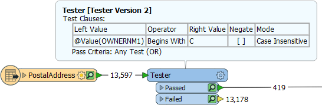
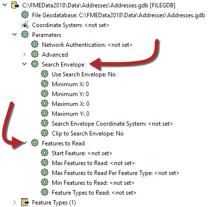
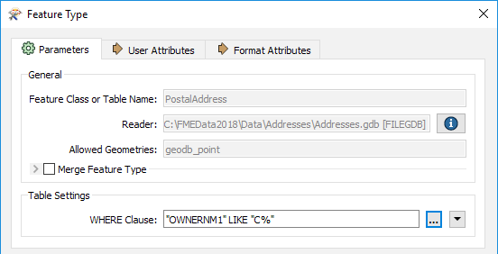
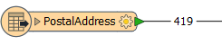
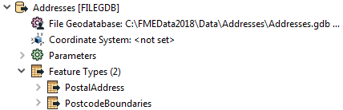
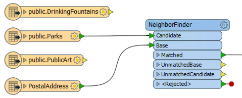

# Improving Reader Performance #

The most important method to improve reading performance is to minimize the amount of data that is being read. As already mentioned, reading excess features counts as unnecessary work and is therefore inefficient.

<!--Warning Section--> 

<table style="border-spacing: 0px">
<tr>
<td style="vertical-align:middle;background-color:darkorange;border: 2px solid darkorange">
<i class="fa fa-exclamation-triangle fa-lg fa-pull-left fa-fw" style="color:white;padding-right: 12px;vertical-align:text-top"></i>
WARNING
</td>
</tr>

<tr>
<td style="border: 1px solid darkorange">

It's bad enough to read extra features, but - in FME 2018 and newer - that effect can be multiplied many times when Feature Caching is turned on. Therefore you need to be extra careful to read no more data than is necessary. 

</td>
</tr>
</table>

---

## Filtering Input ##

For example, this workspace reads nearly 14,000 features but immediately discards all except 419 of them (ones where the owner's name begins with "C":

In this scenario, if possible, it would be much more efficient to simply just read those approximately 400 features. Not only does it avoid reading unnecessary data, but it also avoids caching it twice over!

Fortunately, all formats have various sets of parameters that speed up feature reading, by filtering the amount of data being read. 

The first of these – search envelope – defines the data to read as a geographic area. Then only that area of data needs to be read. These parameters are available on every spatial data reader but have the most effect when the source data is spatially indexed. Then the query is being carried out at its most efficient.

Similarly, there are a number of parameters designed to let the user define how many features to read. These parameters include the ability to define a maximum number of features to read, and what features to start with. There is also a parameter that defines which feature types (layers or tables) should be read.

By using these judiciously, the amount of data being read can be reduced and the translation sped up. For example, if we knew that the first records in the dataset were the ones beginning with "C", we could set Max Features to Read to 419. 

Other formats – particularly databases – have additional clauses that can help reduce the data flow:

Here, for example, this Geodatabase reader has a ‘WHERE Clause’ parameter that applies the "owner name begins with 'C' test" in a way that is more efficient than reading the entire contents of a large table and using a Tester transformer.

---

<table style="border-spacing: 0px">
<tr>
<td style="vertical-align:middle;background-color:darkorange;border: 2px solid darkorange">
<i class="fa fa-quote-left fa-lg fa-pull-left fa-fw" style="color:white;padding-right: 12px;vertical-align:text-top"></i>
Jake Speedie says…
</td>
</tr>

<tr>
<td style="border: 1px solid darkorange">

In short, when you want to filter source data, and can use a specific reader parameter to do so, it is more efficient than reading all of the source data and then filtering it with a transformer.

</td>
</tr>
</table>

---

## Excess Feature Types ##

Another potential bottleneck - specifically for formats with a table list – is the case where you have more feature types than are necessary.

Here the user has added two tables to their Geodatabase reader:

However, if you look at the workspace, the PostcodeBoundaries table is not even connected to anything. The unconnected table is still being read - and cached - but the data is being ignored:

Presumably, the user added the tables for some reason, but then decided they did not need them, In that case, they should delete the feature type from the FME workspace. Then the table will not be read and performance will improve.
