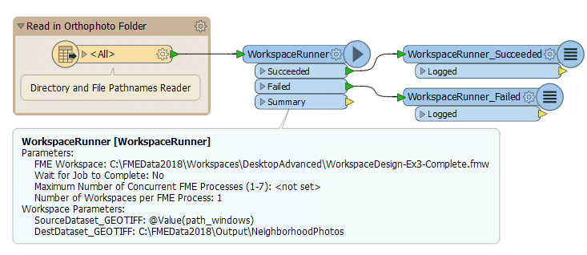
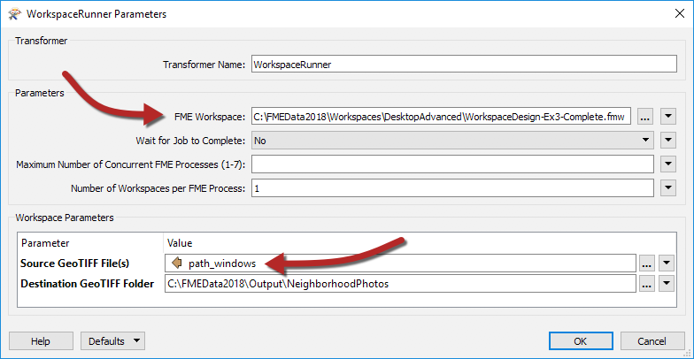
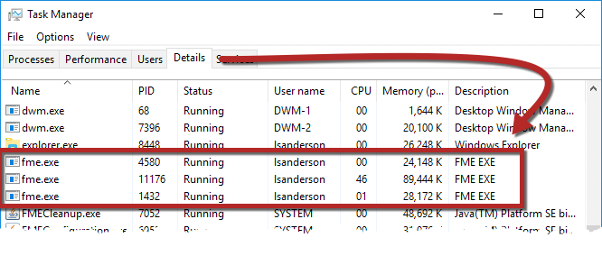
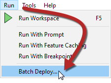
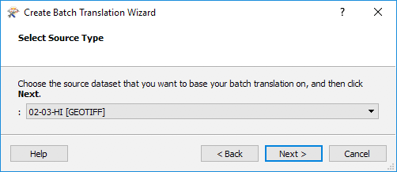
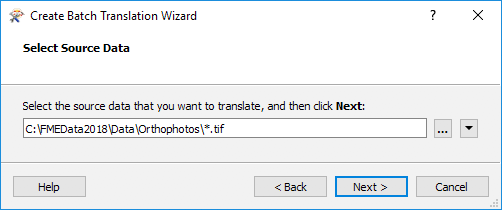
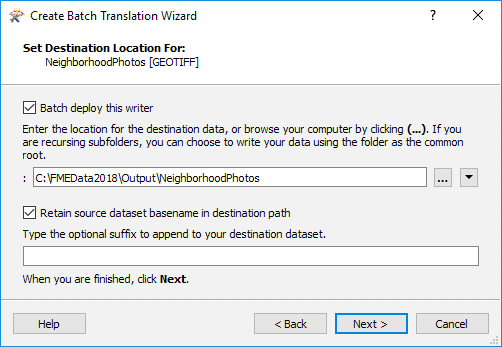
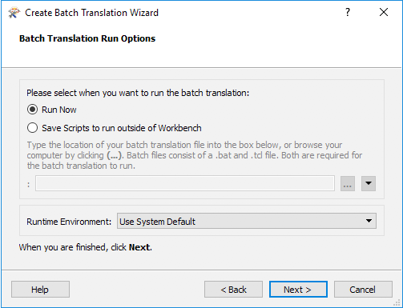

# Batch Processing #

Batch processing is the execution of a series of workspaces in FME or the processing of multiple files at one time.  

---

## Batch Processing Using the WorkspaceRunner ##

The WorkspaceRunner is a transformer that runs another FME workspace when used in a translation. Used in conjunction with the Directory and File Pathname reader it can be used for batch processing. 

For example, we have a workspace that reads in orthophoto tiles and clips them to neighborhood boundaries, writing them using a combination of tile and neighborhood as the output filename:

Imagine we get new orthophotos each week. Instead of changing the data in the previous workspace each time, we create a workspace to batch process all the new files. This allows FME to start multiple processes simultaneously so that the data is processed faster:

To set up the WorkspaceRunner, the FME Workspace parameter is pointed to the workspace to be batch processed. The Source File parameter is set to *path_windows*, an attribute created by the Directory and File Pathnames Reader:

The option to Wait for Jobs to Complete ensures one job is completed before starting another. Setting this option prevents multiple Concurrent FME Processes. 

If the job order is unimportant, the parameter Maximum Number of Concurrent FME Processes can be set. This causes multiple FME processes (up to a maximum of seven) to be launched, and these can be seen in the Details tab of Windows Task Manager:

---

## Batch Processing Using the Batch Deploy Wizard ##

Batch deploy is available under the Run menu in FME Workbench. It supports both instant batch execution and the creation of batch files. This allows you to process a large number of source datasets in the current workspace and produce a separate output for each:

 

Batch deploy operates in the form of a Wizard. The user specifies the input and output datasets plus any other relevant settings such as a suffix for the output file names. 

If the process is not executed right away, a batch .tcl file is created containing the batch process settings, as well as a .bat file which is used to start the process at a later date. 

Using the same workspace as above in the Create Batch Translation Wizard, setting the Source Type to the GeoTiff Reader:

 

Then select your Source Data. You can select all of the data you want to be batch processed manually or you can use a &ast; wildcard, which will find all of the files ending in .tif:

 

You can select a different file destination as well as change the dataset basename if desired:

 

Finally, you can choose to run this batch deploy now or save the scripts so you can run the workspace outside of Workbench:

 

If you chose to run the workspace now, clicking finish in the wizard will run the workspace immediately. If you saved the scripts, you can browse to them and run the workspace at any time. 

---

<!--Tip Section--> 

<table style="border-spacing: 0px">
<tr>
<td style="vertical-align:middle;background-color:darkorange;border: 2px solid darkorange">
<i class="fa fa-info-circle fa-lg fa-pull-left fa-fw" style="color:white;padding-right: 12px;vertical-align:text-top"></i>
TIP
</td>
</tr>

<tr>
<td style="border: 1px solid darkorange">

Batch Processing can also be done using the command line or an FME Command File. These techniques are more advanced then we want to get into for this course, but if you are interested in learning more you can check out the Knowledge Base Article <a href="https://knowledge.safe.com/articles/1384/fme-batch-processing-methods-1.html" alt="Batch Processing Article">FME Batch Processing Methods</a>

</td>
</tr>
</table>