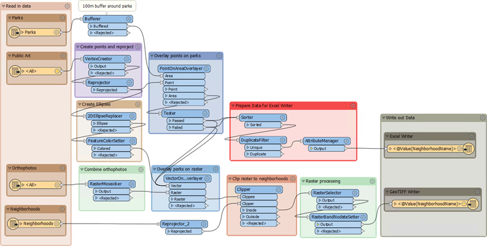
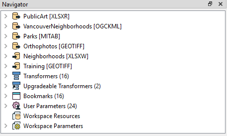
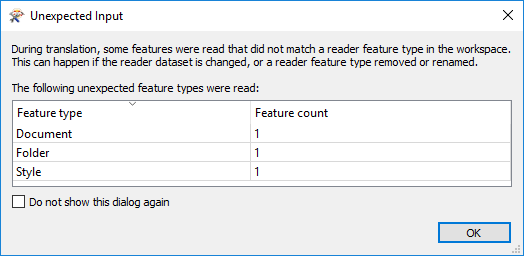

<!--Exercise Section-->

<table style="border-spacing: 0px;border-collapse: collapse;font-family:serif">
<tr>
<td style="vertical-align:middle;background-color:darkorange;border: 2px solid darkorange">
<i class="fa fa-cogs fa-lg fa-pull-left fa-fw" style="color:white;padding-right: 12px;vertical-align:text-top"></i>
Exercise 1
</td>
<!--AKA What Does the Log Say?-->
<td style="border: 2px solid darkorange;background-color:darkorange;color:white">
Public Art in Parks - Feature Caching
</td>
</tr>

<tr>
<td style="border: 1px solid darkorange; font-weight: bold">Data</td>
<td style="border: 1px solid darkorange">City Neighborhoods (Google KML) Public Art (Microsoft Excel) 
Parks (MapInfo Tab) 
City Orthophotos (GeoTIFF)</td>
</tr>

<tr>
<td style="border: 1px solid darkorange; font-weight: bold">Overall Goal</td>
<td style="border: 1px solid darkorange">Examine a workspace that analyzes public art in city parks</td>
</tr>

<tr>
<td style="border: 1px solid darkorange; font-weight: bold">Demonstrates</td>
<td style="border: 1px solid darkorange">Inspecting a log file</td>
</tr>

<tr>
<td style="border: 1px solid darkorange; font-weight: bold">Start Workspace</td>
<td style="border: 1px solid darkorange">C:\FMEData2019\Workspaces\DesktopAdvanced\WorkspaceDesign-Ex1-Begin.fmw</td>
</tr>

<tr>
<td style="border: 1px solid darkorange; font-weight: bold">End Workspace</td>
<td style="border: 1px solid darkorange">None</td>
</tr>

</table>

The provincial government has given the city a grant to fund new public art in parks. To maximize the use of funds, the city would like to add art to parks without existing art, or with no art within 100 meters of the park. 

A colleague has created a workspace to analyze the amount of art in each city park. The results are written to an Excel spreadsheet and a series of raster maps (one per neighborhood). Your task is to carry out a code review to ensure that the workspace is efficient and well-designed.

---

 **1) Open and Run Workspace**
 Start Workbench if necessary and open the starting workspace. It is a relatively large workspace compared to what we have seen so far:

Firstly check that the log timestamp option is turned on (Tools &gt; FME Options &gt; Translation &gt; Log Settings). Secondly, ensure Feature Caching is also turned on and then run the workspace. It will take about 20 seconds to complete.

Now we have a log file and a set of caches, and can start to deconstruct the workspace and how it performs.

 **2) Examine Workspace**
 The first step is to understand how the workspace operates. Luckily our colleague has made a workspace that appears well organized and has plenty of bookmarks and annotation.

The Navigator window shows that there are four readers (and two writers):

So the first bookmarks contains four feature types, each of which must belong to a different reader. The workspace reads Parks (MapInfo TAB) and a list of public art (Excel spreadsheet), which are obvious requirements. The other readers read orthophotos (GeoTIFF) from which the output maps are created, and a set of neighborhoods (Google KML) which are used to subdivide the data.

Inspect each of the source datasets in turn to become familiar with them. Notice that the datasets vary in their coordinate systems, so you can't view them all together unless you have an active background map. 

In general, the workspace is divided into two streams of data, each of which leads to a writer feature type. This is the upper stream:

This section:

- Puts a buffer around the parks (Bufferer) to account for the within 100 meters of a park rule
- Turns the art Excel records into points (VertexCreator) and reprojects them (Reprojector)
- Overlays the artwork points onto the parks polygons (PointOnAreaOverlayer)
- Tests which parks contain artwork and which do not (Tester)
- Sorts the data (Sorter), removes duplicates (DuplicateFilter), and removes excess attributes (AttributeManager)

This is the data that gets written to the Excel spreadsheet.

The lower stream looks like this:

This section:

- Turns the artwork points into larger ellipses (2DEllipseReplacer) and styles them (FeatureColorSetter)
- Mosaics (dissolves) the orthophoto files into a single image (RasterMosaicker)
- Overlays the artwork and park features onto the orthophoto image (VectorOnRasterOverlayer)
- Divides the image into neighborhoods (Clipper) using the reprojected (Reprojector) neighborhood boundaries
- Selects the bands to process (RasterSelector) and sets a nodata value (RasterBandNodataSetter)

This is the data that gets written to the GeoTIFF map images.

Take your time to examine the cache for each transformer to see the effect it has on the incoming data. When you are thoroughly familiar with how the workspace operates, we'll turn to the log window...

 **3) Examine Log Window**
 We know how the workspace operates; now let's see what the log window reports. The log is nearly 1,000 lines long, so we'll only lightly touch on some parts of it.

Firstly examine the command line section. This comes at the very start of the log. It tells us which command we would use if the workspace was to be run in a batch file. It's interesting, but does little for us here, apart from confirm which readers and writers exist.

Next check the configuration information. It will start off like this:

<pre>
Starting translation...
FME 2019.0.0.0 (20190328 - Build 19238 - WIN64)
FME_HOME is 'C:\Program Files\FME2019\'
FME Desktop Smallworld Edition (floating)
Permanent License.
Machine host name is: Training2019
</pre>

This lets us know which version and build of FME we are using. Importantly we are using 64-bit FME, though that is pretty much the standard version now anyway. The more important part is:

<pre>
FME Configuration: Process limit is 8.00 GB of physical memory
FME Configuration: Start freeing memory when process usage exceeds 24.00 GB of virtual memory
FME Configuration: Stop freeing memory when process usage is below 18.00 GB of virtual memory
</pre>

Here we see how our machine will manage memory. If there is a large difference between running the workspace on our machine, versus running the workspace on our colleague's machine, then this would be important information in determining why that difference might occur.

If you continue to scan through the workspace, you'll find these messages, in this order (line numbers are approximate as they may vary per computer):

<pre>
Creating reader for format: Microsoft Excel (line 67)
VertexCreator (VertexCreatorFactory): Splitting feature table (123)
Reprojector: Using transformation `NAD83_to_WGS84 (126)
Excel Reader: Closing dataset 'C:\FMEData2019\Data\Culture\PublicArt.xlsx'... (155)
Creating reader for format: Google KML (156)
Creating reader for format: MapInfo TAB (MITAB) (190)
Closing native MapInfo reader (203)
Creating reader for format: GeoTIFF (Geo-referenced Tagged Image File Format) (205)
MULTI_READER(GEOTIFF_1): Done reading 40 features from 40 readers (533)
Emptying factory pipeline (535)
</pre>

These are key messages. They indicate readers being opened and closed. Several interesting things are:

- The order in which readers are opened matches the order they are shown in the Navigator window
- Transformation (here the VertexCreator/Reprojector) take place while data is being still read
- The KML reader appears to have no message when it is closed
- Emptying Factory Pipeline denotes that all readers have read their data and are now closed.

Further scanning shows us transformers mentioned in this order:

<pre>
RasterMosaicker (line 547)
Bufferer (549)
Reprojector_2 (552)
VertexCreator (554)
Reprojector (556)
PointOnAreaOverlayer (568)
Tester (571)
Sorter (578)
DuplicateFilter (622)
AttributeManager (624)
2DEllipseReplacer (625)
FeatureColorSetter (631)
VectorOnRasterOverlayer (634)
Clipper (637)
RasterSelector (665)
RasterBandNodataSetter (669)
</pre>

So that's all of our transformers. The order is generally correct, but not necessarily to be relied upon. That's because logging is not always consistent; some messages might get stored in a buffer and not logged immediately, some transformers might not log a message for the same event, and the inner-workings of FME may be different than depicted in the workspace. Still, it is a good start.

More scanning and we see the writers logged:

<pre>
Creating writer for format: Microsoft Excel (Line 583)
Creating writer for format: GeoTIFF (Geo-referenced Tagged Image File Format) (765)
</pre>

This too occurs in the order shown in the Navigator window. The interesting part there is that the Excel writer is started as soon as a feature reaches it from the AttributeManager; it doesn't wait until all transformation is complete. And this also shows how log messages can be a little odd: the Excel writer is logged as created before the AttributeManager is logged as sending features to it!

The final part of the log mentions the results of our translation. This includes the features read and written, plus a summary of the translation performance:

<pre>
Translation was SUCCESSFUL with 9 warning(s) (70 feature(s) output)
FME Session Duration: 19.6 seconds. (CPU: 10.5s user, 4.6s system)
END - ProcessID: 7880, peak process memory usage: 715544 kB, current process memory usage: 146176 kB
</pre>

When you ran the workspace you might have seen a pop-up window mention that some features were read but discarded:

...and this message is repeated as the final line of the log. What it means is that a few objects from the KML dataset were ignored. The Unexpected Input Remover would also show this during the log:

<pre>
Router and Unexpected Input Remover (RoutingFactory): 
Tested 314 input feature(s), wrote 314 output feature(s): 
311 matched merge filters, 311 were routed to output, 3 could not be routed.
</pre>

So that's all explained.

---

<!--Exercise Congratulations Section--> 

<table style="border-spacing: 0px">
<tr>
<td style="vertical-align:middle;background-color:darkorange;border: 2px solid darkorange">
<i class="fa fa-thumbs-o-up fa-lg fa-pull-left fa-fw" style="color:white;padding-right: 12px;vertical-align:text-top"></i>
CONGRATULATIONS
</td>
</tr>

<tr>
<td style="border: 1px solid darkorange">

By completing this exercise, you have learned how to:
<ul><li>Examine a workspace to determine its function</li>
<li>Deconstruct a workspace log</li></ul>

</td>
</tr>
</table>