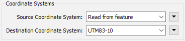
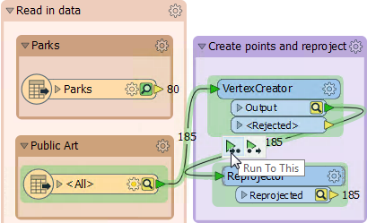
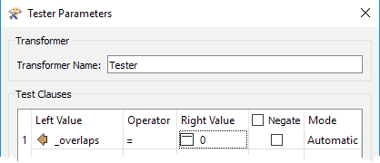

<!--Exercise Section-->

<table style="border-spacing: 0px;border-collapse: collapse;font-family:serif">
<tr>
<td style="vertical-align:middle;background-color:darkorange;border: 2px solid darkorange">
<i class="fa fa-cogs fa-lg fa-pull-left fa-fw" style="color:white;padding-right: 12px;vertical-align:text-top"></i>
Exercise 1
</td>
<!--AKA What Does the Log Say?-->
<td style="border: 2px solid darkorange;background-color:darkorange;color:white">
Public Art in Parks - Feature Caching
</td>
</tr>

<tr>
<td style="border: 1px solid darkorange; font-weight: bold">Data</td>
<td style="border: 1px solid darkorange">City Neighborhoods (Google KML) Public Art (Microsoft Excel) 
Parks (MapInfo Tab) 
City Orthophotos (GeoTIFF)</td>
</tr>

<tr>
<td style="border: 1px solid darkorange; font-weight: bold">Overall Goal</td>
<td style="border: 1px solid darkorange">Plan out a workspace and determine which parks do not contain public art</td>
</tr>

<tr>
<td style="border: 1px solid darkorange; font-weight: bold">Demonstrates</td>
<td style="border: 1px solid darkorange">Workspace layouting and running a translation with feature caches</td>
</tr>

<tr>
<td style="border: 1px solid darkorange; font-weight: bold">Start Workspace</td>
<td style="border: 1px solid darkorange">C:\FMEData2018\Workspaces\DesktopAdvanced\WorkspaceDesign-Ex1-Begin.fmw</td>
</tr>

<tr>
<td style="border: 1px solid darkorange; font-weight: bold">End Workspace</td>
<td style="border: 1px solid darkorange">C:\FMEData2018\Workspaces\DesktopAdvanced\WorkspaceDesign-Ex1-Complete.fmw</td>
</tr>

</table>

The provincial government has given the city a grant to fund new public art in parks. To maximize the use of funds, the city would like to add art to parks without existing art. 

You are tasked with creating a workspace to determine which parks should get new artwork. Before any art is commissioned, the proposal needs to have public input so your output data will need to be broken down to a neighborhood level. 

This workspace will also be passed on to several different departments so you will need to ensure that it runs efficiently and is well designed. 

---
 **1) Start Workbench**
 Open a blank workspace (or open the starting workspace and skip to step two).

There is a lot to think about before you start creating your workspace, so you have decided to create a quick wireframe design using bookmarks, to lay out what you need to do.

First, we'll need to read in the following datasets:

- Parks.tab
- NeighbourhoodBoundaries.kml
- PublicArt.xlsx
- The entire folder of GeoTiff orthophotos

For now, just mark their place in the workspace with a bookmark. We don't know how large each section will be, so make them all the same size for now. 

Next, we will need to create points and reproject the public art, then overlay the public art on the parks to find out which ones are contained within a park boundary; so add a bookmark for this section. 

Then we will need to test for parks without art and create a label for our map. 

Next, we will handle the orthophoto data, and clip it to the neighborhood boundaries. There might need to be some raster post-processing after we clip it, so add in a section for that. 

Finally, we will overlay the parks without art on the raster images and write it all out to GeoTiff: 

 **2) Read in the data**
 Now we can start adding substance to the workspace. Let's read in all the data, each with an individual reader:

<table style="border: 0px">

<tr>
<td style="font-weight: bold">Reader Format</td>
<td style="">MapInfo Tab (MITAB)</td>
</tr>

<tr>
<td style="font-weight: bold">Reader Dataset</td>
<td style="">C:\FMEData2018\Data\Parks\Parks.tab</td>
</tr>

<tr>
    <td></td><td></td>
</tr>

<tr>
<td style="font-weight: bold">Reader Format</td>
<td style="">Microsoft Excel </td>
</tr>

<tr>
<td style="font-weight: bold">Reader Dataset</td>
<td style="">C:\FMEData2018\Data\Culture\PublicArt.xlsx</td>
</tr>

<tr>
<td style="font-weight: bold">Reader Workflow Options</td>
<td style="">Single Merged Feature Type</td>
</tr>

<tr>
    <td></td><td></td>
</tr>

<tr>
<td style="font-weight: bold">Reader Format</td>
<td style="">Google KML </td>
</tr>

<tr>
<td style="font-weight: bold">Reader Dataset</td>
<td style="">C:\FMEData2018\Data\Boundaries\VancouverNeighborhoods.kml</td>
</tr>

<tr>
<td style="font-weight: bold">Reader Workflow Options</td>
<td style="">Individual Feature Types</td>
</tr>

<tr>
    <td></td><td></td>
</tr>

<tr>
<td style="font-weight: bold">Reader Format</td>
<td style="">GeoTIFF (Geo-referenced Tagged Image File Format) </td>
</tr>

<tr>
<td style="font-weight: bold">Reader Datasets</td>
<td style="">C:\FMEData2018\Data\Orthophotos\02-03-HI.tif to 14-15-RS.tif</td>
</tr>

<tr>
<td style="font-weight: bold">Reader Workflow Options</td>
<td style="">Single Merged Feature Type</td>
</tr>

</table>

When you read in the VancouverNeighborhoods.kml, you can read in all the Feature Types, just move them to the side. We are only interested in the Neighborhood Feature type, so move that one into your bookmark.

 **3) Create points and reproject**
 For this first exercise, we will focus only on parks and public art. We will need to create points from our Excel data. Add a VertexCreator transformer to the canvas and connected to the Public Art Feature Type. In the parameters set the X Value and Y Value to Longitude and Latitude, respectively: 

Add a Reprojector transformer connected to the VertexCreator:Output port. In the parameters set the Destination Coordinate System UTM83-10:

 **4) Run workspace with feature caching**
 Let's test that the point features are correct. Select Run &gt; Run with Feature Caching on the menubar, then Run the workspace. This will run the workspace, caching all features along the way. 

Once the workspace is finished, data caches are represented by green magnifying-glass icons. These can be inspected individually, but we wish to inspect two caches together. 

So, click on the Reprojector transformer. Holding the _Shift_ key on your keyboard, now click the Parks Feature Type to highlight it as well. Right-click on either the Parks or the Reprojector and choose *Inspect cached features...* (Ctrl+I is the shortcut). This will open the selected caches in the FME Data Inspector:

 **5) Add coordinate system and run from the Reprojector**
 If (as is probably the case) the two datasets don't line up, it's because there is no coordinate system set on the Microsoft Excel reader. Let's go back to FME Workbench and fix that. 

In the Navigator Window, under the PublicArt &#91;XLSXR&#93; Reader, set the Coordinate System to LL84:

Now the feature caches on the Public Art Feature Type, VertexCreator, and the Reprojector have all turned yellow. This means that the caches are stale because something changed. We need to re-run the translation, but a good thing about the feature caches is we only need to run the section that was changed.

Click on the Reprojector, on the popup menu, click *Run To This*; this will run only the section of the workspace that is highlighted, in this case, the PublicArt Feature Table, VertexCreator, and Reprojector:

Inspect the caches again and this time the data is lined up correctly:

 **6) Overlay the Public Art onto the Parks**
 Now let's overlay the Public Art points onto the Parks polygons using the PointOnAreaOverlayer transformer. This will give us an attribute called _overlaps that we can then test for. 

Add a PointOnAreaOverlayer transformer to the canvas. Connect the Parks to the PointOnAreaOverlayer:Area input port and the reprojected PublicArt to the PointOnAreaOverlayer:Points input port. In the PointOnAreaOverlayer parameters, under Attribute Accumulation, enable Merge Attributes. This setting ensures attributes from both features are on the output features:

 **7) Test for overlaps**
 Add a Tester transformer to the canvas, connected to the PointOnAreaOverlayer:Area output port. In the Tester parameters dialog create a test for _overlaps = 0:

This test separates parks with art, from parks without art.

Once you've created the test, click on the Tester and use Run From This (shortcut F6). 

The PointOnAreaOverlayer transformer also needs to be run. If you chose *Run From This* on the menu, then you will see a warning telling you that prior transformers need to be run as well:

If you use the F6 key, you'll find this is not just a shortcut to the Run From This option, but also bypasses the warning dialog and runs the workspace including any prior requirements.

Once complete, inspect the Tester:Passed output port, to ensure that the test worked correctly. There should be 68 parks with no Public Art. 

Don't forget to ensure that you made use of your bookmark wireframes, and resized them as needed. The workspace will be continued in coming exercises. 

---

<!--Exercise Congratulations Section--> 

<table style="border-spacing: 0px">
<tr>
<td style="vertical-align:middle;background-color:darkorange;border: 2px solid darkorange">
<i class="fa fa-thumbs-o-up fa-lg fa-pull-left fa-fw" style="color:white;padding-right: 12px;vertical-align:text-top"></i>
CONGRATULATIONS
</td>
</tr>

<tr>
<td style="border: 1px solid darkorange">

By completing this exercise, you have learned how to:
<ul><li>Plan out a workspace using bookmarks</li>
<li>Use feature caches to inspect a workspace</li></ul>

</td>
</tr>
</table>
