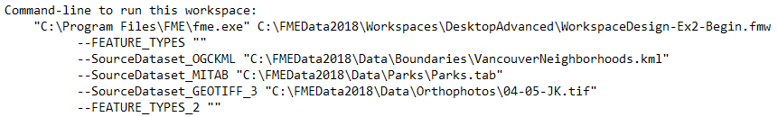
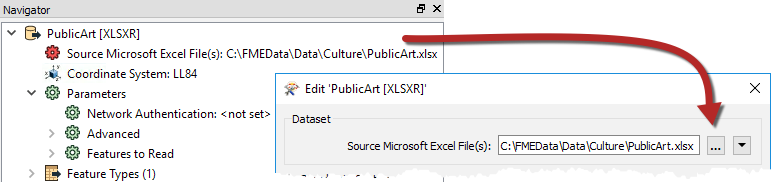
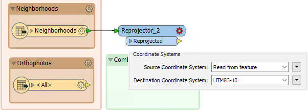
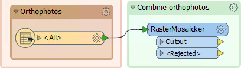
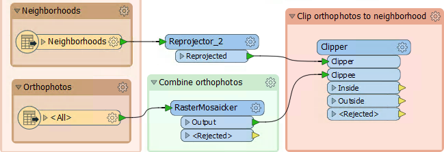
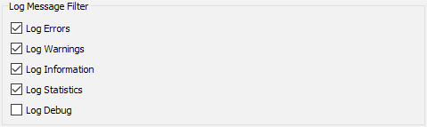
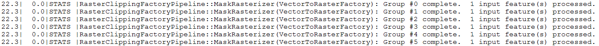
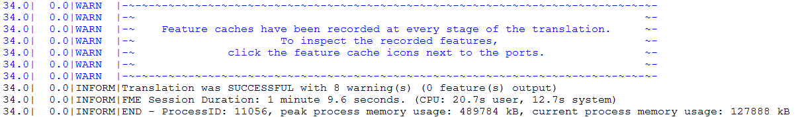
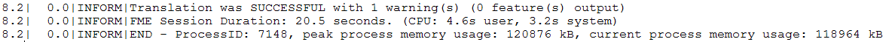

<!--Exercise Section-->

<table style="border-spacing: 0px;border-collapse: collapse;font-family:serif">
<tr>
<td style="vertical-align:middle;background-color:darkorange;border: 2px solid darkorange">
<i class="fa fa-cogs fa-lg fa-pull-left fa-fw" style="color:white;padding-right: 12px;vertical-align:text-top"></i>
Exercise 1
</td>
<!--AKA What Does the Log Say?-->
<td style="border: 2px solid darkorange;background-color:darkorange;color:white">
Public Art in Parks - Log File Interpreation
</td>
</tr>

<tr>
<td style="border: 1px solid darkorange; font-weight: bold">Data</td>
<td style="border: 1px solid darkorange">City Neighborhoods (Google KML) Public Art (Microsoft Excel) 
Parks (MapInfo Tab) 
City Orthophoto (GeoTIFF)</td>
</tr>

<tr>
<td style="border: 1px solid darkorange; font-weight: bold">Overall Goal</td>
<td style="border: 1px solid darkorange">Plan out a workspace and determine which parks do not contain public art</td>
</tr>

<tr>
<td style="border: 1px solid darkorange; font-weight: bold">Demonstrates</td>
<td style="border: 1px solid darkorange">Interpreting an FME Log file</td>
</tr>

<tr>
<td style="border: 1px solid darkorange; font-weight: bold">Start Workspace</td>
<td style="border: 1px solid darkorange">C:\FMEData2018\Workspaces\DesktopAdvanced\WorkspaceDesign-Ex2-Begin.fmw 
C:\FMEData2018\Workspaces\DesktopAdvanced\WorkspaceDesign-Ex2-Logfile.log</td>
</tr>

<tr>
<td style="border: 1px solid darkorange; font-weight: bold">End Workspace</td>
<td style="border: 1px solid darkorange"C:\FMEData2018\Workspaces\DesktopAdvanced\WorkspaceDesign-Ex2-Complete.fmw</td>
</tr>

</table>

While designing your workspace, you were surprised to see 68 out of the 80 parks don't have public art. Worried that you made a mistake or that your data is out of date, you passed the workspace to a college. 

They confirmed the 68 parks and sent back the workspace along with a log file. Before continuing work on your workspace, you review their workspace and the log file because they mentioned that they got an error last time they tried to run it. 

---
 **1) Open Log File**
 Open C:\FMEData2018\Workspaces\DesktopAdvanced\WorkspaceDesign-Ex2-Logfile.txt in a text editor. 

This is the log file from your colleague. They said the workspace you sent was working fine but they added some new data and it broke. 

Review the command line section first to get an overview of what is being read into the workspace:

It looks like there are only three datasets, there used to be four. It looks like the PublicArt.xlsx dataset is missing. This might be why the workspace isn't working, but we should continue reading just to confirm that. 

There is a lot going on in a log file and it is easy to get overwhelmed. Scroll all the way to the bottom. The bottom of the log will tell you if the translation was successful, if there are any error or warning messages and if the data was written out:

The translation failed due to a fatal error. Looking a couple lines above that line we can see why:

The dataset path must have gotten changed between their computer and yours. Thankfully this is an easy fix. 

 **2) Fix Public Art Dataset Path**
 Start up FME Workbench and then open the WorkspaceDesign-Ex2-Begin.fmw workspace. 

---

<!--Tip Section--> 

<table style="border-spacing: 0px">
<tr>
<td style="vertical-align:middle;background-color:darkorange;border: 2px solid darkorange">
<i class="fa fa-info-circle fa-lg fa-pull-left fa-fw" style="color:white;padding-right: 12px;vertical-align:text-top"></i>
TIP
</td>
</tr>

<tr>
<td style="border: 1px solid darkorange">

If you still have the workspace open from the previous exercise you can skip Step 2 and move on to Step 3. The only thing that changed is the PublicArt.xlsx dataset path. 

</td>
</tr>
</table>

---

In the Navigator Window, expand the PublicArt &#91;XLSXR&#92; Reader. Double click on the Source Dataset to open the parameters: 

Set the Source Microsoft Excel File(s) to:

<pre>
C:\FMEData2018\Data\Culture\PublicArt.xlsx
</pre>

Click ok and run the translation. Check the log to ensure the translation was successful:

 **3) Reproject Neighborhoods**
 Now that the translation is running smoothly again and our results have been confirmed, we can move onto the second branch of our workspace. This second part we will clip the orthophotos to the neighborhood boundary. First, we will need to reproject the neighborhood KML file. 

Add a Reprojector transformer to the canvas and connect it to the Neighborhoods KML Feature Type. In the parameters set the Destination Coordinate System to UTM83-10: 

The reason we are not using the Reprojector connected to the Public Art Feature Type is because we want to keep the two streams separate until the data is ready to be joined. 

 **4) Mosaic Rasters**
 Next we want to mosaic the raster together into one image so that when we clip it, it will be in solid polygons for each neighborhood. If we don't mosaic it, we will have several image tiles for each neighborhood. 

Add a RasterMosaicker transformer to the canvas and connect it to the GeoTiff Feature Reader, you can leave the parameters as the defaults:

 **5) Clip Orthophoto to Neighborhoods**
 Now we can clip the mosaicked orthophoto to the neighborhoods. This will result in 6 images, each the shape of a neighborhood. 

In the Clip orthophoto to neighborhoods bookmark, we added in the last exercise, add a Clipper transformer. Connect the Clipper Input port to the Reprojected Output port on the Reprojector_2. Then connect the Clipee Input port to the Output port on the Mosaicker:

In the parameters, enable Merge Attributes. This will add all the attribute from the Neighbourhoods KML to our orthophoto.  

 **6) Run the translation**
 Before we run the translation, let's make sure that we have the translation log set up so that we can see all of the messages. In the menu bar go to Tools > FME Options... then in the FME Options dialog go to the Translation Section. Under Log Message Filter, ensure that Log Errors, Warnings, Information and Statistics is enabled. Leave Log Debug unchecked:

Now that the log is set up, we can run the translation. If you have feature caching turned on still, you can run the translation from the Clipper. If you don't, turn it on and run the entire translation. After the translation has finished running inspect the log: 

You also might have caught:

<pre>
    FFS Writer: Completed 50.1% of intermediate processing
</pre>

This message appears below the log window during the translation, but depending on the speed of your computer it might also show up in the translation log. It is just informing you that the translation is still in process and hasn't stalled. 

You might have noticed that this translation ran slower than before we added the clipper. This is because we are caching all the features from the raster which takes a lot of memory. This is important to be aware of when working with raster data. With Feature Caching turned on my translation took 1 minute and 9.6 seconds:

If you want to test the difference, turn off Feature Caching and run the translation normally. On my machine it took 20.5 seconds to run without Feature Caching turned on:

In the next exercise, we will continue working on this workspace and look at other ways of increasing performance. 

---

<!--Exercise Congratulations Section--> 

<table style="border-spacing: 0px">
<tr>
<td style="vertical-align:middle;background-color:darkorange;border: 2px solid darkorange">
<i class="fa fa-thumbs-o-up fa-lg fa-pull-left fa-fw" style="color:white;padding-right: 12px;vertical-align:text-top"></i>
CONGRATULATIONS
</td>
</tr>

<tr>
<td style="border: 1px solid darkorange">

By completing this exercise you have learned how to:
<ul><li>Mosaic rasters together</li>
<li>Debug a workspace by reading the log file</li>
<li>Interpret the log file to understand what transformers are doing</ul>

</td>
</tr>
</table>
