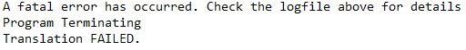
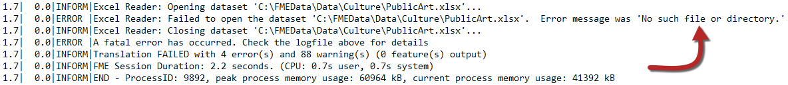
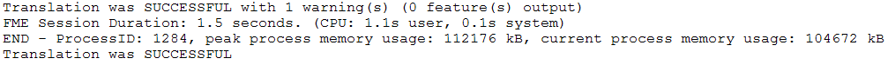
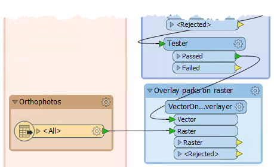
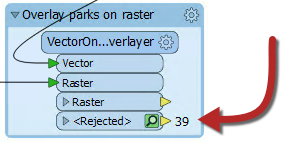
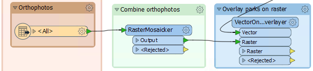
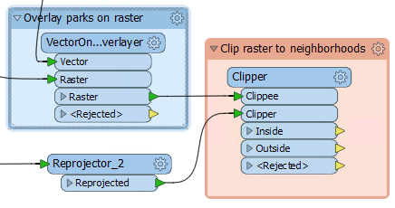
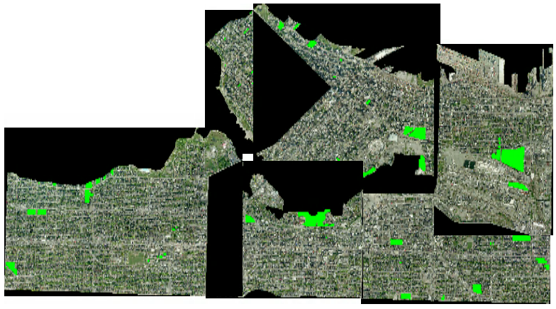

<!--Exercise Section-->

<table style="border-spacing: 0px;border-collapse: collapse;font-family:serif">
<tr>
<td style="vertical-align:middle;background-color:darkorange;border: 2px solid darkorange">
<i class="fa fa-cogs fa-lg fa-pull-left fa-fw" style="color:white;padding-right: 12px;vertical-align:text-top"></i>
Exercise 1
</td>
<!--AKA What Does the Log Say?-->
<td style="border: 2px solid darkorange;background-color:darkorange;color:white">
Public Art in Parks - Log File Interpreation
</td>
</tr>

<tr>
<td style="border: 1px solid darkorange; font-weight: bold">Data</td>
<td style="border: 1px solid darkorange">City Neighborhoods (Google KML) Public Art (Microsoft Excel) 
Parks (MapInfo Tab) 
City Orthophoto (GeoTIFF)</td>
</tr>

<tr>
<td style="border: 1px solid darkorange; font-weight: bold">Overall Goal</td>
<td style="border: 1px solid darkorange">Plan out a workspace and determine which parks do not contain public art</td>
</tr>

<tr>
<td style="border: 1px solid darkorange; font-weight: bold">Demonstrates</td>
<td style="border: 1px solid darkorange">Interpreting an FME Log file</td>
</tr>

<tr>
<td style="border: 1px solid darkorange; font-weight: bold">Start Workspace</td>
<td style="border: 1px solid darkorange">C:\FMEData2018\Workspaces\DesktopAdvanced\WorkspaceDesign-Ex2-Begin.fmw 
C:\FMEData2018\Workspaces\DesktopAdvanced\WorkspaceDesign-Ex2-Logfile.log</td>
</tr>

<tr>
<td style="border: 1px solid darkorange; font-weight: bold">End Workspace</td>
<td style="border: 1px solid darkorange"C:\FMEData2018\Workspaces\DesktopAdvanced\WorkspaceDesign-Ex2-Complete.fmw</td>
</tr>

</table>

While designing your workspace, you were surprised to see 68 out of the 80 parks don't have public art. Worried that you made a mistake or that your data is out of date, you passed the workspace to a colleague. 

They confirmed the 68 parks and sent back the workspace along with a log file. Before continuing work on your workspace, you review their workspace and the log file because they mentioned that they got an error last time they tried to run it. 

---
 **1) Open Log File**
 Open WorkspaceDesign-Ex2-Logfile.log in a text editor. 

This is the log file from your colleague. They said the workspace you sent was working fine but they added some new data and it broke. 

Review the command line section first to get an overview of what is being read into the workspace:

It looks like there are only three datasets, there used to be four. It looks like the PublicArt.xlsx dataset is missing. This might be why the workspace isn't working, but we should continue reading just to confirm that. 

There is a lot going on in a log file and it is easy to get overwhelmed. Scroll all the way to the bottom. The bottom of the log will tell you if the translation was successful, if there are any error or warning messages and if the data was written out:

The translation failed due to a fatal error. Looking a couple lines above that line we can see why:

The dataset path must have gotten changed between their computer and yours. Thankfully this is an easy fix. 

 **2) Fix Public Art Dataset Path**
 Start up FME Workbench and then open the WorkspaceDesign-Ex2-Begin.fmw workspace. 

---

<!--Tip Section--> 

<table style="border-spacing: 0px">
<tr>
<td style="vertical-align:middle;background-color:darkorange;border: 2px solid darkorange">
<i class="fa fa-info-circle fa-lg fa-pull-left fa-fw" style="color:white;padding-right: 12px;vertical-align:text-top"></i>
TIP
</td>
</tr>

<tr>
<td style="border: 1px solid darkorange">

If you still have the workspace open from the previous exercise you can skip Step 2 and move on to Step 3. The only thing that changed is the PublicArt.xlsx dataset path. 

</td>
</tr>
</table>

---

In the Navigator Window, expand the PublicArt &#91;XLSXR&#92; Reader. Double click on the Source Dataset to open the parameters: 

Set the Source Microsoft Excel File(s) to:

<pre>
C:\FMEData2018\Data\Culture\PublicArt.xlsx
</pre>

Click OK and run the translation. Check the log to ensure the translation was successful:

 **3) Overlay Vectors on Rasters**
 Now that the workspace is reading in the correct dataset, we will overlay the park vector polygons on to the orthophoto rasters. To do this we will use a VectorOnRasterOverlayer transformer. Add a VectorOnRasterOverlayer to the canvas. Connect the VectorOnRasterOverlayer:Vector input port to the Tester:Passed output port. Then connect the Orthophoto Feature Type to the VectorOnRasterOverlayer:Raster input port:

 **4) Run the Translation**
 Let's run the translation and make sure the parks were overlaid correctly:

Oh, well it looks like all the featured were sent to the VectorOnRasterOverlayer:Rejected output port, but if we look at the translation log it looks like the translation was successful. 

Sometimes the translation log doesn't indicate why the feature was rejected because the translation still completed. To find out why these features were rejected we will need to inspect them. Click on the inspection icon on the VectorOnRasterOverlayer:Rejected output port to open it up in the Data Inspector. 

In the Data Inspector, drag your mouse over any section of the raster image to select all of it. It should be highlighted with a yellow box. Then in the Feature Information Window look at the fme_rejection_code to find out why these features were rejected:

This error is because we can only overlay vectors onto **one** raster so we will need to mosaic the rasters together first.

 **5) Mosaic Rasters**
 Back in FME Workbench, add a RasterMosaicker transformer between the Orthophotos Feature Type and the VectorOnAreaOverlayer so that the RasterMosaicker:Input port is connected to the Orthophotos Feature Type and the RasterMosaicker:Output port is connected to the VectorOnRasterOverlayer:Raster input port.  This transformer will mosaic all of the orthophoto rasters into a single raster: 

You can run the translation again to ensure that the VectorOnRasterOverlayer is working correctly if you wish. 

 **6) Reproject Neighborhoods**
 Now that the translation is running smoothly again, we will clip the orthophotos to the neighborhood boundary but first, we will need to reproject the neighborhood KML file. 

Add a Reprojector transformer connected to the Neighborhood KML Feature Type. In the parameters set the Destination Coordinate System to UTM83-10: 

The reason we are not using the Reprojector connected to the Public Art Feature Type is because we want to keep the data separate until it is ready to be clipped. 

 **5) Clip Orthophoto to Neighborhoods**
 Now we can clip the raster overlayed with the parks to the neighborhood boundaries. This will result in 6 images, each the shape of a neighborhood. 

In the Clip orthophoto to neighborhoods bookmark, we added in the last exercise, add a Clipper transformer. Connect the Clipper:Clipper input port to the Reprojector_2:Reprojected output port. Then connect the Clipper:Clipee input port to the VectorOnRasterOverlayer:Raster output port:

In the parameters, enable Merge Attributes. This will add all the attributes from the Neighbourhoods KML to our raster:  

 **6) Run and Inspect Data**
 Before we go any further we should make sure the Clipper did what we expected. Run the translation from the Clipper and inspect the Clipper:Inside output port:

The orthophoto was clipped correctly with each neighborhood being a new image, but there are black borders around each image. These black borders are considered no data and we will remove them in the next exercise as well as look at increasing the performance of our workspace.  

---

<!--Exercise Congratulations Section--> 

<table style="border-spacing: 0px">
<tr>
<td style="vertical-align:middle;background-color:darkorange;border: 2px solid darkorange">
<i class="fa fa-thumbs-o-up fa-lg fa-pull-left fa-fw" style="color:white;padding-right: 12px;vertical-align:text-top"></i>
CONGRATULATIONS
</td>
</tr>

<tr>
<td style="border: 1px solid darkorange">

By completing this exercise you have learned how to:
<ul><li>Overlay vectors onto a raster</li>
<li>Mosaic rasters together</li>
<li>Debug a workspace by reading the log file and fme_rejection_code</li>
<li>Interpret the log file to understand what transformers are doing</ul>

</td>
</tr>
</table>
