<!--Exercise Section-->

<table style="border-spacing: 0px;border-collapse: collapse;font-family:serif">
<tr>
<td style="vertical-align:middle;background-color:darkorange;border: 2px solid darkorange">
<i class="fa fa-cogs fa-lg fa-pull-left fa-fw" style="color:white;padding-right: 12px;vertical-align:text-top"></i>
Exercise 3
</td>
<!--AKA What Does the Log Say?-->
<td style="border: 2px solid darkorange;background-color:darkorange;color:white">
Public Art in Parks - Feature Caching
</td>
</tr>

<tr>
<td style="border: 1px solid darkorange; font-weight: bold">Data</td>
<td style="border: 1px solid darkorange">City Neighborhoods (Google KML) Public Art (Microsoft Excel) 
Parks (MapInfo Tab) 
City Orthophotos (GeoTIFF)</td>
</tr>

<tr>
<td style="border: 1px solid darkorange; font-weight: bold">Overall Goal</td>
<td style="border: 1px solid darkorange">Examine a workspace that analyzes public art in city parks</td>
</tr>

<tr>
<td style="border: 1px solid darkorange; font-weight: bold">Demonstrates</td>
<td style="border: 1px solid darkorange">Improving Design and Performance</td>
</tr>

<tr>
<td style="border: 1px solid darkorange; font-weight: bold">Start Workspace</td>
<td style="border: 1px solid darkorange">C:\FMEData2019\Workspaces\DesktopAdvanced\WorkspaceDesign-Ex3-Begin.fmw</td>
</tr>

<tr>
<td style="border: 1px solid darkorange; font-weight: bold">End Workspace</td>
<td style="border: 1px solid darkorange">C:\FMEData2019\Workspaces\DesktopAdvanced\WorkspaceDesign-Ex3-Complete.fmw</td>
</tr>

</table>

As you'll recall, the provincial government has given the city a grant to fund new public art in parks. 

A colleague has created a workspace to analyze the amount of art in each city park and we are carrying out a code review to ensure that the workspace is efficient and well-designed. Previously we inspected the workspace to see what it produced, deconstructed the log file, and ran the workspace multiple times to assess the relative performance of each component.

Now let's look at some specific changes we can make to improve performance.

---

 **1) Open and Run Workspace**
 Open your workspace from the previous exercise, or the workspace listed above. Turn on feature caching (we're back in authoring mode now) and re-run the workspace.

First let's first check if the readers are well-designed and don't read any excess data.

- Check the Parks source data. We wish to identify parks without artwork, so we need all of these parks features.
- Check the Neighborhoods data. Again, we need all of these features.
- Check the Public Art data. Again, we need all of these features.
	- It's important to note that artworks fall in one of six neighborhoods, and there are the same six neighborhoods in that dataset. There are no artworks outside one of these neighborhoods and no neighborhoods outside where we have artworks, so there is no excess data being read.
- Check the Orthophotos data. We're reading all the image files for the entire city. Are they any files we don't need?

To check the orthophoto coverage, start the FME Data Inspector (it will be easier than the Visual Preview window). Select File &gt; Open Dataset and set the files to open as follows:

<table style="border: 0px">

<tr>
<td style="font-weight: bold">Reader Format</td>
<td style="">GeoTIFF (Geo-referenced Tagged Image File Format)</td>
</tr>

<tr>
<td style="font-weight: bold">Reader Dataset</td>
<td style="">C:\FMEData2019\Data\Orthophotos\*.tif</td>
</tr>

<tr>
<td style="font-weight: bold">Parameters</td>
<td style="">Feature Type Name(s): From File Name(s)</td>
</tr>

</table>
 
In other words, select all of the TIF files in the Orthophotos folder. The Feature Type Name(s) parameter makes sure the Data Inspector lists files by name. 

Now select File &gt; Add Dataset and set that dialog up as follows:

<table style="border: 0px">

<tr>
<td style="font-weight: bold">Reader Format</td>
<td style="">Google KML</td>
</tr>

<tr>
<td style="font-weight: bold">Reader Dataset</td>
<td style="">C:\FMEData2019\Data\Boundaries\VancouverNeighborhoods.kml</td>
</tr>

</table>

Now you can check whether any GeoTIFF tiles fall outside the extents of the neighborhoods. If so, there are files being read that are not necessary.

 **2) Switch GeoTIFF Reader to FeatureReader**
 It appears that there are GeoTIFF files being unnecessarily read. This causes a performance hit, especially when Feature Caching is turned on. We could just select the files we want to read, but if the neighborhoods dataset changed then this list might not be correct. 

So, instead delete the GeoTIFF format reader from the workspace. Add a FeatureReader transformer in its place. Make the reprojected Neighborhoods data the Initiator (create a separate connection):

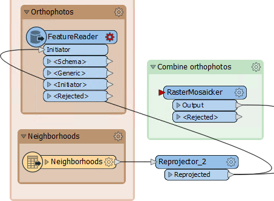

Open the FeatureReader parameters. Set the format to GeoTIFF and select all of the TIF files as the source. Set the **Spatial Filter** parameter to *Initiator Intersects Result*:

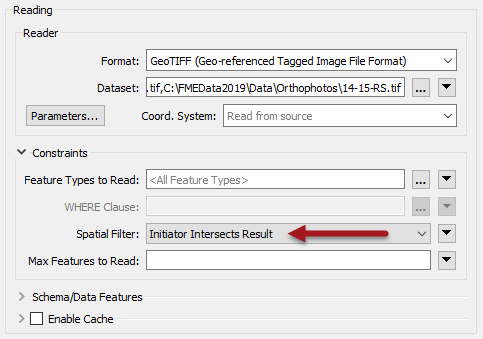

Close the dialog and the FeatureReader now has a GeoTIFF output port. Connect this to the RasterMosaicker:

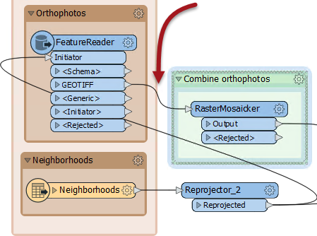

If we run the workspace now the FeatureReader outputs 48 features. This is more than we had before (40) and occurs because GeoTIFF tiles that overlap two neighborhoods are being read twice.

So add a Dissolver transformer between Reprojector_2 and FeatureReader. This will consolidate the neighborhoods into a single feature and ensure each GeoTIFF is only read once. Re-run the workspace:

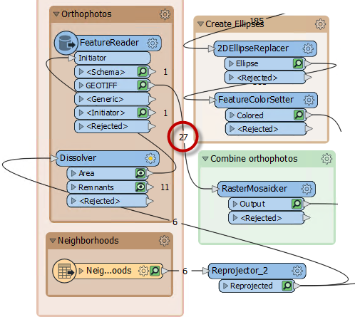

Now we only read 27 features, which is the correct amount. We are reading less data and so the workspace is performing better.

 **3) Check Writer Order**
 The simplest writer improvement we might make is to change the order of the writers. Currently the Excel spreadsheet is being written first. This means that GeoTIFF files - which are large in size - are being cached, instead of the smaller Excel file.

So, adjust the order of the writers, so that the GeoTIFF writer comes first in the Navigator:

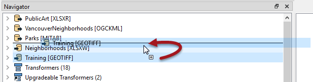

Re-run the workspace. Although the workspace wasn't really slow to start with, you should notice it now runs slightly faster, using less memory.

<!--Tip Section--> 

<table style="border-spacing: 0px">
<tr>
<td style="vertical-align:middle;background-color:darkorange;border: 2px solid darkorange">
<i class="fa fa-info-circle fa-lg fa-pull-left fa-fw" style="color:white;padding-right: 12px;vertical-align:text-top"></i>
TIP
</td>
</tr>

<tr>
<td style="border: 1px solid darkorange">

One other writer feature to consider is whether the Excel dataset is being deleted/recreated, or just emptied of data. In theory it might be (very marginally) quicker to empty the sheets rather than creating the whole spreadsheet from scratch.
  To try this, change the writer parameter Overwrite Existing File to No, and change the writer feature type parameter for Truncate Existing Sheet to Yes:
  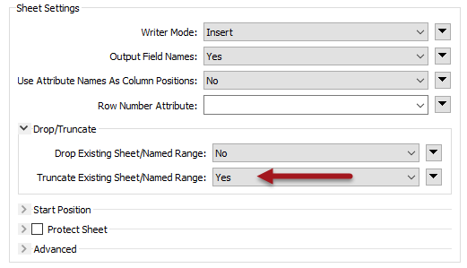
  It's unlikely to make a very large performance improvement, but it is these sort of differences that you can consider when reviewing a workspace for performance. You would especially want to consider this question when writing to a database table with an index (more on that later).

</td>
</tr>
</table>

---

 **4) Upgrade Transformers**
 Now let's look into transformers. This is where there are a lot of different changes we can make. The first is to check for old transformer versions. Notice in the Navigator window that two transformers are listed as "Upgradeable":

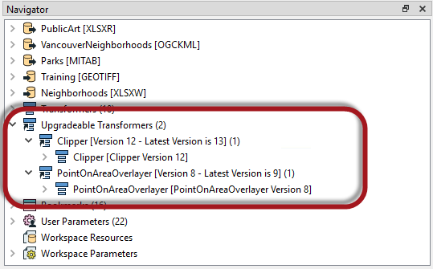

In turn right-click each entry and choose to Upgrade Transformer. You will be prompted with a warning that you can ignore, and even choose to skip in future.

A dialog will open to show the changes in GUI to the transformer, and you can click the Show Changes button to get a written list of changes:

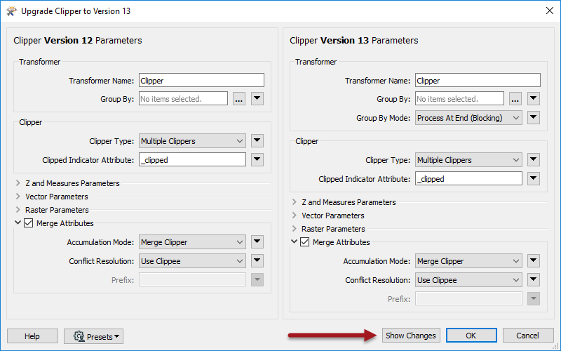

Upgrading transformers doesn't always make them operate faster - some changes are either functional or cosmetic - and it might make their results slightly different. Therefore, it's not advisable to upgrade all transformers without first checking what the upgrade involves.

However, in this case both transformers should be safe to upgrade, and the PointOnAreaOverlayer may even get an improved performance from the upgrade. So go ahead and upgrade both transformers. 

 **5) Check Transformer Order**
 Look at the bookmark labelled *Prepare Data for Excel Writer*: 

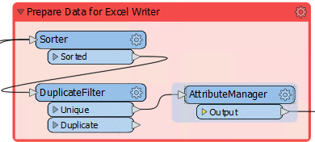

Inspect the transformers and you will see that data is sorted into order for writing first of all; then unnecessary features are filtered out and unnecessary attributes removed.

This is not the correct order to maximize performance: unnecessary features with unnecessary attributes are being processed by the sorting action. Remember, the key order is Filter-Remove-Action.

So, move the Sorter transformer after the AttributeManager:

Notice that the Sorter transformer is now flagged as incomplete. Inspect the parameters and you'll notice that the attribute &#95;overlaps no longer exists; it was renamed by the AttributeManager to ArtWorks.

So simply change the Sorter to sort by ArtWorks and the transformer will work again.

The other thing to consider is whether data can be filtered or removed earlier in the workspace. The two filtering transformers in this workspace are the Tester and DuplicateFilter. Can we move these to earlier in the workspace?

---

<table style="border-spacing: 0px">
<tr>
<td style="vertical-align:middle;background-color:darkorange;border: 2px solid darkorange">
<i class="fa fa-quote-left fa-lg fa-pull-left fa-fw" style="color:white;padding-right: 12px;vertical-align:text-top"></i>
FME Lizard asks...
</td>
</tr>

<tr>
<td style="border: 1px solid darkorange">

<quiz name="">
  <question>
    

      Q) Can the Tester or DuplicateFilter be moved to earlier in the workspace?
    

    <answer>The Tester can be moved, but not the DuplicateFilter</answer> 
    <answer>The DuplicateFilter can be moved, but not the Tester</answer> 
    <answer>Both can be moved</answer> 
    <answer correct>Neither can be moved</answer>
      <explanation>A) The Tester is testing a value created by the PointOnAreaOverlayer, so it cannot be moved. The DuplicateFilter is removing excess records where a park is made up of multiple polygons. That only applies to the Excel output, so it too should not be moved.</explanation>
  </question>
</quiz>
</tr>
</table>

---

Can the AttributeManager transformer be moved? Well, it can't be *moved* because its renaming of the &#95;overlaps attribute can only happen here. However, removing attributes could be carried out much earlier.

The simplest technique is to add an AttributeManager after every reader whose attributes can be removed:

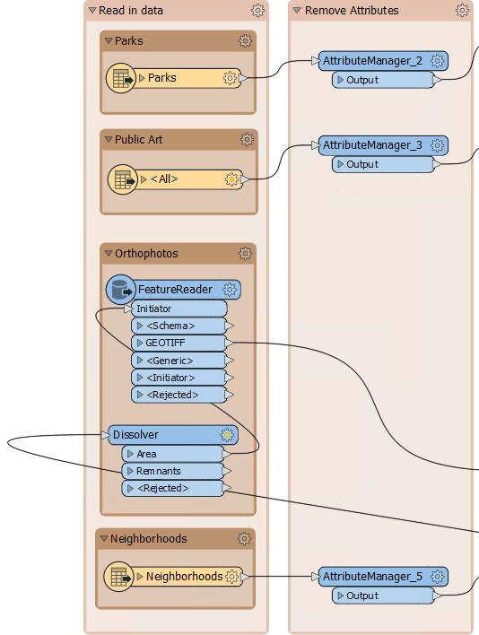

So add an AttributeManager to each input that can be cleaned, and remove whatever attributes are not necessary to the workspace. You can tell if you remove a necessary attribute if a transformer (or writer feature type) further on in the stream is flagged as incomplete.

One transformer that is legitimately incomplete is the original AttributeManager (in the Prepare Data bookmark). This no longer receives the attributes it expects. Simply open the parameters for that transformer and click the   option for *Remove All Invalid 'Input Attribute' Rows*:

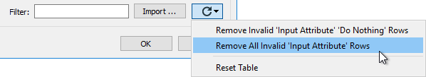

Now we have removed all unnecessary attributes from the workspace, as soon as possible.

---

<!--Tip Section--> 

<table style="border-spacing: 0px">
<tr>
<td style="vertical-align:middle;background-color:darkorange;border: 2px solid darkorange">
<i class="fa fa-info-circle fa-lg fa-pull-left fa-fw" style="color:white;padding-right: 12px;vertical-align:text-top"></i>
TIP
</td>
</tr>

<tr>
<td style="border: 1px solid darkorange">

An alternative solution for database-type formats is to not read the attributes at all. In our workspace the Excel reader is capable of this. You could open the reader feature type, change the Attributes to Read to Exposed Attributes, and uncheck Name and Title: 
  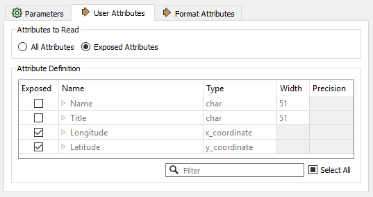
  If you do this then any AttributeManager you added could be removed.

</td>
</tr>
</table>

---

 **6) Check Transformer Performance Parameters**
 As mentioned, a number of transformers have parameters specifically for performance benefits. These are often labelled as **Group By Mode** or **&lt;Features First&gt;** 

Check the transformers in this workspace. The two of particular interest are the Clipper and PointOnAreaOverlayer. Both of them have a Group By Mode and a Features First parameter:

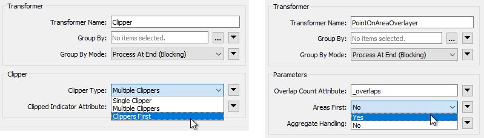

The Group By Mode parameters don't apply, because neither transformer is using a Group By. However, the *Clippers First* and *Areas First* options are of interest. If we set these options we can get a performance boost, but we do have to confirm that either Clippers or Areas are the first features to arrive.

In the PointOnAreaOverlayer, change the Areas First parameter to Yes. Re-run the workspace (either turn off caching or use re-run entire workspace). Notice that all Area features exit as &lt;Rejected&gt; features. They are rejected because they are not first!

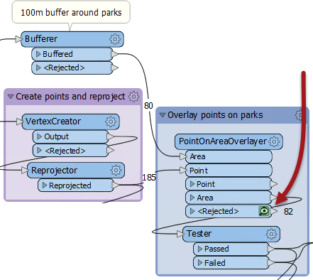

One reason might be that the MapInfo park features are being read after the Excel records. So, in the Navigator window move the Parks reader to the top of the list:

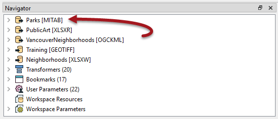

Re-run the workspace. Notice that the park features are now first. This part of the workspace should be working more efficiently now.

Try the same action on the Clipper transformer, to see if Clipper features are first so that the Clipper Type parameter can be set to Clippers First.

 **7) Re-Run Workspace**
 With Feature Caching off, re-run the entire workspace. Check if the log results show that the workspace is quicker and more memory efficient than it was before. The code review of your colleague's workspace is complete.

<!--Person X Says Section-->

<table style="border-spacing: 0px">
<tr>
<td style="vertical-align:middle;background-color:darkorange;border: 2px solid darkorange">
<i class="fa fa-quote-left fa-lg fa-pull-left fa-fw" style="color:white;padding-right: 12px;vertical-align:text-top"></i>
FME Lizard says...
</td>
</tr>

<tr>
<td style="border: 1px solid darkorange">

Overall, the difference might be very slight. The workspace may not be hugely faster or more memory efficient. However, it is better designed than the original workspace. This makes it more scalable, plus it will help to teach your colleague techniques that might, elsewhere, have a larger effect.

</td>
</tr>
</table>

---

<!--Exercise Congratulations Section--> 

<table style="border-spacing: 0px">
<tr>
<td style="vertical-align:middle;background-color:darkorange;border: 2px solid darkorange">
<i class="fa fa-thumbs-o-up fa-lg fa-pull-left fa-fw" style="color:white;padding-right: 12px;vertical-align:text-top"></i>
CONGRATULATIONS
</td>
</tr>

<tr>
<td style="border: 1px solid darkorange">

By completing this exercise, you have learned how to:
<ul><li>Reduce the amount of data being read</li>
<li>Adjust the order of writers in a workspace</li>
<li>Reorder transformers to get the best performance</li>
<li>Use performance-related transformer parameters</li>
<li>Adjust the order of readers in a workspace</li></ul>

</td>
</tr>
</table>