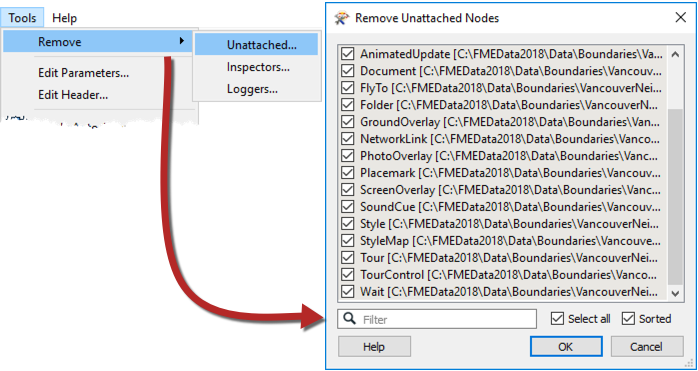
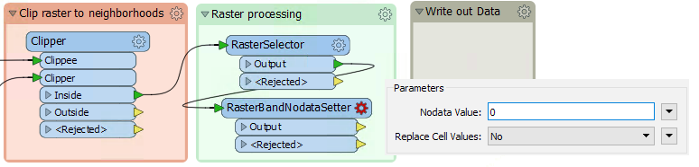
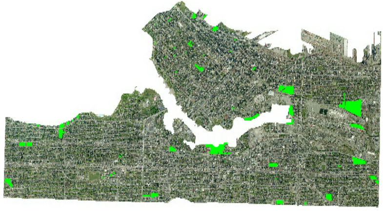
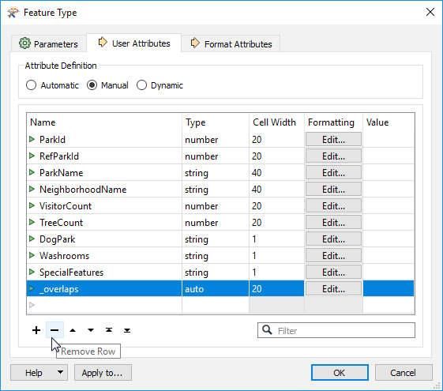
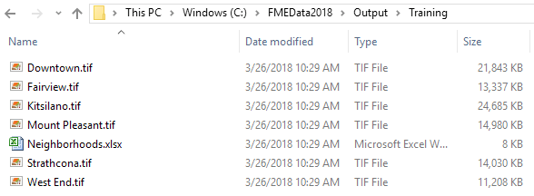

<!--Exercise Section-->

<table style="border-spacing: 0px;border-collapse: collapse;font-family:serif">
<tr>
<td style="vertical-align:middle;background-color:darkorange;border: 2px solid darkorange">
<i class="fa fa-cogs fa-lg fa-pull-left fa-fw" style="color:white;padding-right: 12px;vertical-align:text-top"></i>
Exercise 1
</td>
<!--AKA What Does the Log Say?-->
<td style="border: 2px solid darkorange;background-color:darkorange;color:white">
Public Art in Parks - Log File Interpreation
</td>
</tr>

<tr>
<td style="border: 1px solid darkorange; font-weight: bold">Data</td>
<td style="border: 1px solid darkorange">City Neighborhoods (Google KML) Public Art (Microsoft Excel) 
Parks (MapInfo Tab) 
City Orthophoto (GeoTIFF)</td>
</tr>

<tr>
<td style="border: 1px solid darkorange; font-weight: bold">Overall Goal</td>
<td style="border: 1px solid darkorange">Plan out a workspace and determine which parks do not contain public art</td>
</tr>

<tr>
<td style="border: 1px solid darkorange; font-weight: bold">Demonstrates</td>
<td style="border: 1px solid darkorange">Increasing workspace efficency and raster processing</td>
</tr>

<tr>
<td style="border: 1px solid darkorange; font-weight: bold">Start Workspace</td>
<td style="border: 1px solid darkorange">C:\FMEData2018\Workspaces\DesktopAdvanced\WorkspaceDesign-Ex2-Begin.fmw 
C:\FMEData2018\Workspaces\DesktopAdvanced\WorkspaceDesign-Ex2-Logfile.log</td>
</tr>

<tr>
<td style="border: 1px solid darkorange; font-weight: bold">End Workspace</td>
<td style="border: 1px solid darkorange"C:\FMEData2018\Workspaces\DesktopAdvanced\WorkspaceDesign-Ex2-Complete.fmw</td>
</tr>

</table>

Our workspace is almost complete, we just need to remove the black borders that were created when the raster was clipped and then write out the data to GeoTIFF. We should also look at making this workspace more efficent. 

---
 **1) Open Workspace**
 Start FME Workbench and open WorkspaceDesign-Ex3-Begin.fmw or continue working on the same workspace from the last exercise.  

 
 **2) Remove Extra Feature Types**
 When we added the Neighborhood KML back in the first exercise, we added all of the feature types associated with it, but we only ended up using the Neighborhood feature type. All these excess feature types can slow down a workspace. If there is data added to the canvas that isn't being used in the translation it should be removed. 

You can manually select all of the excess feature types and remove them or you can bulk remove them. To bulk remove them go to the top menu bar and go to Tools > Remove... > Unattached... Then select all and click OK:

---

<!--Tip Section--> 

<table style="border-spacing: 0px">
<tr>
<td style="vertical-align:middle;background-color:darkorange;border: 2px solid darkorange">
<i class="fa fa-info-circle fa-lg fa-pull-left fa-fw" style="color:white;padding-right: 12px;vertical-align:text-top"></i>
TIP
</td>
</tr>

<tr>
<td style="border: 1px solid darkorange">

You should also remove excess Loggers and Inspectors once you are done developing your workspace. 

</td>
</tr>
</table>

---

 **3) Remove No Data**
 Now that we have removed all the unused data we can continue with our workspace. 

To remove the no data black borders we will need to use two raster specific transformers, the RasterSelector and the RasterBandNoDataSetter. First, add the RasterSelector transformer and connect it to the Inside Output port on the Clipper. This transformer allows you to select specific bands and palletes to manipulate with other transformers. We will select all of the bands and palletes, so just accept the default parameters:

Next, add the RasterBandNoDataSetter transformer to the output port on the RasterSelector. In the parameters set the NoData Value to 0. The RasterBandNoDataSetter will remove no data values on the selected bands and palletes:

 **4) Run the Translation**
 Run the translation again and inspect the output from the RasterBandNoDataSetter:

The data looks good, all of the black borders are removed and it is split up by neighborhood, time to write it out. 

 **5) Write to GeoTIFF**
 
<table style="border: 0px">

<tr>
<td style="font-weight: bold">Writer Format</td>
<td style="">GeoTIFF (Geo-referenced Tagged Image File Format)</td>
</tr>

<tr>
<td style="font-weight: bold">Writer Dataset</td>
<td style="">C:\FMEData2018\Output\Training</td>
</tr>

<tr>
<td style="font-weight: bold">Raster File Definition</td>
<td style="">Automatic</td>
</tr>
</table>

Once the GeoTIFF writer is added to the canvas connect it to the Output port on the RasterBandNoDataSetter. Open the writer parameters and set the Raster File Name to the attribute NeighborhoodName. This will fanout our rasters so that each neighborhood will be written out as a separate GeoTIFF:

While we are in the parameters we should also remove some of the attributes since we don't need to write them all out. Switch the tab to User Attributes then select Manual for Attribute Definition. Now all the attribute can be edited. Select each row, then click the minus button at the bottom and remove all of the attributes:

---

<!--Tip Section--> 

<table style="border-spacing: 0px">
<tr>
<td style="vertical-align:middle;background-color:darkorange;border: 2px solid darkorange">
<i class="fa fa-info-circle fa-lg fa-pull-left fa-fw" style="color:white;padding-right: 12px;vertical-align:text-top"></i>
TIP
</td>
</tr>

<tr>
<td style="border: 1px solid darkorange">

If you know ahead of time that you don't want to write out all of the attributes when adding the writer, you can set the File Definition to None:
  

</td>
</tr>
</table>

---

 **6) Write to Excel**
 Just as we were about to send the rasters off, we were asked to provide an excel spreadsheet to accompany each park file. This is easy to do since already creates this data, we just need to write it out. 

Add an Excel Writer to the canvas:

<table style="border: 0px">

<tr>
<td style="font-weight: bold">Writer Format</td>
<td style="">Microsoft Excel</td>
</tr>

<tr>
<td style="font-weight: bold">Writer Dataset</td>
<td style="">C:\FMEData2018\Output\Training\Neighborhoods</td>
</tr>

<tr>
<td style="font-weight: bold">File Definition</td>
<td style="">Automatic</td>
</tr>
</table>

Once you've added it to the canvas, connect it to the Tester Passed port. Then go into the parameters and set the Sheet Name to NeighbourhoodName:

Then switch to the User Attributes tab and set the Attribute Definition to Manual. Remove the _overlaps attribute that was created by the PointOnAreaOverlayer, but keep the rest:

 **7) Run the translation**
 Finally, run the translation. In the Output\Training folder, there will be a GeoTIFF for each of the neighborhood rasters, as well as an Excel file with each neighborhood on separate sheets. 

---

<!--Exercise Congratulations Section--> 

<table style="border-spacing: 0px">
<tr>
<td style="vertical-align:middle;background-color:darkorange;border: 2px solid darkorange">
<i class="fa fa-thumbs-o-up fa-lg fa-pull-left fa-fw" style="color:white;padding-right: 12px;vertical-align:text-top"></i>
CONGRATULATIONS
</td>
</tr>

<tr>
<td style="border: 1px solid darkorange">

By completing this exercise you have learned how to:
<ul><li>Mosaic rasters together</li>
<li>Remove NoData from rasters</li>
<li>Debug a workspace by reading the log file</li>
<li>Interpret the log file to understand what transformers are doing</ul>

</td>
</tr>
</table>

