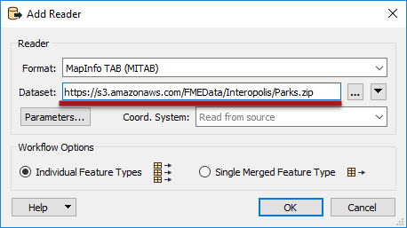
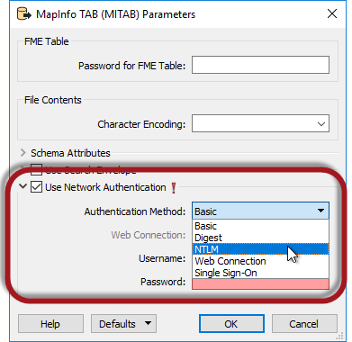
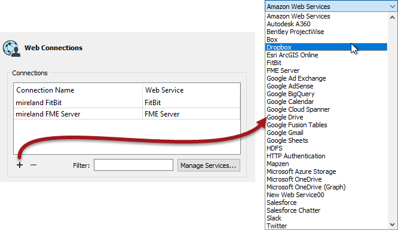
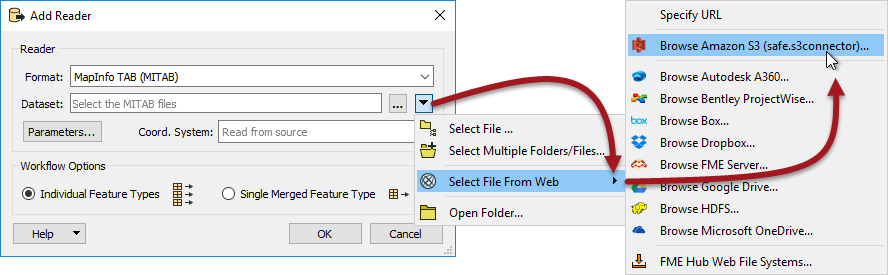
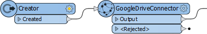

# Web Based Datasets #

There can be no doubt that there is a trend towards data being stored in the cloud, including spatial data. For that reason FME has comprehensive tools for reading datasets that are web-based.
 

## Simple URL Selection ##

The easiest way to read a web-based dataset is to simply paste the URL into the source dataset parameter.

 <!-- **Update screenshot -->

Here the workspace author is adding a reader to read a Shapefile directly from an open data ftp site.

---

<!--Person X Says Section-->
<!--Sister Intuitive is the representative for this chapter-->

<table style="border-spacing: 0px">
<tr>
<td style="vertical-align:middle;background-color:darkorange;border: 2px solid darkorange">
<i class="fa fa-quote-left fa-lg fa-pull-left fa-fw" style="color:white;padding-right: 12px;vertical-align:text-top"></i>
Sister Intuitive says…
</td>
</tr>

<tr>
<td style="border: 1px solid darkorange">

A folder-based dataset must be compressed to a single zip file for FME to read it from the web like this; the above is a perfect illustrations of that requirement. Datasets can be read from non-zipped datasets, but only when the dataset consists of a single file (such as an AutoCAD DWG file).

</td>
</tr>
</table>

---

The URL entered into a source dataset field may also be a reference to a shared resource on a web-based file storage system. For example, here a user is reading a MapInfo TAB dataset directly from a Dropbox link into the FME Data Inspector:

The key is to force the web service to provide a direct link to the file, rather than to their own web interface. For example, to cause Dropbox to render data you should [set the dl query parameter](https://www.dropbox.com/en/help/201) to 1 in the URL, as in the above screenshot, instead of the default value of 0 (zero).

However, there are better ways to read data from a web service...

---

<!--Tip Section--> 

<table style="border-spacing: 0px">
<tr>
<td style="vertical-align:middle;background-color:darkorange;border: 2px solid darkorange">
<i class="fa fa-info-circle fa-lg fa-pull-left fa-fw" style="color:white;padding-right: 12px;vertical-align:text-top"></i>
TIP
</td>
</tr>

<tr>
<td style="border: 1px solid darkorange">

If the web site data is being read from needs authentication, most readers have parameters to enter such information:
  

</td>
</tr>
</table>

---

## Web Services ##

Besides being able to read from a URL, FME can also directly access certain web services to read data. This is done with functionality inside FME called **Web Connections**.

Web Connections are created by selecting Tools &gt; FME Options &gt; Web Connections on the FME Workbench menubar and clicking the plus button in the Web Connections dialog:

 <!-- ** Update Screenshot --> 

---

There are a large number of web services to which a connection can be made - and the Manage Services button allows you to integrate any other web service you require - but the key ones are:
<!-- Condensing white space for this list by putting it into a table-->
<table>
<tr>
    <td style="border: 1px solid white; background-color:white">&bull; Amazon S3</td>
    <td style="border: 1px solid white; background-color:white">&bull; FME Server</td>
</tr>
<tr>
    <td style="border: 1px solid white; background-color:white">&bull; Autodesk A360</td>
    <td style="border: 1px solid white; background-color:white">&bull; Google Drive</td>
</tr>
<tr>
    <td style="border: 1px solid white; background-color:white">&bull; Box</td>
    <td style="border: 1px solid white; background-color:white">&bull; HDSF</td>
</tr>
<tr>
    <td style="border: 1px solid white; background-color:white">&bull; Dropbox</td>
    <td style="border: 1px solid white; background-color:white">&bull; Microsoft OneDrive</td>
</tr>
</table>

These are key types because they are capable of storing data in a way that can be accessed directly from the Add Reader dialogs:

 <!-- ** Update Screenshot-->

In the above screenshot an author is adding a CSV dataset from Google Drive. This action opens a dialog in which they can browse Google Drive for the required file:

<!-- **Update Screenshot--> 

The reader is then added to the workspace and functions just as any other.

Note that if you wish to use a FeatureReader transformer instead of a reader, then the same "Select File From Web" option is available.

---

<!--Warning Section--> 

<table style="border-spacing: 0px">
<tr>
<td style="vertical-align:middle;background-color:darkorange;border: 2px solid darkorange">
<i class="fa fa-exclamation-triangle fa-lg fa-pull-left fa-fw" style="color:white;padding-right: 12px;vertical-align:text-top"></i>
WARNING
</td>
</tr>

<tr>
<td style="border: 1px solid darkorange">

Obviously there is an authentication step that needs to be carried out when adding a new web service connection into FME, and if the workspace is published to FME Server or simply copied to another FME Desktop installation, then the same authentication needs to be carried out in the new location.

</td>
</tr>
</table>

---

## Connector Transformers ##

Besides being able to direct a reader to a web service, various transformers exist that can read files. These relate to the same list supported by readers, so we have:
<!-- Condensing white space for this list by putting it into a table-->
<table>
<tr>
    <td style="border: 1px solid white; background-color:white">&bull; AutodeskA360Connector</td>
    <td style="border: 1px solid white; background-color:white">&bull; OneDriveConnector</td>
</tr>
<tr>
    <td style="border: 1px solid white; background-color:white">&bull; BoxConnector</td>
    <td style="border: 1px solid white; background-color:white">&bull; PintrestConnector</td>
</tr>
<tr>
    <td style="border: 1px solid white; background-color:white">&bull; DropboxConnector</td>
    <td style="border: 1px solid white; background-color:white">&bull; S3Connector</td>
</tr>
<tr>
    <td style="border: 1px solid white; background-color:white">&bull; FMEServerResourceConnector</td>
    <td style="border: 1px solid white; background-color:white">&bull; SalesForceConnector</td>
</tr>
<tr>
    <td style="border: 1px solid white; background-color:white">&bull; GoogleDriveConnector</td>
    <td style="border: 1px solid white; background-color:white">&bull; SlackConnector</td>
</tr>
<tr>
    <td style="border: 1px solid white; background-color:white">&bull; HDFSConnector </td>
    <td style="border: 1px solid white; background-color:white"></td>
</tr>
</table>

These transformers don't *read* data in the traditional FME sense. Instead they read a selected file and either add the contents to an attribute or download the file to the local filesystem.

Here, for example, an author is using a Creator transformer to trigger the reading of a file from Google Drive:

 

The contents of the file have been added to an attribute that can then be processed as required. For example, maybe it is a snippet of XML that can be decoded with an XML transformer.

---

<!--Tip Section--> 

<table style="border-spacing: 0px">
<tr>
<td style="vertical-align:middle;background-color:darkorange;border: 2px solid darkorange">
<i class="fa fa-info-circle fa-lg fa-pull-left fa-fw" style="color:white;padding-right: 12px;vertical-align:text-top"></i>
TIP
</td>
</tr>

<tr>
<td style="border: 1px solid darkorange">

Connector transformers can also upload a file, list the contents of a web service, and delete files from that service.

</td>
</tr>
</table>

---

Given the "Select File From Web" tool on readers, Connector transformers are not generally intended for reading source data; although they could be used to download a file that is subsequently read using a FeatureReader.

Another use would be to retrieve a list of files that are then read directly using a FeatureReader.

But perhaps the more likely use is to transfer written data to the web. Writers don't have an equivalent "Select File From Web" option, so the best alternative is to write data with a FeatureWriter transformer and then use a Connector transformer to transfer that data to a web service of choice. 

