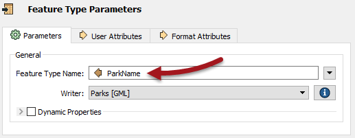

## Feature Type Fanout ##

A Feature Type Fanout delivers data to multiple feature types (layers/tables) within a single dataset. Taking the elevation example, here the output is a different feature type for each elevation value:

The result of this fanout is a DXF dataset containing multiple layers of data.

### Setting a Feature Type Fanout ###

A feature type fanout is not a specific setting. Instead it is defined by selecting an attribute for a writer feature type name, like so:

The Feature Type Name then changes to match what is selected:

In this case, each park record with a different neighborhood gets written to a different sheet of the Excel output spreadsheet. The Excel file will have a sheet named Downtown, a sheet named Kitsilano, and so on.
