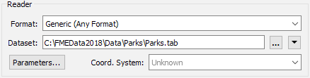
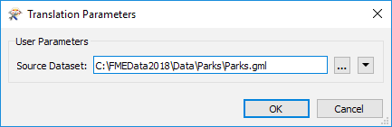
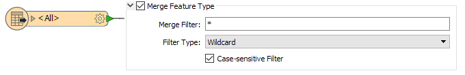
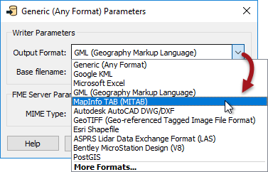

# The Generic Reader/Writer

The Generic Reader and Generic Writer allow FME workspaces to be freed from format restrictions.

Where all other readers and writers are tied to a specific format of data, the Generic Reader and Generic Writer are not. The Generic Reader is capable of reading almost any format of data, and the Generic Writer is capable of writing almost any format of data.

In that way, a single workspace can be used to process different data formats without being specifically set up for that format.

--- 

## The Generic Reader ##

A Generic Reader is used in the same way as any other reader; by specifying the format in the Add Reader (or Generate Workspace) dialog:

There the source dataset is an AutoCAD DWG dataset, but FME does not know that yet. When the workspace is run FME examines the extension of the file chosen to determine this for itself.

At a later time the end-user might then choose a different file - in a completely different format - to be read, like so:

Again, at runtime FME examines the file extension to identify the format of data and then - having discovered it is MicroStation DGN - reads it just as if it were a true DGN reader.

That way a single reader can be made to read any format of data.

---

<table style="border-spacing: 0px">
<tr>
<td style="vertical-align:middle;background-color:darkorange;border: 2px solid darkorange">
<i class="fa fa-quote-left fa-lg fa-pull-left fa-fw" style="color:white;padding-right: 12px;vertical-align:text-top"></i>
Sister Intuitive says…
</td>
</tr>

<tr>
<td style="border: 1px solid darkorange">

You're thinking there must be a catch, right? Well, it's true. Firstly this technique only works with file-based formats (it won't work on a database or web format). Secondly, the Generic Reader is not immune from the Unexpected Input Remover, so switching datasets - regardless of format - only works with a compatible schema (see below).

</td>
</tr>
</table>

---

### Generic Reader Feature Types ###
The Unexpected Input Remover is the function in FME that filters incoming data against the list of permitted feature types. If the incoming data is not defined in the workspace, then it is dropped from the translation. 

In the previous example, traffic signals in the AutoCAD dataset were stored on a layer called "TrafficSignals", and the workspace names the reader feature type so. But, if the MicroStation file stored data on a different layer, then this would be the result:

All 778 records were dropped from the translation. So, although the Generic Reader allows you to read datasets of different formats, the limitation is that each dataset must have its layers defined as feature types in the workspace.

Of course, an easy way to allow all layers to pass is to set a Merge Feature Type in the Feature Type Properties:

With that setup, any layer of data can be passed into the workspace, regardless of format. Of course, even then you need to be careful about assuming what attributes will be available!

---

## The Generic Writer ##

A Generic Writer is used in the same way as any other writer; by specifying the format in the Add Reader (or Generate Workspace) dialog:

There the destination dataset is specified as a folder. FME does not know the format to be written yet and so will not know whether it is file-based or folder-based.
The format required to be written can be specified by the author through a parameter when the writer is added:

...by the author in the Navigator window, or the end-user can specify it at runtime using an automatically created user parameter:

That way a single writer can be made to write any format of data, the format being chosen by the end-user at runtime.

---

<table style="border-spacing: 0px">
<tr>
<td style="vertical-align:middle;background-color:darkorange;border: 2px solid darkorange">
<i class="fa fa-quote-left fa-lg fa-pull-left fa-fw" style="color:white;padding-right: 12px;vertical-align:text-top"></i>
Sister Intuitive says…
</td>
</tr>

<tr>
<td style="border: 1px solid darkorange">

Generic Readers and Writers by nature only deal with a flexible format, but can also be set up to be flexible with layers using a Merge Filter or Fanout.
  However, each dataset being read must have the same attribute schema. Additionally, each dataset written receives an identical attribute schema. This part is not flexible.
  Flexible attribute schemas require the use of either Automatic Attribute Definitions or a Dynamic Translation.

</td>
</tr>
</table>
