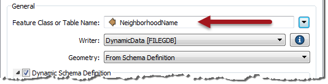

## Dynamic Feature Types ##

There are three main components of a schema:

- Feature Type
- Attributes
- Geometry

This section looks at Feature Types, and how a workspace author can change the feature types that are written in a dynamic translation.

---

### Defining Feature Type Names ###

In static writer feature types, the feature type name is usually a fixed value. However, it can also be defined by an attribute (or string constructed from attributes). We call that a Fanout.

In a dynamic translation, a fanout is set automatically. By default an FME attribute called **fme&#95;feature&#95;type** is used as the feature type name:

fme&#95;feature&#95;type is an FME attribute that stores the name of the original feature type on incoming features. It makes sense to default to this attribute because then all data is written to the same feature type as it came from, and we get an output that is a duplicate of the input.

However, should you wish, there's no reason why a different attribute couldn't be used, in order to define a different set of output feature types:

Here, for example, the author is using NeighborhoodName to supply the name of the layers to create. For example, features might have the value Downtown, West End, or Fairview.

At runtime, FME looks in each of the Schema Sources to find a table called Downtown. It will use the schema of that table to define the attributes and geometry allowed in the dynamic writer's output.

---

#### Schema Requirements ####

Of course, be aware that this isn't exactly the same thing as a fanout. A fanout creates layers from a static definition. A dynamic workspace fetches that definition from somewhere else (the schema source).

Therefore, the feature type names chosen **must** match a layer that exists in that source schema.

Failure to do so will lead to the data being dropped - instead of written - with a log message reporting the problem. For example, if the NeighborhoodName attribute had values (like "Downtown" or "Kitsilano") that didn't exist as a table in the schema source, there would be log messages like this:

<pre>
===========================================================================
FileGDB Writer: A feature with feature type `Downtown' could not be written
+++++++++++++++++++++++++++++++++++++++++++++++++++++++++++++++++++++++++++
===========================================================================
FileGDB Writer: A feature with feature type `Kitsilano' could not be written
+++++++++++++++++++++++++++++++++++++++++++++++++++++++++++++++++++++++++++
</pre>

What the author must ensure is that the schema used actually contains these layers. Then the translation will proceed as expected.