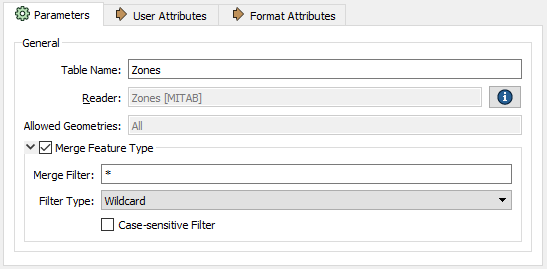
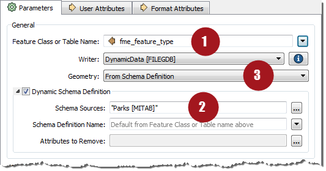

# Schema Handling in Dynamic Translations #

Checking the feature type properties for a dynamic translation reveals the checkboxes that turn on this behavior.

For a reader, all that is really happening is the merge feature type setting is turned on:

Unchecking that box turns off the full behavior and there are not many parameters to adjust. However, for a writer, the dialog is a bit more complex:

The three components of schema - 1) feature type, 2) geometry, and 3) attributes - all have different ways in which they can be set.

---

<table style="border-spacing: 0px">
<tr>
<td style="vertical-align:middle;background-color:darkorange;border: 2px solid darkorange">
<i class="fa fa-quote-left fa-lg fa-pull-left fa-fw" style="color:white;padding-right: 12px;vertical-align:text-top"></i>
Sister Intuitive says…
</td>
</tr>

<tr>
<td style="border: 1px solid darkorange">

By <strong>default</strong> the writer schema in a dynamic translation is defined not in the workspace, but by the source dataset. So whatever dataset is chosen as input defines the chosen output structure. Simple.
  However, the parameters in a writer feature type let us alter how that schema is defined. We can choose to take the structure from an entirely different dataset to the source. Or, we can individually define each component of our schema (Feature Types, Attributes, Geometry) in a variety of ways. 
  So, we'll start out by looking at how to use a schema from a different dataset, then we'll look at each schema component separately.

</td>
</tr>
</table>
