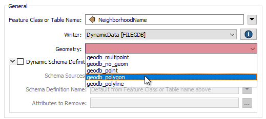
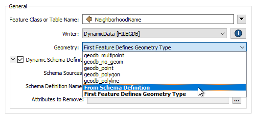

## Dynamic Geometry ##

Of the three main components of a schema:

- Feature Type
- Attributes
- Geometry

...the last of these to investigate is Geometry; in particular how a workspace author can decide which geometries are valid for a particular feature type.

---

### Schema Geometry Definition ###

The geometry permitted in an output dataset depends on the format used. Some formats allow any geometry - or mix of geometries - to exist in a feature type.

However, some formats do not allow a mix of geometries in a single feature type, and that can cause problems.

For example, a standard (static) Geodatabase writer feature type allows you to pick the geometry allowed in that file:

In a dynamic workspace, this changes. The geometry type can be chosen manually, depending on the first feature, or depending on the chosen schema definition:

In Schema Definition mode, and when the data being read provides the schema, then the permitted geometry is a duplicate of that source dataset's schema.

But when the Schema Source parameter is changed to point to another dataset, then the permitted geometry is defined by that dataset's schema. 

If the geometry of the data to be written is different from that schema, and the destination format does not support multiple geometry types, then features would be dropped instead of written.

---

### Fixed Geometry Definition ###

Even in a dynamic translation, the workspace author may set the dynamic schema parameter for permitted geometry back to a fixed value. For example, the author could choose geodb&#95;polygon (for a Geodatabase) or shape&#95;polygon (for a Shapefile). 

This will override the geometry defined by the chosen schema source, so that polygon features (but only polygon features) can be written.

---

### First Feature Geometry Definition ###

The other option for defining geometry type is First Feature Defines Geometry Type.

Geometry type can be difficult to handle in a dynamic translation because there is a degree of uncertainty about what geometry types might be in the source data, and how well they will match up to the geometry types specified in the source schema. However, this same uncertainty makes it difficult to set a fixed geometry definition.

The First Feature Defines Geometry Type option solves this. When selected, the first feature to arrive at the writer gets to set the geometry type. That way the author does not need to know in advance what geometry is being processed or what geometry the schema permits.

For example, if the first feature is a polygon, then the geometry type for that feature type is set to polygon only; subsequent features destined for the same feature type are refused if they do not have the same polygon geometry.

---

<table style="border-spacing: 0px">
<tr>
<td style="vertical-align:middle;background-color:darkorange;border: 2px solid darkorange">
<i class="fa fa-quote-left fa-lg fa-pull-left fa-fw" style="color:white;padding-right: 12px;vertical-align:text-top"></i>
FME Lizard says…
</td>
</tr>

<tr>
<td style="border: 1px solid darkorange">

If you've understood everything so far about dynamic translations, without having to read each section at least twice, then you are doing very well. This is a very advanced topic, and not everyone understands it the first time.
  To summarize, all of these settings allow us to create an output dataset whose schema is defined not by the source data, but in multiple other ways. 
  If you can keep that idea in your head when faced with schema handling beyond the usual static workspace, you'll know what functionality is required and can look it up in this manual or in the <a href="https://knowledge.safe.com/index.html">FME Knowledgebase</a>, and be able to figure out what techniques match your particular need.
  Also, remember this key table...
 <table border=1 cellspacing=0 cellpadding=0>
<tr>
<td></td>
<td style="font-weight:bold;text-align:center">I know the format</td>
<td style="font-weight:bold;text-align:center">I don't know the format</td>
<td></td>
</tr>
<tr>
<td style="font-weight:bold;text-align:right">I know the feature types</td>
<td style="text-align:center;">Static</td>
<td style="text-align:center;">Generic + Static</td>
<td style="font-weight:bold;text-align:left">I know the attributes</td>
</tr>
<tr>
<td style="font-weight:bold;text-align:right">I don't know the feature types</td>
<td style="text-align:center;">Fanout</td>
<td style="text-align:center;">Generic + Fanout</td>
<td style="font-weight:bold;text-align:left">I know the attributes</td>
</tr>
<tr>
<td style="font-weight:bold;text-align:right">I know the feature types</td>
<td style="text-align:center;">Dynamic</td>
<td style="text-align:center;">Generic + Dynamic</td>
<td style="font-weight:bold;text-align:left">I don't know the attributes</td>
</tr>
<tr>
<td style="font-weight:bold;text-align:right">I don't know the feature types</td>
<td style="text-align:center;">Dynamic</td>
<td style="text-align:center;">Generic + Dynamic</td>
<td style="font-weight:bold;text-align:left">I don't know the attributes</td>
</tr>
</table>

</td>
</tr>
</table>
