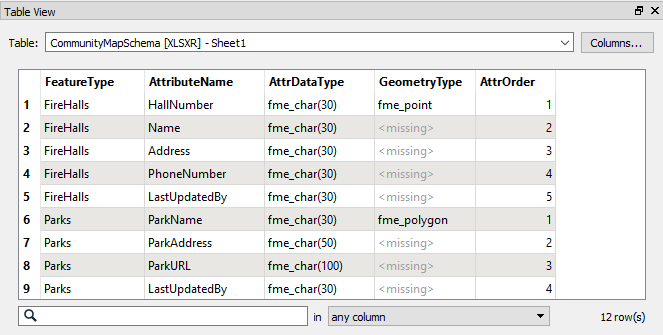
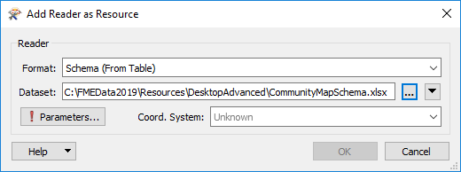
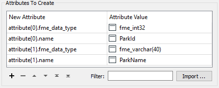
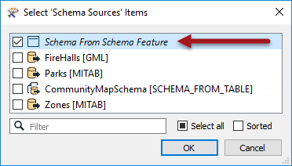

# Alternative Dynamic Schema Sources #

In general, the schema for a dynamic translation comes from either the source dataset itself or from a different dataset (such as the database table the data is being written to).

However, there are two other scenarios for providing the output schema: 

- A schema can come from a lookup table (text file or spreadsheet) in which definitions are stored
- A schema can be defined dynamically as a list of attributes in a workspace

---

## Table-Based Schemas ##

In this scenario, the output schema is stored as some form of a table in a text file or spreadsheet; for example:

Here the author has listed a series of feature types, attributes, and geometry types that define the output schema. In FME they would use this schema by adding a Resource Reader. The format of the Resource Reader would be Schema (From Table):

In the parameters dialog for this reader there are parameters to specify which fields in the table represent which parts of the schema:

Geometry type is optional but used in this example.

Attribute sequence is another optional parameter. It defines a field in the table that records the order that attributes should appear in.

Then, of course, this reader must be used as the source for the output schema:

As always, the incoming attributes must be mapped to the outgoing schema. The best way here is the SchemaMapper transformer since it too can use a lookup table to create its mappings.

---

<table style="border-spacing: 0px">
<tr>
<td style="vertical-align:middle;background-color:darkorange;border: 2px solid darkorange">
<i class="fa fa-quote-left fa-lg fa-pull-left fa-fw" style="color:white;padding-right: 12px;vertical-align:text-top"></i>
FME Lizard says…
</td>
</tr>

<tr>
<td style="border: 1px solid darkorange">

A significant advantage of this method is that you don’t need to edit the workspace, or edit a dataset, to make schema changes. Once you change the output schema in the table, then that is automatically applied in the FME translation.

</td>
</tr>
</table>

---

## Constructed Attribute Schemas ##

This scenario is a way to construct an attribute schema using lists in FME. The schema is defined by using attributes in the list, for example:

The writer is told to use this schema in preference to any others by selecting it as the Source Schema:

---

### FME Data Types ###

Both of the two preceding tools allow the user to define attribute type in an output schema.
There are a set of valid datatypes in FME, which are as follows:

<table>
<tr><th>General Field Type</th><th>Specific Field Types</th></tr>
<tr><td>Character Fields</td><td>fme&#95;varchar(width), fme&#95;char(width), fme&#95;char</td></tr>
<tr><td>Integer Fields</td><td>fme&#95;uint8, fme&#95;int16, fme&#95;uint16, fme&#95;int32, fme&#95;uint32, fme&#95;int64,fme&#95;uint64</td></tr>
<tr><td>Numeric Fields</td><td>fme&#95;decimal(width,decimal), fme&#95;real32, fme&#95;real64</td></tr>
<tr><td>Date-Time Fields</td><td>fme&#95;datetime, fme&#95;time, fme&#95;date</td></tr>
<tr><td>Other Fields</td><td>fme&#95;buffer, fme&#95;boolean</td></tr>
</table>

---

<table style="border-spacing: 0px">
<tr>
<td style="vertical-align:middle;background-color:darkorange;border: 2px solid darkorange">
<i class="fa fa-quote-left fa-lg fa-pull-left fa-fw" style="color:white;padding-right: 12px;vertical-align:text-top"></i>
FME Lizard asks…
</td>
</tr>

<tr>
<td style="border: 1px solid darkorange">

<quiz name="">
  <question>
    

      Q) The ability to construct a dynamic schema from attributes in a workspace has lots of possibilities. In fact, one of these FME transformers automatically creates dynamic schema attributes specifically so you can create a new schema. Which is it?
    

    <answer><li>SchemaMapper</answer>
    <answer correct><li>AttributePivoter</answer>
    <answer><li>PythonCaller</answer>
    <answer><li>Clipper</answer>
    <explanation>  A) The AttributePivoter creates a whole new series of attributes that are completely different to the source schema; therefore it also generates a dynamic schema to assist you in writing the data. Check it out and you will see it creates a whole series of attribute&#95;name{} and attribute&#95;data&#95;type{} list attributes.</explanation>
  </question>
</quiz>

</td>
</tr>
</table>