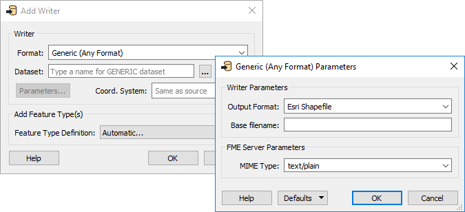
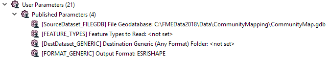
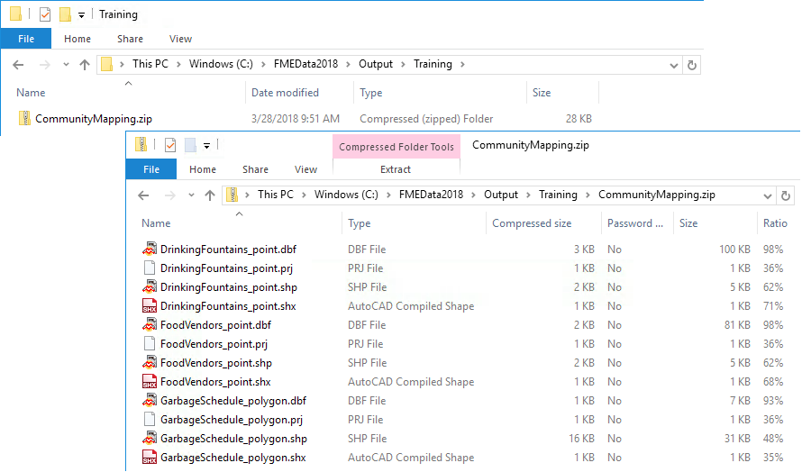

<!--Exercise Section-->

<table style="border-spacing: 0px;border-collapse: collapse;font-family:serif">
<tr>
<td style="vertical-align:middle;background-color:darkorange;border: 2px solid darkorange">
<i class="fa fa-cogs fa-lg fa-pull-left fa-fw" style="color:white;padding-right: 12px;vertical-align:text-top"></i>
Exercise 2
</td>
<td style="border: 2px solid darkorange;background-color:darkorange;color:white">
Community Mapping Data Translation Project
</td>
</tr>

<tr>
<td style="border: 1px solid darkorange; font-weight: bold">Data</td>
<td style="border: 1px solid darkorange">Community Mapping (Esri File Geodatabase)</td>
</tr>

<tr>
<td style="border: 1px solid darkorange; font-weight: bold">Overall Goal</td>
<td style="border: 1px solid darkorange">Create a workspace to translate Community Mapping data to a format of the end-user's choice and zip it</td>
</tr>

<tr>
<td style="border: 1px solid darkorange; font-weight: bold">Demonstrates</td>
<td style="border: 1px solid darkorange">Generic Writer, fanout and writing zip files</td>
</tr>

<tr>
<td style="border: 1px solid darkorange; font-weight: bold">Start Workspace</td>
<td style="border: 1px solid darkorange">None</td>
</tr>

<tr>
<td style="border: 1px solid darkorange; font-weight: bold">End Workspace</td>
<td style="border: 1px solid darkorange">C:\FMEData2018\Workspaces\DesktopAdvanced\ReadWrite-Ex2-Complete.fmw</td>
</tr>

</table>

As resident FME expert you are often asked to translate data (particularly the community map) between formats. You realize that it would be way simpler if you created a workspace to do this - regardless of format - and let the end-users carry out the translation themselves. In the future this would make an excellent use for an FME Server Data Download service, but for now we'll let the users simply run the workspace in FME Workbench.
 

 **1) Start Workbench**
 Start FME Workbench and begin with an empty canvas. Select Readers > Add Reader from the menubar and add the following:

<table style="border: 0px">

<tr>
<td style="font-weight: bold">Reader Format</td>
<td style="">Esri Geodatabase (File Geodb Open API)</td>
</tr>

<tr>
<td style="font-weight: bold">Reader Dataset</td>
<td style="">C:\FMEData2018\Data\CommunityMapping\CommunityMap.gdb</td>
</tr>

<tr>
<td style="font-weight: bold">Workflow Options</td>
<td style="">Single Merged Feature Type</td>
</tr>

</table>

By selecting the single merged feature type option we will have a workspace that is nice and compact, plus it will allow the user to select which tables they want to read from the source.

Click OK to close the dialog and add the reader.

 **2) Add Writer**
 Select Writers > Add Writer from the menubar and add a Generic Writer:

<table style="border: 0px">

<tr>
<td style="font-weight: bold">Writer Format</td>
<td style="">Generic (Any Format)</td>
</tr>

<tr>
<td style="font-weight: bold">Writer Dataset</td>
<td style=""></td>
</tr>

<tr>
<td style="font-weight: bold">Writer Parameters</td>
<td style="">Output Format: Esri Shapefile</td>
</tr>

<tr>
<td style="font-weight: bold">Add Feature Types</td>
<td style="">Feature Type Definition: Automatic</td>
</tr>

</table>

You don’t have to select an output location, but will you have to open the parameters dialog and set an original output format; so do that and select a format like Esri Shapefile.

In the "Add Feature Types" section of the dialog, select Automatic for feature type definitions:

Click OK and the Feature Type Properties dialog for the new writer will open automatically. Set the Geometry field to fme_any. This will allow any data to be written to this feature type:

Click OK to close the dialog and to add the new feature type. Connect it to the source feature type. When you make the connection the attribute schema will automatically be updated to match the connected reader feature type:

 **3) Check User Parameters**
 Look in the Navigator window at the user parameters that were created automatically with the reader and writer:

The parameter for SourceDataset_FILEGDB is something we won’t ever need (this translation will always use the same dataset) so delete it.

Another automatically created parameter is called Feature Types to Read. This is very useful because when the user runs the workspace they will be prompted to select which tables to read from the source Geodatabase, so keep this parameter.

Similarly keep the Destination Dataset parameter.

The Output Format parameter is interesting. Double-click on it as if you were going to set a value. Notice that the "More Formats..." option in the drop-down list opens up the full FME formats list:

It wouldn’t be fair to the end-user to expose so many formats, when they don’t really need to see or select most of them. It would be better to restrict this list. So, delete this user parameter and we’ll create a new - more restrictive - one.

 **4) Add User Parameter**
 Add a new User Parameter by right-clicking on User Parameters and selecting Create User Parameter.

In the dialog that opens set the following:

<table style="border: 0px">

<tr>
<td style="font-weight: bold">Type</td>
<td style="">Choice with Alias</td>
</tr>

<tr>
<td style="font-weight: bold">Name</td>
<td style="">OutputFormat</td>
</tr>

<tr>
<td style="font-weight: bold">Published</td>
<td style="">Yes (checked)</td>
</tr>

<tr>
<td style="font-weight: bold">Optional</td>
<td style="">No (unchecked)</td>
</tr>

<tr>
<td style="font-weight: bold">Prompt</td>
<td style="">Select Output Format:</td>
</tr>

</table>

For the configuration field click the browse button to open a new dialog. In that dialog, select Import &gt; Writer Formats. Select a handful of the most common formats like Esri Shapefile, AutoCAD DWG, GML, and MapInfo TAB; then click OK.

Then click OK twice more until all the dialogs are closed.

 **5) Link Parameter**
 Now, in the Navigator window, expand the parameters for the Generic Writer. Locate the Output Format parameter. Right-click it and choose Link to User Parameter.

Select the newly created OutputFormat parameter and click OK:

Now when the workspace is run, the choice of output format will be between these few:

 **6) Expose Format Attribute**
 The other, final, task we can do here is to output the features to their original table. To do this we need to know where they came from, and that is obtained from a format attribute called *fme&#95;feature&#95;type*.

Inspect the properties for the writer feature type. Set a fanout by choosing *fme&#95;feature&#95;type* as the attribute supplying the feature type name.

 **7) Save and Run Workspace**
 Save the workspace and then run it with the prompt option set. When prompted, select some source tables to read (include at least the GarbageSchedule plus one other).

Then for Destination Generic (Any Format) Folder, we will create a zipped folder to contain all of our files. Set the location of an output folder then at the end type:

<pre>
    \CommunityMapping.zip
</pre>

This will create a zipped file called CommunityMapping.

Finally, set Esri Shapefile as the format to write. Click OK to run the translation

Examine the output folder. A zipped folder has been created which contains all the selected tables that have been written back to Shapefile format:

Now you have a solution that almost anyone will be able to open and run for themselves. Also, if you published the workspace to FME Server it would automatically create a web page that matched the different user parameters.

---

<table style="border-spacing: 0px">
<tr>
<td style="vertical-align:middle;background-color:darkorange;border: 2px solid darkorange">
<i class="fa fa-quote-left fa-lg fa-pull-left fa-fw" style="color:white;padding-right: 12px;vertical-align:text-top"></i>
Sister Intuitive says…
</td>
</tr>

<tr>
<td style="border: 1px solid darkorange">

Did you notice that FME handled the different geometry types and output the files with the geometry as part of the name? It’s a Shape format thing. FME can never – and will never – write more than one geometry type to the same Shape file.
  The one drawback is that each output Shape file has <strong>all</strong> of the attributes of <strong>all</strong> of the source tables. To avoid that you would need to use a dynamic translation, as we shall see shortly.

</td>
</tr>
</table>

---

<!--Exercise Congratulations Section--> 

<table style="border-spacing: 0px">
<tr>
<td style="vertical-align:middle;background-color:darkorange;border: 2px solid darkorange">
<i class="fa fa-thumbs-o-up fa-lg fa-pull-left fa-fw" style="color:white;padding-right: 12px;vertical-align:text-top"></i>
CONGRATULATIONS
</td>
</tr>

<tr>
<td style="border: 1px solid darkorange">

By completing this exercise you have learned how to:
<ul><li>Add a Generic Writer to a workspace</li>
<li>Set the initial format of a Generic Writer</li>
<li>Create a Choice with Alias parameter that prompts for a writer format</li>
<li>Use a Choice with Alias parameter for the Generic Writer output format</li>
<li>Use a feature type fanout on fme_feature_type to return features to their original layer</li>
<li>Use a .zip extension to create zipped output datasets</li>

</td>
</tr>
</table>
