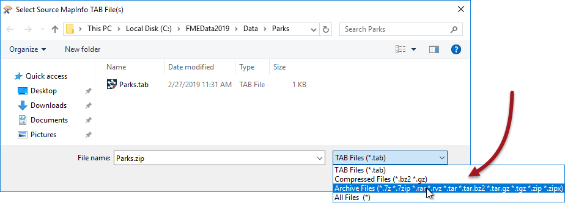
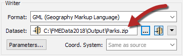
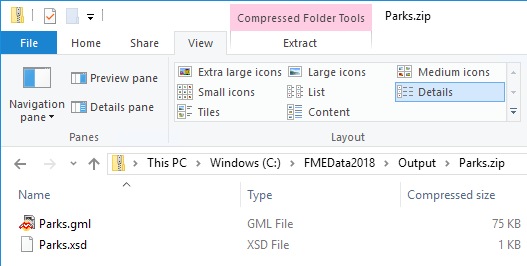

# Archive File Handling

Both FME readers and writers are capable of working with compressed, archived files of various formats. As well as a size reduction, these file types are a convenient way to store datasets that need handling as a single unit; for example, a set of multiple dataset files contained within a single zip file.

---

## Archive File Reading ##

The dataset a reader reads is defined by the Source Dataset/Files parameter in the Navigator window:

 

As in the above screenshot, this dataset parameter can point to an archived file. You simply select the archive file in the source parameter and FME will extract the data when it is being read. 

This technique works regardless of whether the archived dataset is file-based (like a single AutoCAD file) or folder-based (like the set of files that make up a Shapefile dataset).

The only difficulty in setting this up is to remember that the file browser does not display archive files by default and that the file extension being viewed must be changed:

---

<!--New Section--> 

<table style="border-spacing: 0px">
<tr>
<td style="vertical-align:middle;background-color:darkorange;border: 2px solid darkorange">
<i class="fa fa-bolt fa-lg fa-pull-left fa-fw" style="color:white;padding-right: 12px;vertical-align:text-top"></i>
NEW
</td>
</tr>

<tr>
<td style="border: 1px solid darkorange">

Previous versions of FME allowed reading (and writing) of Zip-format archives. FME 2019 introduces support for other archive formats such as 7zip and RAR.

</td>
</tr>
</table>

---

## Archive File Writing ##

Writing data as an archive file is particularly useful for where the output data needs to be post-processed. For example, if you use a shutdown script to move or copy output data to a new location, it’s more convenient to handle a single archive file than multiple data files.

The simplest way to create an archived output is to change the file extension in the output dataset field:

 

You can also specify the filename to be written inside the archive file. In fact, a shortcut button does this for you for Zip format archives:

 

Notice the small icon in the dataset field that indicates the zipped status.

When the workspace is run the log file reports the file creation at various points:

<pre>
MULTI_WRITER: Output will be zipped
Zipping contents of temporary dataset
Finished updating output zip file: `C:\FMEData2019\Output\Parks.zip'
</pre>

...and the output is, indeed, an archived dataset: 

 

---

<!--Person X Says Section-->

<table style="border-spacing: 0px">
<tr>
<td style="vertical-align:middle;background-color:darkorange;border: 2px solid darkorange">
<i class="fa fa-quote-left fa-lg fa-pull-left fa-fw" style="color:white;padding-right: 12px;vertical-align:text-top"></i>
FME Lizard says…
</td>
</tr>

<tr>
<td style="border: 1px solid darkorange">

Some users may want to archive data in order to move or copy it to a different location as a single entity. A user parameter can be used in a TCL or Python shutdown script to find the name of the file just written, and the FeatureWriter transformer also provides the name of the dataset as an attribute.

</td>
</tr>
</table>
