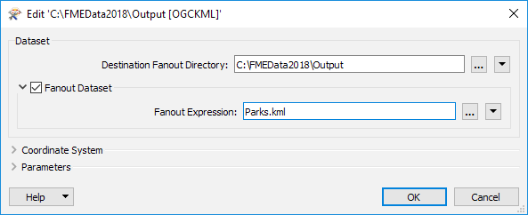
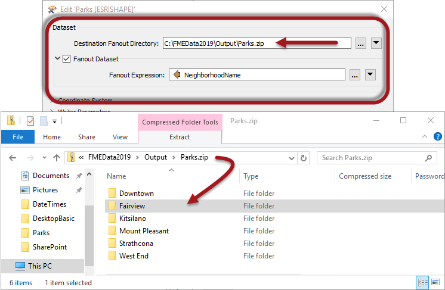

## Dataset Fanout ##

A Dataset Fanout delivers data to the same feature type, but in multiple datasets. Using the elevation example again, here the output is a different dataset for each elevation value:

The result of this fanout is a series of DXF datasets, each of which has one elevation’s worth of contours on one layer.

### Setting a Dataset Fanout ###

A Dataset Fanout is defined in the Navigator window in Workbench, just below the writer’s dataset parameter:

Double-clicking the Fanout Dataset parameter opens a dialog in which a Fanout checkbox is set. Here you can define the folder to write to and the Fanout Expression to use. The default values set the Fanout Directory from the destination dataset path, and the Fanout Expression from the destination dataset file name:

To achieve a fanout (a different file per attribute value) select an attribute to include in the file name, such as this:

In this case, each different neighborhood produces a separate file of park features. 

It's important to note that the Text Editor dialog can be used to add different components to both the Fanout Directory and the Fanout Expression, including user parameters, functions, and datetimes. Generally, even if the requirement is to use an attribute to define a sub-folder, it would go into the Fanout Expression, rather than the Fanout Directory. 

---

### Combining Dataset Fanout and Zip Files ###

It's easily possible to both apply a fanout to a writer and zip (compress/archive) the files that are written. In fact there are several methods of doing so...

#### Fanout to a Single Zip File ####

By setting the Destination Fanout Directory as a zip file, it's possible to write multiple, fanned-out datasets, to a single zip file:

Here the user is fanning out to Shapefile based on the NeighborhoodName attribute. The output directory is set to a zip file meaning the output is a single zip file with multiple datasets. Because this is Shapefile format, each dataset is a folder containing a number of files (.shp, .shx, and so on).

#### Fanout to Multiple Zip Files ####

By setting the Fanout Expression with a zip file extension, it's possible to write multiple, fanned-out zip files, each containing a single dataset. 

Here the user is also fanning out to Shapefile based on the NeighborhoodName attribute. The output directory is set to a plain directory, but the Fanout Expression is given a zip file extension. This leads to multiple zip files, one per dataset. 

This sort of fanout is potentially useful when the output format includes multiple files (like Shapefile format) and you wish to handle the output some way, post-translation. It's also useful for large datasets (such as raster) where a single file can be way larger than its zipped equivalent.

#### Fanout to Multiple Zip Files inside a Single Zip File ####

By using both of the above techniques (in other words giving both the directory and the fanout parameters a zip file extension) you are able to write multiple zip files containing a single dataset, into a single zip file!

Here the output is a single zip file (Training.zip) containing a series of zipped dataset files!

---

<table style="border-spacing: 0px">
<tr>
<td style="vertical-align:middle;background-color:darkorange;border: 2px solid darkorange">
<i class="fa fa-quote-left fa-lg fa-pull-left fa-fw" style="color:white;padding-right: 12px;vertical-align:text-top"></i>
FME Lizard asks…
</td>
</tr>

<tr>
<td style="border: 1px solid darkorange">

<quiz name="">
  <question multiple>
    

      Q) Fanouts are an important part of writing data with FME, so tell me, which of these statements are true? Pick as many of these answers as you think are correct:
    

    <answer correct>You can have both a Feature Type Fanout and a Dataset Fanout in the same workspace</answer> 
    <answer correct>You can use a Feature Type Fanout with a database format, but not a Dataset Fanout</answer> 
    <answer>A fanout expression can be an attribute, or a constructed string, but not a user parameter</answer> 
    <answer>A fanout cannot be based on a format attribute such as fme_color</answer> 
     <explanation>A) It's true you can have both types of fanout in the same workspace, although a database writer won't do a Dataset Fanout (it can create multiple tables, but not multiple databases). A Fanout Expression can be any attribute (including FME attribute or format attribute) or string, and it can be a user parameter too!</explanation>
  </question>
</quiz>

</td>
</tr>
</table>
