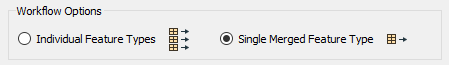
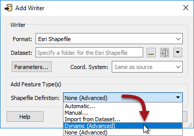
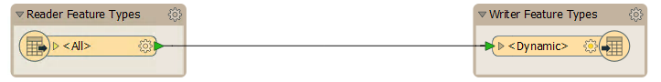

## Creating a Dynamic Translation ##

When an author creates a translation using the Generate Workspace dialog, there are two options for what is called workflow: **Static Schema** and **Dynamic Schema**.

The Static Schema option is the default for a workspace including schema. Choosing the Dynamic Schema option creates a schema-less workspace with dynamic readers and writers.

It is, however, possible to also create a workspace where only the readers are dynamic or only the writers...

### Dynamic Reader Only ###
The Add Reader dialog has similar options for static and dynamic; however, in this case, we try to make them more user-friendly by labeling them *Individual Feature Types* and *Single Merged Feature Type*:

In essence, a dynamic reader is similar to just setting the Merge Feature Type option.

### Dynamic Writer Only ###
The Add Writer dialog has options for how feature types and their attributes are defined. The most commonly used ones are Manual and Automatic. There is also an option that adds a writer in dynamic mode:

---

<table style="border-spacing: 0px">
<tr>
<td style="vertical-align:middle;background-color:darkorange;border: 2px solid darkorange">
<i class="fa fa-quote-left fa-lg fa-pull-left fa-fw" style="color:white;padding-right: 12px;vertical-align:text-top"></i>
FME Lizard says…
</td>
</tr>

<tr>
<td style="border: 1px solid darkorange">

Let's clarify Automatic vs. Dynamic. Automatic attributes take their definition from whatever is connected to them. If the Source Dataset parameter is changed, that change has no effect. 
  Dynamic attributes are different. If the Source Dataset parameter is changed, the attribute definition comes from whatever source data gets read, regardless of what is connected to it. 

</td>
</tr>
</table>

---

## How Does a Dynamic Translation Look? ##

Both dynamic readers and dynamic writers each have a single Feature Type, regardless of the schema of the reader datasets:

Notice that there is only a single feature type, regardless of whether the data is made up of several layers or tables.

Also, notice that the sole reader Feature Type is named **&lt;All&gt;** (which provides a clue to what is happening here) and that the sole writer Feature Type is named **&lt;Dynamic&gt;**.

When the workspace is run, all of the source data is read through a single feature type. On the writer side, although there is only one output type, the data will be dynamically divided back into its component layers, keeping its original attributes and geometry type.

With this workspace, you can switch the source dataset to anything (in the correct format) and the output is a mirror image. There is no need to worry about unexpected input or unsupported geometry types. Plus, if you used the Generic Reader/Writer, it could read any dataset, of any format and create a duplicate output of it!