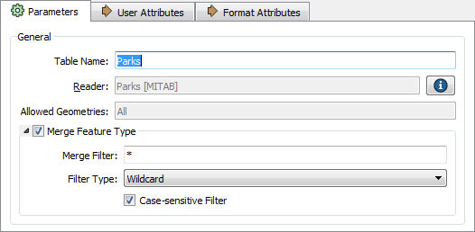

# Schema Handling in Dynamic Translations #

Checking the feature type properties for a dynamic translation reveals the checkboxes that turn on this behavior.

For a reader, all that is really happening is the merge feature-type setting is turned on:

Unchecking that box turns off the full behavior, and there are not many parameters to adjust. However, for a writer, the dialog is a bit more complex:

The three components of schema - 1) feature type, 2) attributes, and 3) geometry - all have different ways in which they can be set.
