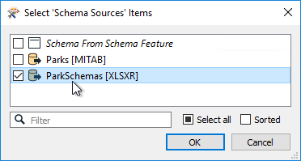

## Schema Sources ##

By default, the writer schema in a dynamic translation is defined not in the workspace, but by the source dataset. So whatever dataset is chosen as input defines the chosen output structure.

However, the parameters in a writer feature type let us alter how that schema is defined. We can choose to take the structure from an entirely different dataset to the source. Alternatively, we can individually define each component of our schema (Feature Types, Attributes, Geometry) in a variety of ways. 

The writer feature type has a dynamic parameter labeled Schema Sources:

This parameter defines from where the destination schema is going to be obtained. By default, this parameter is set to whatever source dataset is being read. That way the output schema is always a duplicate of the input.

However, it can be set to use any reader dataset – in any format – as the source for the outgoing schema. 

For example, here the workspace author is converting parks data to an Esri Geodatabase, but has chosen an Excel spreadsheet as the required structure for the output dataset.

If the data is fanned out (say by NeighborhoodName) then the Excel spreadsheet should have a different sheet for each neighborhood, and that structure is used as the schema of the output in this workspace.

---

<table style="border-spacing: 0px">
<tr>
<td style="vertical-align:middle;background-color:darkorange;border: 2px solid darkorange">
<i class="fa fa-quote-left fa-lg fa-pull-left fa-fw" style="color:white;padding-right: 12px;vertical-align:text-top"></i>
FME Lizard says…
</td>
</tr>

<tr>
<td style="border: 1px solid darkorange">

Let me make it clear if it isn't already. In this scenario the user is not writing to those Excel sheets; the user is writing to a File Geodatabase. However, the output Geodatabase receives the same schema (structure) as the matching Excel sheets.
  
It's called “Dynamic” because the destination schema gets fetched at runtime. For example, if the Excel sheets were to change in structure and the workspace ran a second time, it will produce Geodatabase feature types to match the changes. The best part is that the workspace does not need updating to do so.

</td>
</tr>
</table>

---

### Resource Readers ###

The Schema Source parameter can be set to point to any reader as the source of a dynamic schema. However, in most cases, all we need from the dataset is the schema, not the data. 

This is where Resource Readers can be used.

A Resource Reader is a reader that returns the schema of a dataset, but no data. One is added using Readers > Add Reader as Resource on the menubar:

Here the user adds an Excel spreadsheet database as a resource, and it appears in the Navigator window:

Once available the resource reader can be used as the source of a schema for a dynamic writer.

---

### Why Use an External Schema? ###

The main reason for using an external dataset schema is to adhere to a fixed standard. Perhaps the most useful aspect of this is that if the schema of the dataset changes, then the workspace makes use of it automatically. There's no need to update the workspace manually because the output requirements have changed.

However, as noted above, the data being written must match that standard or risk being dropped. So there is always likely to be some data transformation required in the workspace to coax the input data into the required output schema.

The SchemaMapper transformer is useful for reconciling data with the required schema - that's because the SchemaMapper too can use an external lookup table, meaning that the dynamic workspace can be changed to meet any required output schema without having to make edits in Workbench!

---

<!--Warning Section--> 

<table style="border-spacing: 0px">
<tr>
<td style="vertical-align:middle;background-color:darkorange;border: 2px solid darkorange">
<i class="fa fa-exclamation-triangle fa-lg fa-pull-left fa-fw" style="color:white;padding-right: 12px;vertical-align:text-top"></i>
WARNING
</td>
</tr>

<tr>
<td style="border: 1px solid darkorange">

Geometry is discussed shortly. However, for now be aware that permitted geometry types are (by default) obtained from the schema source. If the schema source changes, you may not want its geometry type.
 Therefore simply set Geometry to "First Feature Defines Geometry Type" to avoid issues.

</td>
</tr>
</table>
