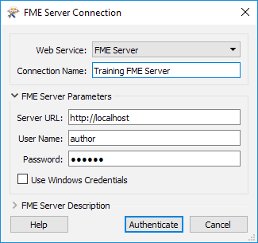
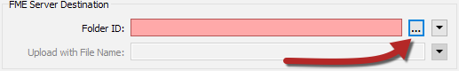
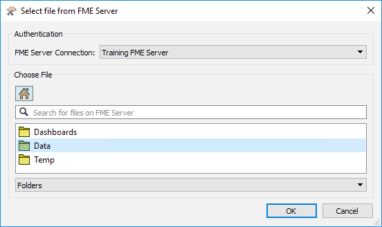
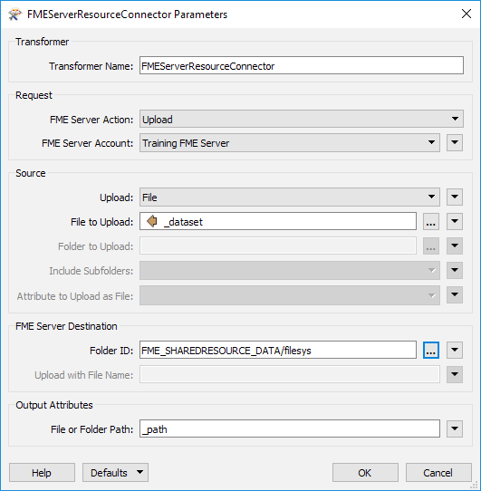

<!--Exercise Section-->

<table style="border-spacing: 0px;border-collapse: collapse;font-family:serif">
<tr>
<td style="vertical-align:middle;background-color:darkorange;border: 2px solid darkorange">
<i class="fa fa-cogs fa-lg fa-pull-left fa-fw" style="color:white;padding-right: 12px;vertical-align:text-top"></i>
Exercise 1
</td>
<td style="border: 2px solid darkorange;background-color:darkorange;color:white">
Web-Based Connections
</td>
</tr>

<tr>
<td style="border: 1px solid darkorange; font-weight: bold">Data</td>
<td style="border: 1px solid darkorange">Point Cloud Data (LiDAR LAS) and Building Outline Data (AutoCAD DWG) </td>
</tr>

<tr>
<td style="border: 1px solid darkorange; font-weight: bold">Overall Goal</td>
<td style="border: 1px solid darkorange">Upload data to an online web service</td>
</tr>

<tr>
<td style="border: 1px solid darkorange; font-weight: bold">Demonstrates</td>
<td style="border: 1px solid darkorange">Creating a web connection and using a connector transformer</td>
</tr>

<tr>
<td style="border: 1px solid darkorange; font-weight: bold">Start Workspace</td>
<td style="border: 1px solid darkorange">C:\FMEData2019\Workspaces\DesktopAdvanced\ReadWrite-Ex1-Begin.fmw</td>
</tr>

<tr>
<td style="border: 1px solid darkorange; font-weight: bold">End Workspace</td>
<td style="border: 1px solid darkorange">C:\FMEData2019\Workspaces\DesktopAdvanced\ReadWrite-Ex1-Complete.fmw</td>
</tr>

</table>

In this exercise we'll create a workspace that does a join to an online dataset, processes the data, and writes it back out to a different web destination.

 **1) Add Reader**
 Start FME Workbench and in an empty workspace add a reader with these parameters:

<table style="border: 0px">

<tr>
<td style="font-weight: bold">Reader Format</td>
<td style="">Autodesk AutoCAD DWG/DXF</td>
</tr>

<tr>
<td style="font-weight: bold">Reader Dataset</td>
<td style="">C:\FMEData2019\Data\Transportation\CompleteRoads.dwg</td>
</tr>

<tr>
<td style="font-weight: bold">Parameters</td>
<td style="">Group Entities By: Attribute Schema</td>
</tr>

<tr>
<td style="font-weight: bold">Workflow Options</td>
<td style="">Single Merged Feature Type</td>
</tr>

</table>

The Group Entities parameter is an AutoCAD-specific option. It ensures that we have attributes from the AutoCAD source data exposed in Workbench.

The Merged Feature Type option means all the road data is treated as a single map layer, which is fine because we aren't too interested in handling multiple layers separately.

 **2) Locate Snowfall Dataset**
 In a web browser, browse to the City of Interopolis **[Open Data Portal](https://s3.amazonaws.com/FMEData/Interopolis/interopolis.html)** (https://s3.amazonaws.com/FMEData/Interopolis/interopolis.html).

Locate the dataset for Snowfall Predictions, right-click on where it says Excel Spreadsheet, and choose to copy the URL:

The exact command will vary according to web browser of choice.

 **3) Add DatabaseJoiner Transformer**
 Back in FME Workbench, add a DatabaseJoiner transformer and connect it to the roads feature type. Open the DatabaseJoiner parameters.

Set the parameters as follows:

<table style="border: 0px">

<tr>
<td style="font-weight: bold">Reader Format</td>
<td style="">Microsoft Excel</td>
</tr>

<tr>
<td style="font-weight: bold">Reader Dataset</td>
<td style="">https://s3.amazonaws.com/FMEData/Interopolis/Snowfall.xlsx</td>
</tr>

</table>

...where, of course, you can paste the URL you copied from the web browser.

Click the parameters button and check that the data is being read correctly. Proof of this is the preview window showing records with the correct columns. 

Back in the main DatabaseJoiner dialog, select Snowfall as the join table and select StreetId as both the Feature Attribute and Table Field to be joined:

---

<!--Tip Section--> 

<table style="border-spacing: 0px">
<tr>
<td style="vertical-align:middle;background-color:darkorange;border: 2px solid darkorange">
<i class="fa fa-info-circle fa-lg fa-pull-left fa-fw" style="color:white;padding-right: 12px;vertical-align:text-top"></i>
TIP
</td>
</tr>

<tr>
<td style="border: 1px solid darkorange">

If no attributes are available under the Feature Attribute field, then you failed to use the Group Entities By: Attribute Schema parameter when adding the AutoCAD reader. To resolve this the simplest method is to delete and re-add the reader, using the correct options this time.

</td>
</tr>
</table>

---

The final parameters to set in the DatabaseJoiner are *Fields to Add* and *Cardinality*:

Select the following for Fields to Add:

- EstimatedSnowfall
- LastTreated
- Temperature
- WeatherStation

Ensure Cardinality is set to **Match First (1:0...1+)**; then each road feature will be joined to the first matching database record FME finds. It's the option least likely to lead to error messages in the log.

 **4) Add KMLStyler Transformer (Optional)**
 The goal of the project is to write the data to KML format. As a training exercise, we're really only interested in how and where we write the data. However, a realistic requirement would be to set the color and style of the spatial data being written (in spatial terms we sometimes call this *symbology*).

So, as an optional step, place a KMLStyler transformer, connected to the DatabaseJoiner. Open the parameters dialog and set it up to give the roadwork features a specific style.

Here the author has used Conditional Values (discussed in chapter one) to illustrate the roads differently according to the amount of expected snowfall:

However, you can choose to select a fixed color, copy the transformer from the completed workspace, or even ignore this step completely.

 **5) Add FeatureWriter Transformer**
 Back in FME Workbench, add a DatabaseJoiner transformer and connect it to the roads feature type. Open the DatabaseJoiner parameters.

 **2) Add FMEServerResourceConnector Transformer**
 In the bookmark labeled Connect to FME Server, add a FMEServerResourceConnector transformer and connect it to the FeatureWriter:Summary output port:

In the parameters ensure that the FME Server Action is set to Upload. For the FME Server Account open the drop-down menu and click Add Web Connection:

In the FME Server Connection Dialog change the Connection Name, if desired. Then set following parameters, then click Authenticate:

<pre>
Server URL: http://localhost
Username: author
Password: author
</pre>

---

<!--Warning Section-->

<table style="border-spacing: 0px">
<tr>
<td style="vertical-align:middle;background-color:darkorange;border: 2px solid darkorange">
<i class="fa fa-info-circle fa-lg fa-pull-left fa-fw" style="color:white;padding-right: 12px;vertical-align:text-top"></i>
TIP
</td>
</tr>

<tr>
<td style="border: 1px solid darkorange">

  
If you do not have FME Server installed, you can connect to any web connection for this exercise, just add the appropriate connector transformer and create a connection the same way.

  
If you are using a Safe Software live training virtual machine and you get an authentication error saying <code>Retrieval Error : Unable to make the request to FME Server. Ensure your machine has internet connectivity</code>, we recommend restarting your virtual machine. Click the Start button > Power > Restart. The machine will take a minute or two to restart, and your issue should be resolved. If not, please use the GoToWebinar Questions panel to ask for help or email <a href="mailto:train@safe.com">train@safe.com</a>.

</td>
</tr>
</table>
---

For the Source ensure that Upload is set to File. Then for File to Upload, click the drop-down icon then Attribute then select _dataset:

Finally for the FME Server Destination click on the ellipsis next to Folder ID:

This will connect to your FME Server Resources folder. Double click on the Data folder to open it. Then click OK:

Your parameters should look like this when it's all set up:

 **3) Run Translation**
 Now when we run our translation the data will write to our local disk but also upload the output file onto FME Server where any of our colleagues can download it.

Run the translation.

 **4) Test Upload**
 We need to check to see if our data was uploaded successfully without opening FME Server (that's a different course).

To do this we can use our FMEServerResourceConnector transformer. Open up the parameters and change the FME Server Action to Download. Then click the ellipsis next to FME Server Source Object ID:

This opens the file browser for FME Server. Double click on the Data folder to open it and our 3DBuildings.pdf is there:

Cancel out of all dialogs to return the FMEServerResourceConnector to the Upload state.

---

<!--Exercise Congratulations Section-->

<table style="border-spacing: 0px">
<tr>
<td style="vertical-align:middle;background-color:darkorange;border: 2px solid darkorange">
<i class="fa fa-thumbs-o-up fa-lg fa-pull-left fa-fw" style="color:white;padding-right: 12px;vertical-align:text-top"></i>
CONGRATULATIONS
</td>
</tr>

<tr>
<td style="border: 1px solid darkorange">

By completing this exercise you have learned how to:
<ul><li>Set up a web connection</li>
<li>Upload data to FME Server or another online service</li>
<li>Download data from FME Server or another online service</li></ul>

</td>
</tr>
</table>
