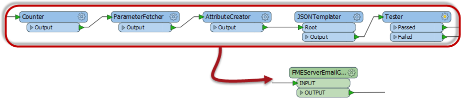
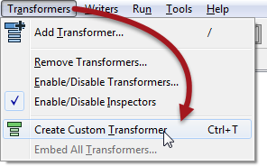
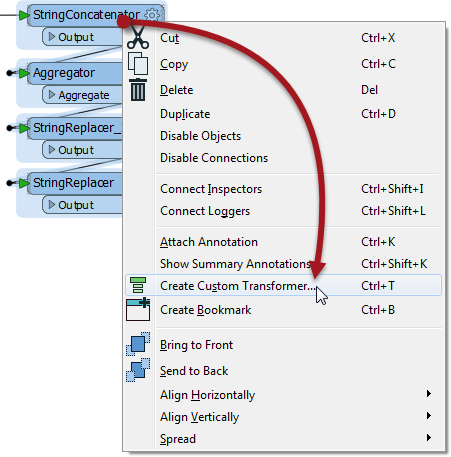
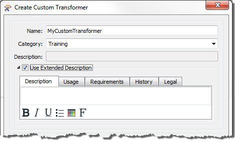
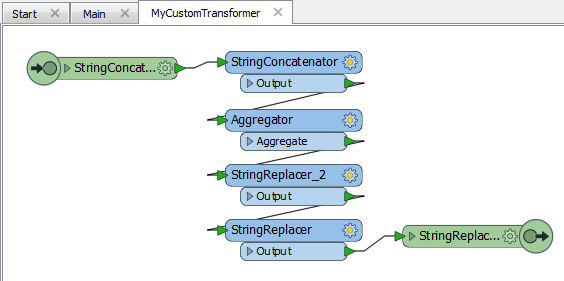
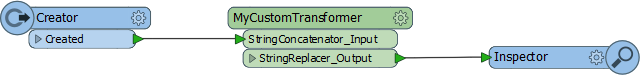
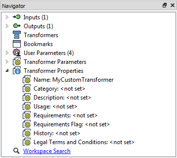
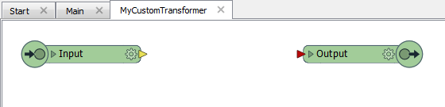

# Custom Transformers #

Custom Transformers are very powerful tools at either a basic or an advanced level.

## What is a Custom Transformer? ##

A custom transformer is a sequence of standard transformers condensed into a single transformer. Any existing sequence of transformers can be turned into a custom transformer.

### Custom Transformer Purposes ###

Among other functions, custom transformers help to:

- Tidy Workspaces
 - By condensing chunks of content the workspace canvas becomes less cluttered
- Reuse Content
 - A sequence of transformers encapsulated in a single object can be reused throughout a workspace and shared with colleagues.
- Employ Advanced Functionality
 - Using a Custom Transformer enables additional functionality to be used, such as looping and parallel processing

---

<!--Person X Says Section-->

<table style="border-spacing: 0px">
<tr>
<td style="vertical-align:middle;background-color:darkorange;border: 2px solid darkorange">
<i class="fa fa-quote-left fa-lg fa-pull-left fa-fw" style="color:white;padding-right: 12px;vertical-align:text-top"></i>
First Officer Transformer says…
</td>
</tr>

<tr>
<td style="border: 1px solid darkorange">

Welcome aboard this Safe Software training chapter on Custom Transformers. I’ll be your guide to all of the functionality involved. As you can see, Custom Transformers are excellent tools for carrying out Best Practices
in FME, both speeding up your projects and reducing turbulence in the Workbench canvas.

</td>
</tr>
</table>

---

## Creating a Custom Transformer ##

A Custom Transformer can be created from scratch – i.e. you start with an empty custom transformer and add content into it – or can be created from an existing sequence of transformers.

Custom transformers are created by either selecting Create Custom Transformer from the canvas context (right-click) menu, or by selecting Transformers > Create Custom Transformer from the menubar. The shortcut key for this function is Ctrl+T.

If a number of existing transformers are selected when you issue the Create Custom Transformer command, then they are automatically added to the new custom transformer; otherwise the new custom transformer is created empty except for an input and output port.

Here a user is creating a new custom transformer based on a series of existing ones:

The new custom transformer will be pre-populated with these four transformers.

## Naming a Custom Transformer ##

All Custom Transformers require a name and (optionally) a category and description. A dialog in which to define these automatically appears when you create a new custom transformer.

The category can be set to match any existing category of FME transformers, or a custom category of your own.

Notice also the “Use Extended Description” parameter. This allows you to enter extra information about the custom transformer, such as requirements for use, development history, and legal terms and conditions; in fields that support the use of rich text.

These fields are particularly important when you intend to share the custom transformer with work colleagues or clients.

## The New Custom Transformer ##

A newly created custom transformer then looks like this:

Notice that it appears under a new tab on the Workbench canvas and consists of the original transformers with additional input and output objects.

When you click on the Main tab, to return to the main canvas view, the three original transformers have now been replaced by a custom transformer object that is automatically connected into the existing workspace:

This custom transformer looks and behaves in the same way as any standard FME transformer; with input and output ports (that match the input/output objects in the custom transformer tab), plus a parameters dialog.

## Editing a Custom Transformer ##

To edit the contents of a custom transformer, simply click on the tab for that transformer. This opens the transformer definition and you may edit the content in the same way that you would in the main canvas.

In the Navigator window, where a workspace would have a section labelled Workspace Properties, a custom transformer has Transformer Properties.

This is where the information – name, category, description, etc. – that was entered earlier can be edited.

---

<table style="border-spacing: 0px">
<tr>
<td style="vertical-align:middle;background-color:darkorange;border: 2px solid darkorange">
<i class="fa fa-quote-left fa-lg fa-pull-left fa-fw" style="color:white;padding-right: 12px;vertical-align:text-top"></i>
First Officer Transformer says…
</td>
</tr>

<tr>
<td style="border: 1px solid darkorange">

If a custom transformer has been created from scratch, without any original transformers selected, it would start out empty and look like this:
  
  Then you can start building or editing the transformer from scratch. There is not a lot of difference between creating content in the main canvas and turning it into a custom transformer, and creating an empty custom transformer and creating the content in there.

</td>
</tr>
</table>

