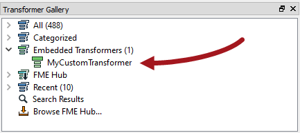
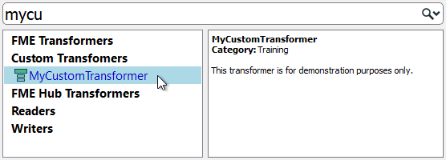

# Using Custom Transformers #

Once a custom transformer has been created, it is connected into the workspace and - apart from a different color - looks just like a normal FME transformer would.

However, the resemblance to a normal transformer is not just in appearance. In the same way that multiple instances of a transformer can be used in a workspace, a custom transformer can be used any number of times too. This makes Custom Transformers not just a way to tidy a workspace, but also as a way of re-using content.

To place extra copies of a custom transformer - again like a regular transformer - you use the Transformer Gallery (look under a section labelled “Embedded Transformers):

...or you can use Quick Add:

As with FME transformers, each newly placed instance of a custom transformer will be renamed (or numbered) as necessary, in order to avoid a clash of names.

---

<!--Tip Section--> 

<table style="border-spacing: 0px">
<tr>
<td style="vertical-align:middle;background-color:darkorange;border: 2px solid darkorange">
<i class="fa fa-info-circle fa-lg fa-pull-left fa-fw" style="color:white;padding-right: 12px;vertical-align:text-top"></i>
TIP
</td>
</tr>

<tr>
<td style="border: 1px solid darkorange">

The transformer name, category, and description all appear in the Quick Add tool - as well as appearing in the help window - so it is definitely worthwhile setting these parameters.

</td>
</tr>
</table>

---

## Editing a Re-used Custom Transformer ##

Multiple instances of a custom transformer all use the same core definition; i.e. there may be multiple copies on the Main tab, but only a single tab for the custom transformer definition. 

A key benefit of this approach is that every instance can be updated or edited simply by editing the custom transformer definition.

For example, if a parameter is changed for the Aggregator inside this custom transformer:

...then the parameter automatically changes for ALL instances of the transformer that have been placed.

This makes the editing of a sequence of transformers much easier, because the edit only needs to be made once, no matter how many times that sequence has been used.
