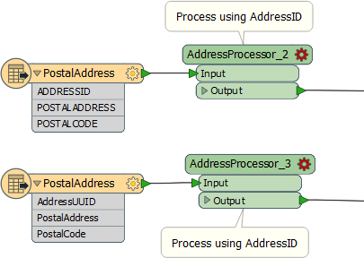
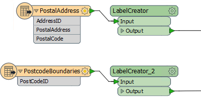

# Custom Transformers and Schema

Schema Handling is one of the most misunderstood components in Custom Transformers. That's because there are consequences that arise from allowing the re-use of content, and these consequences are not always apparent to the workspace author.

In brief, the ability to re-use a custom transformer means that it might be used in places where the schema does not match the custom transformer design. 

---

<!--Person X Says Section-->

<table style="border-spacing: 0px">
<tr>
<td style="vertical-align:middle;background-color:darkorange;border: 2px solid darkorange">
<i class="fa fa-quote-left fa-lg fa-pull-left fa-fw" style="color:white;padding-right: 12px;vertical-align:text-top"></i>
First Officer Transformer says...
</td>
</tr>

<tr>
<td style="border: 1px solid darkorange">

The best analogy I can come up with is this: I have a laptop computer. I can use it at home and in the office. I can also use it overseas. The difference in power supply (110v against 240v) was considered by the manufacturers and the computer will work on both. It's well designed.
  In much the same way, the author of a custom transformer must be aware of the limitations that might apply if it is used outside of its expected area, and try to adapt to them. Schema is a key consideration.

</td>
</tr>
</table>

---

## Handling Attribute Schema ##

One part of the schema to be considered is the set of attributes available to the custom transformer.

For example, in this workspace a custom transformer carries out processing on incoming data using an attribute called AddressID as a key field:

However, if that transformer is duplicated and used elsewhere, there is no guarantee that AddressID will exist:

These cases are both flagged red as "incomplete"; the first schema has ADDRESSID (not AddressID) and the other AddressUUID. Without FME's help, the end user would need to edit the transformer definition to fix these.

Therefore it’s vital that there is some form of mechanism for protecting against problems of a mismatched schema of this type. 

In fact there are two ways this can be handled: FME can automatically take care of the schema, or the workspace author can handle it manually.

Before looking at those solutions, let's take a look at a similar problem...

## Handling User Parameters ##

Besides attributes, the other part of the schema to be handled is user parameters.

Here, for example, a LabelPointReplacer transformer has user parameters to allow user input for label content and height:

Now let's assume that LabelPointReplacer is incorporated into a custom transformer, and that transformer used in several places in a workspace:

There's no problem with attributes, because the transformer isn't using any. 

But both instances of the custom transformer are using the same user parameter, and perhaps the user doesn't want to enter the same value for each instance. We need a mechanism for the user to enter different values.

As with attribute schema, there is an automated method for handling these, you just need to be aware of it in order to make some adjustments.

