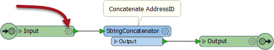
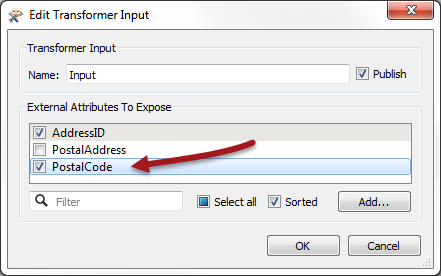
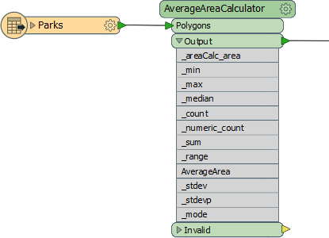
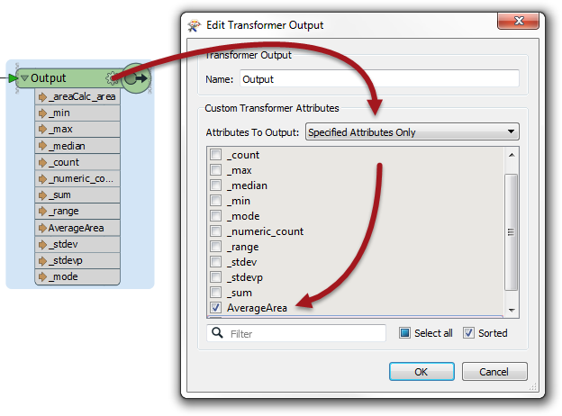

### Post-Creation Schema Handling ###

As we know, Custom Transformers can be edited after they have been created. 

The "Handle with Published Parameters" setting handles attributes used in a custom transformer when it is created, but there also needs to be a mechanism for handling edits to a custom transformer (or where the custom transformer is simply created from scratch).

This is achieved using a schema-editing button on the custom transformer.

For example, in this custom transformer definition the user concatenates a string using AddressID. AddressID is exposed in the custom transformer because it was being used when the custom transformer was created (and Handle With Published Parameters was set).

However, now the author wishes to add PostalCode to the concatenated string. By default they won't find PostalCode in the StringConcatenator, because it has not yet been exposed in the custom transformer. So they click the cog-wheel parameters icon on an input port:

This opens a dialog in which the incoming schema can be defined, and here the PostalCode attribute can be exposed:

Now PostalCode becomes available to the StringConcatenator and, additionally, back on the main canvas the custom transformer has a newly exposed parameter ready to accept an attribute selection should PostalCode not be available.

### Handling Outgoing Attributes ##

Besides incoming attributes, there is also the question of what attributes should emerge from the output of a custom transformer.

Best Practice suggests that we really don’t want to output more attributes than are expected by the user. We should hide or remove any attributes that are part of a calculation, or any attributes that are otherwise generated inside the custom transformer but aren’t necessary to the output.

Here a custom transformer is calculating the average area of a number of polygon features. It has renamed ports and a specific output port to deal with bad features, but it is outputting more attributes than I would expect:

 
Basically, no effort is being made to clear up other attributes that are being used or generated, such as _area, _min, and _max.

The workspace author should clean up this output. They can do this by visiting the custom transformer definition, clicking on the parameters (cog wheel) button for the output port object, and opening a dialog in which the attributes to be output can be defined:

