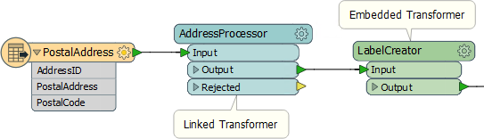

# Custom Transformer Types

There are two types of custom transformers.

An **embedded** transformer is one that exists only in the workspace itself. Its definition is stored (embedded) inside the workspace file and it is not available to any other workspace.

A **linked** transformer is one that exists outside of a workspace. Its definition is stored in its own file and it is available to any other workspace, which reference it through a link.

On a workspace canvas, embedded transformers are identified by their green color, while linked transformers are colored cyan:

---

<table style="border-spacing: 0px">
<tr>
<td style="vertical-align:middle;background-color:darkorange;border: 2px solid darkorange">
<i class="fa fa-quote-left fa-lg fa-pull-left fa-fw" style="color:white;padding-right: 12px;vertical-align:text-top"></i>
First Officer Transformer says…
</td>
</tr>

<tr>
<td style="border: 1px solid darkorange">

It's really important to know that the transformer type can be changed inside the workspace. You can switch an embedded custom tranformer from being embedded to being linked, and switch a linked custom transformer to being embedded.

</td>
</tr>
</table>

## Linked vs Embedded Transformers ##

Both type of transformer can be used in an FME workspace, and there are various advantages and disadvantages to each type.

**Embedded Transformers**

Embedded transformers are perhaps easier to understand, need no external files, and their definition is embedded into the workspace. They are particularly useful for tidying a workspace but also work for employing advanced functionality like parallel processing.

However, sharing and re-use of content is not as simple with an embedded transformer. The custom transformer cannot easily be shared with other users, unless they are given a copy of the same workspace, and it is not easy to maintain a consistent definition among several users.

**Linked Transformers**

Linked transformers are perhaps a little harder to understand and manage. They exist as a file (.fmx) outside of the workspace, which is less convenient, and when used to employ advanced functionality like loops they can be more complex. 

However, a linked custom transformer is a little easier to edit (you open the .fmx file rather than the .fmw file) and is much easier to share among users. Not only can the file be given to any FME author to use, any number of authors can actually point their FME to the same custom transformer file. 

Sharing the same file is useful because any changes made to the definition are automatically propagated to all workspaces that use it.

---

<table style="border-spacing: 0px">
<tr>
<td style="vertical-align:middle;background-color:darkorange;border: 2px solid darkorange">
<i class="fa fa-quote-left fa-lg fa-pull-left fa-fw" style="color:white;padding-right: 12px;vertical-align:text-top"></i>
First Officer Transformer says…
</td>
</tr>

<tr>
<td style="border: 1px solid darkorange">

Like embedded transformers, linked transformers also show up in the transformer gallery and Quick Add dialog. Also notice that they have a special icon to signify that you are about to use a linked version, rather than the embedded:
  

</td>
</tr>
</table>