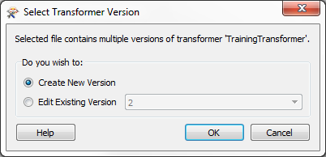
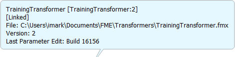
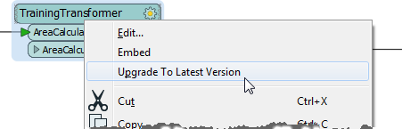

# Custom Transformer Versioning

FME includes functionality so that a linked custom transformer can exist as a number of versions. In short, each time a custom transformer definition is edited, a new version can be saved. 

In that way a single fmx file can contain multiple versions of the same custom transformer. 

## Why use Versioning? ##

One advantage of versioning a custom transformer is that you have a record of previous versions and therefore can revert to a previous one should the need arise. For example, maybe some recent edits were incorrect and you need to switch back to the definition that existed before those edits were made. 

However, a more important advantage relates to FME releases and new functionality.

For example, a custom transformer created in FME2015 and shared by many users could be updated to use new behaviour in FME 2016. If that custom transformer is versioned then the 2015 version remains available to users who have yet to update to that version of FME; while users who have updated their FME can also update their custom transformer to take advantage of the new updates.

## Creating a Versioned Custom Transformer ##

Versioning can occur when you edit a linked custom transformer definition (usually an unversioned one) and then attempt to save it. In that situation a dialog will open to ask what you wish to do:

The two options are to overwrite the existing version or to create a new version. Creating a new version does not create a separate fmx file; instead it creates a separate version of the transformer in the same fmx file.

The title bar in Workbench also changes to illustrate that this is now a new version.

---

<table style="border-spacing: 0px">
<tr>
<td style="vertical-align:middle;background-color:darkorange;border: 2px solid darkorange">
<i class="fa fa-quote-left fa-lg fa-pull-left fa-fw" style="color:white;padding-right: 12px;vertical-align:text-top"></i>
First Officer Transformer says…
</td>
</tr>

<tr>
<td style="border: 1px solid darkorange">

Subsequent saves don’t update the version number. A new version is only created for a new edit session; i.e. the first time you save the transformer after it is newly opened in Workbench. If you keep on making edits, it just saves to the same version. You need to close and reopen the file to create another new version.

</td>
</tr>
</table>

---

## Editing a Specific Transformer Version ##

Whenever a versioned custom transformer is initially opened in Workbench, you are prompted as to which version you wish to edit, or whether you want to just start with a new version:

This way you are able to:

- Create a new version to make edits to
- Continue making edits to the existing version
- Make edits on an older version (particularly useful when that version is tied to a particular FME release)

## Updating a Transformer Version ##

Whenever a workspace contains a linked custom transformer, you get the same version information (in summary annotation and the like) as a regular transformer:

However, if FME detects that a new version is available, then an option appears on the context menu to allow an update to the new version:

Choosing to upgrading means the summary annotation would display the newest version number. 

---

<table style="border-spacing: 0px">
<tr>
<td style="vertical-align:middle;background-color:darkorange;border: 2px solid darkorange">
<i class="fa fa-quote-left fa-lg fa-pull-left fa-fw" style="color:white;padding-right: 12px;vertical-align:text-top"></i>
Miss Vector says…
</td>
</tr>

<tr>
<td style="border: 1px solid darkorange">

What do you think would happen in this scenario? You have a workspace with a linked custom transformer (version 1). The author of that transformer makes a series of edits and updates it to version 4. What will the upgrade option do to the custom transformer in your workspace?
  1. Upgrade it to version 2
 2. Upgrade it to version 3
 3. Upgrade it to version 4
 4. It depends on what version of FME you and the author are using

</td>
</tr>
</table>

