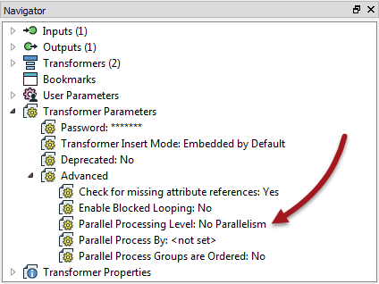
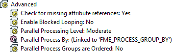
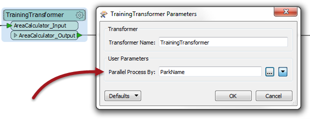
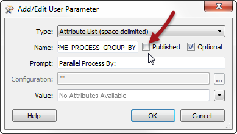

## Custom Transformers and Parallel Processing ##

Parallel Processing is a way to improve performance on high-end machines.

As noted in the Performance chapter, some FME transformers have the option to allow parallel processing. However, custom transformers have a special mechanism to do this. Whereas not all FME transformers allow parallel processing, you can apply this technique to ANY custom transformer that you like!

### Setting up Custom Transformer Parallel Processing ###

Parallel processing for a custom transformer is set up in the Navigator window.

Each custom transformer has a set of transformer parameters that specifically relate to parallel processing. Here you can determine the level of parallel processing, and the attribute that is going to be used to define the processing groups:

By default, these are set to not carry out parallel processing. However, when the author sets a level of parallelism then the Parallel Process By parameter becomes active and a user parameter is automatically created:

---

<table style="border-spacing: 0px">
<tr>
<td style="vertical-align:middle;background-color:darkorange;border: 2px solid darkorange">
<i class="fa fa-quote-left fa-lg fa-pull-left fa-fw" style="color:white;padding-right: 12px;vertical-align:text-top"></i>
First Officer Transformer says…
</td>
</tr>

<tr>
<td style="border: 1px solid darkorange">

Because of how parallel processing works in a custom transformer, you can’t use an attribute for the Parallel Process By parameter. Instead you have to make use of a user parameter that references an attribute.
  
  In short, you can’t select an attribute in this dialog, only user parameters.

</td>
</tr>
</table>

---

The published parameter means that the end user is able to set the attribute to group-by for parallel processing. For example, here the custom transformer is creating a separate process for each different park feature:

If, as an author, I don’t want the end user to be setting the group-by, then what I can do is locate that published parameter, edit its definition, and unset the Published parameter:

---

<table style="border-spacing: 0px">
<tr>
<td style="vertical-align:middle;background-color:darkorange;border: 2px solid darkorange">
<i class="fa fa-quote-left fa-lg fa-pull-left fa-fw" style="color:white;padding-right: 12px;vertical-align:text-top"></i>
First Officer Transformer says…
</td>
</tr>

<tr>
<td style="border: 1px solid darkorange">

Are you using raster data?
  Raster is an oddity in FME as most of the transformers do very little to the data. For example, the RasterResampler doesn’t actually resample the data; it just tags it as being resampled. The actual resampling is carried out when the data is written.
  On the one hand this is great. It means – for example – if you resample then clip some raster data, FME knows to resample only data that falls inside the clip boundary, as the rest is ultimately going to be discarded.
  On the other hand, it does mean that parallel processing doesn’t help performance that much, as most work occurs in the Writers. That’s why few raster transformers have parallel processing options, and why it’s not worth doing in a custom transformer.

</td>
</tr>
</table>

