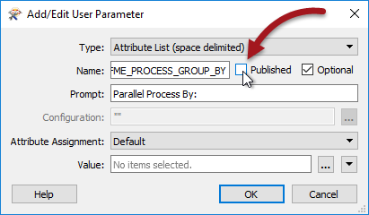

## Custom Transformers and Parallel Processing ##

Parallel Processing is a way to improve performance on high-end machines, by running multiple actions at once as a set of separate processes.

Some FME transformers have parameters to implement parallel processing, but all custom transformers also have a mechanism to do this

### Activating Parallel Processing ###

Each custom transformer has a set of parameters - located in the Navigator window - that specifically relate to parallel processing. Here you can determine the level of parallel processing, and an attribute that defines groups of data that will be transformed as a separate process:

By default, these are set to not carry out parallel processing. However, when the author sets a level of parallelism then the Parallel Process By parameter becomes active and a user parameter is automatically created:

---

### Defining a Group ###

Parallel processing groups are defined by attribute values; however, because of how parallel processing works in a custom transformer, you can’t just double-click this parameter and pick an attribute to use.

Instead, this parameter is published for the end-user to have access to.

If, as an author, I don’t want the end user to be setting the group-by, then what I can do is locate that published parameter, edit its definition, and unset the Published setting:

To set it myself I then expose the attribute I want to use and apply its user parameter to the Parallel Process By parameter:

---

<table style="border-spacing: 0px">
<tr>
<td style="vertical-align:middle;background-color:darkorange;border: 2px solid darkorange">
<i class="fa fa-quote-left fa-lg fa-pull-left fa-fw" style="color:white;padding-right: 12px;vertical-align:text-top"></i>
First Officer Transformer says…
</td>
</tr>

<tr>
<td style="border: 1px solid darkorange">

Are you using raster data?
  Raster is an oddity in FME as most of the transformers do very little to the data. For example, the RasterResampler doesn’t actually resample the data; it just tags it as being resampled. The actual resampling is carried out when the data is written.
  On the one hand this is great. It means – for example – if you resample then clip some raster data, FME knows to resample only data that falls inside the clip boundary, as the rest is ultimately going to be discarded.
  On the other hand, it does mean that parallel processing doesn’t help performance that much, as most work occurs in the Writers. That’s why few raster transformers have parallel processing options, and why it’s not worth doing in a custom transformer.

</td>
</tr>
</table>

