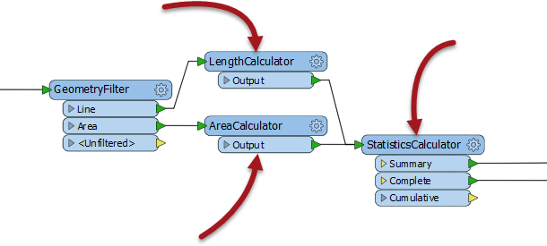
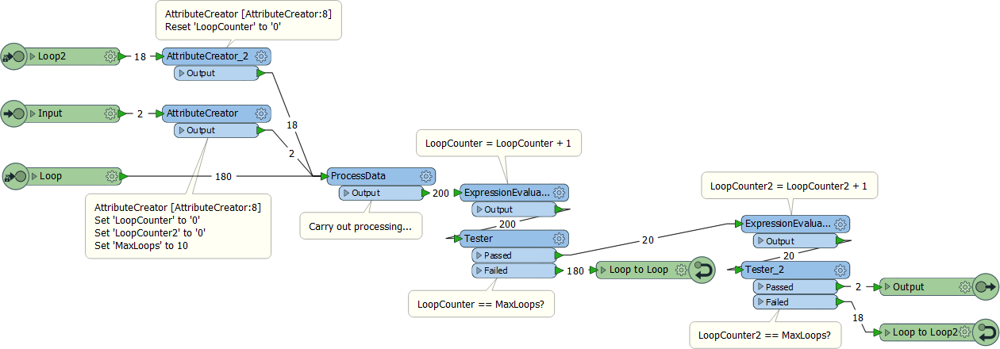

# Questions #

Here are the answers to the questions in this chapter.

---

<!--Person X Says Section-->

<table style="border-spacing: 0px">
<tr>
<td style="vertical-align:middle;background-color:darkorange;border: 2px solid darkorange">
<i class="fa fa-quote-left fa-lg fa-pull-left fa-fw" style="color:white;padding-right: 12px;vertical-align:text-top"></i>
Miss Vector says...
</td>
</tr>

<tr>
<td style="border: 1px solid darkorange">

Which of these is NOT a reason to use Custom Transformers?
  1. To make my content available in Quick Add
 2. To use advanced functionality like looping
 3. To reuse chunks of content in a simple way
 4. To tidy and declutter the main workspace canvas
  Admittedly it does become available in Quick Add, but that's not a specific reason to create a custom transformer. The reason you want it in Quick Add is so that you can reuse the content (answer #3).

</td>
</tr>
</table>

---

<!--Person X Says Section-->

<table style="border-spacing: 0px">
<tr>
<td style="vertical-align:middle;background-color:darkorange;border: 2px solid darkorange">
<i class="fa fa-quote-left fa-lg fa-pull-left fa-fw" style="color:white;padding-right: 12px;vertical-align:text-top"></i>
Miss Vector says...
</td>
</tr>

<tr>
<td style="border: 1px solid darkorange">

Consider this section of workspace. If I select the three transformers highlighted with arrows, and create a custom transformer, how many input and output ports will it have by default?
  

  1. One Input and One Output port
 2. One Input and Two Output ports
 3. Two Input and Two Output ports
 4. Two Input and Three Output ports
  It will have two input and two output ports, proving that FME will automatically create multiple ports where required. There are two inputs because there are two connections entering the set of transformers, and two outputs because there are two connections exiting the set of transformers (although there are three output ports on the StatisticsCalculator, only two are connected).

</td>
</tr>
</table>

---

<!--Person X Says Section-->

<table style="border-spacing: 0px">
<tr>
<td style="vertical-align:middle;background-color:darkorange;border: 2px solid darkorange">
<i class="fa fa-quote-left fa-lg fa-pull-left fa-fw" style="color:white;padding-right: 12px;vertical-align:text-top"></i>
Miss Vector says...
</td>
</tr>

<tr>
<td style="border: 1px solid darkorange">

Why do you think that we left the CSMapReprojector transformer out of our custom transformer (in the exercise)?
  It's because the CSMapReprojector is not a vital part of the process and wouldn't be needed in all cases. Only where the coordinate system wasn't compatible with our area measurements would we need it. For that reason we'll leave it out of the custom transformer - but maybe add a note to the usage setting to say that data needs to be in a specific coordinate system to use this custom transformer.

</td>
</tr>
</table>

---

<!--Person X Says Section-->

<table style="border-spacing: 0px">
<tr>
<td style="vertical-align:middle;background-color:darkorange;border: 2px solid darkorange">
<i class="fa fa-quote-left fa-lg fa-pull-left fa-fw" style="color:white;padding-right: 12px;vertical-align:text-top"></i>
Miss Vector says...
</td>
</tr>

<tr>
<td style="border: 1px solid darkorange">

What do you think would happen if you changed the parameter from "Handle with Published Parameters" to its other possible value, "Fix Manually (Advanced)"? Pick as many of these answers as you think are correct:
  1. The workspace won't run by default because no attributes are available in the custom transformer
 2. There will be no way to pick attributes to use from the main canvas
 3. The author will need to manually fix the custom transformer by exposing attributes in its definition
 4. The custom transformer won't work on a different schema unless the exposed attributes are also published
  Yes, when the parameter is set to manual, it really means manual! All four of these are true, meaning you'll have your work cut out if you don't let FME take care of attribute references for you.

</td>
</tr>
</table>

---

<!--Person X Says Section-->

<table style="border-spacing: 0px">
<tr>
<td style="vertical-align:middle;background-color:darkorange;border: 2px solid darkorange">
<i class="fa fa-quote-left fa-lg fa-pull-left fa-fw" style="color:white;padding-right: 12px;vertical-align:text-top"></i>
Miss Vector says...
</td>
</tr>

<tr>
<td style="border: 1px solid darkorange">

Can you nest custom transformers? That is, can you put one custom transformer inside another?
  1. Yes, with no restrictions
 2. Yes, but you can only nest transformers of the same type (Linked or Embedded)
 3. Yes, but you cannot nest Linked Custom Transformers
 4. Yes, but only a single level of nesting
  Yes you can embed any type of custom transformer inside any other type of custom transformer, to multiple levels of nesting.

</td>
</tr>
</table>

---

<!--Person X Says Section-->

<table style="border-spacing: 0px">
<tr>
<td style="vertical-align:middle;background-color:darkorange;border: 2px solid darkorange">
<i class="fa fa-quote-left fa-lg fa-pull-left fa-fw" style="color:white;padding-right: 12px;vertical-align:text-top"></i>
Miss Vector says...
</td>
</tr>

<tr>
<td style="border: 1px solid darkorange">

You have a workspace with a linked custom transformer (version 1). The author of that transformer makes a series of edits and updates it to version 4. What will the upgrade option do to the custom transformer in your workspace?
  1. Upgrade it to version 2
 2. Upgrade it to version 3
 3. Upgrade it to version 4
 4. It depends on what version of FME you and the author are using
  It will upgrade the custom transformer to the latest version that is compatible with the FME version you are using. If you are using the same version of FME, then it would upgrade the custom transformer to version 4. But if you are using different versions of FME then it could be version 2 or 3 instead (or maybe there would be no available updates at all!)

</td>
</tr>
</table>

---

<!--Person X Says Section-->

<table style="border-spacing: 0px">
<tr>
<td style="vertical-align:middle;background-color:darkorange;border: 2px solid darkorange">
<i class="fa fa-quote-left fa-lg fa-pull-left fa-fw" style="color:white;padding-right: 12px;vertical-align:text-top"></i>
Miss Vector says...
</td>
</tr>

<tr>
<td style="border: 1px solid darkorange">

Which of these statements about loops are true?
  1. Loops are only permitted inside a custom transformer
 2. A loop without a condition will continue processing until manually stopped
 3. Test conditions are built into the loop end point parameters
 4. Nested loops (a loop within a loop) are permitted
  Yes, loops only work in a custom transformer. An endless loop will not continue forever (FME will stop it after a time). Conditions need to be checked with transformers (like the Tester). And Nested Loops are permitted. The following is a screenshot of a nested loop custom transformer:
  
  Notice that there are now two count attributes (one for each loop). The first (inner) loop counter is reset to zero every time the second (outer) loop counter is incremented.

</td>
</tr>
</table>
