<!--Exercise Section-->

<table style="border-spacing: 0px;border-collapse: collapse;font-family:serif">
<tr>
<td style="vertical-align:middle;background-color:darkorange;border: 2px solid darkorange">
<i class="fa fa-cogs fa-lg fa-pull-left fa-fw" style="color:white;padding-right: 12px;vertical-align:text-top"></i>
Exercise 3
</td>
<td style="border: 2px solid darkorange;background-color:darkorange;color:white">
Re-using and editing a Custom Transformer
</td>
</tr>

<tr>
<td style="border: 1px solid darkorange; font-weight: bold">Data</td>
<td style="border: 1px solid darkorange">Neighborhoods (Google KML)</td>
</tr>

<tr>
<td style="border: 1px solid darkorange; font-weight: bold">Overall Goal</td>
<td style="border: 1px solid darkorange">Edit a custom transformer to use published parameters</td>
</tr>

<tr>
<td style="border: 1px solid darkorange; font-weight: bold">Demonstrates</td>
<td style="border: 1px solid darkorange">Published parameters and custom transformers</td>
</tr>

<tr>
<td style="border: 1px solid darkorange; font-weight: bold">Start Workspace</td>
<td style="border: 1px solid darkorange">C:\FMEData2017\Workspaces\DesktopAdvanced\CustomTransformers-Ex3-Begin.fmw</td>
</tr>

<tr>
<td style="border: 1px solid darkorange; font-weight: bold">End Workspace</td>
<td style="border: 1px solid darkorange">C:\FMEData2017\Workspaces\DesktopAdvanced\CustomTransformers-Ex3-Complete.fmw C:\FMEData2017\Workspaces\DesktopAdvanced\CustomTransformers-Ex3-Complete-Advanced.fmw</td>
</tr>

</table>

A colleague - with our help - has created a custom transformer that calculates density for a particular area. However, we need to work on it further to make it more generic - and to expand its capabilities.

This transformer was created using the automatic schema handling parameter and the workspace will already be handling schema properly. So, to an extent we don't have to worry - but there are improvements we can make. 

 **1) Start Workbench**
 Open the workspace containing the embedded custom transformer: C:\FMEData2017\Workspaces\DesktopAdvanced\CustomTransformers-Ex3-Begin.fmw

Notice that, currently there are two instances of the custom transformer. Both produce an attribute with the same name (DensityValue). It would be helpful if the user of the custom transformer could define what the name of that attribute should be. Let's set up the transformer to allow that. 

Click on the tab labelled DensityEvaluator to switch the canvas to the custom transformer definition. Open the parameters dialog for the ExpressionEvaluator. Next to New Attribute click the down-arrow and choose User Parameter > Create User Parameter:

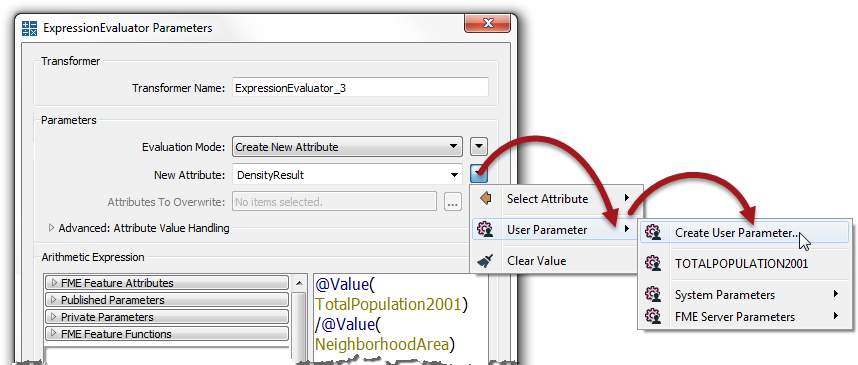

When prompted, click OK and then OK again to close the dialog. Return to the main tab and check the parameters for each custom transformer instance. There should be the option to set the name of the attribute to output.

You can now move the instances so they are joined in sequence (rather than parallel) and change the two output attribute names to something different (PopulationDensity2001 and PopulationDensity2011):

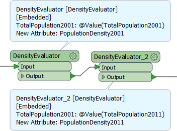 

---

<!--Warning Section--> 

<table style="border-spacing: 0px">
<tr>
<td style="vertical-align:middle;background-color:darkorange;border: 2px solid darkorange">
<i class="fa fa-exclamation-triangle fa-lg fa-pull-left fa-fw" style="color:white;padding-right: 12px;vertical-align:text-top"></i>
WARNING
</td>
</tr>

<tr>
<td style="border: 1px solid darkorange">

A fault in FME2016.1 means the transformer returns zero instead of the expected value. 
 The problem does not occur in FME2016.0 and is fixed in FME2016.1.1 (build 16597 or greater)
 Apart from the incorrect result, the exercise is not otherwise affected by this problem. 

</td>
</tr>
</table>

---

<table style="border-spacing: 0px">
<tr>
<td style="vertical-align:middle;background-color:darkorange;border: 2px solid darkorange">
<i class="fa fa-quote-left fa-lg fa-pull-left fa-fw" style="color:white;padding-right: 12px;vertical-align:text-top"></i>
First Officer Transformer says…
</td>
</tr>

<tr>
<td style="border: 1px solid darkorange">

At first glance it might appear that we've simply reverted the custom transformer right back to where we started from. To an extent, that's true. However, the point is that we've now got a solution that can work in other scenarios (i.e. where something other than population density is being calculated).

</td>
</tr>
</table>

---

 **2) Set Parameter Prompts**
 Looking at the custom transformer parameters we can also see that the prompt for the attribute to analyze is called "TotalPopulation2001". Obviously this is not very generic. 

Return to the custom transformer definition tab and browse the Navigator window to find the related published parameter. Right-click on the parameter and choose Edit Definition. 

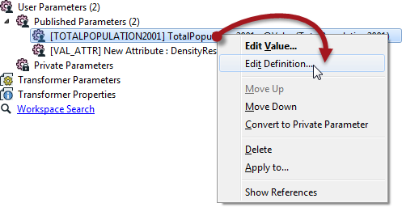

In the dialog that opens set the parameter name to *DensityAttribute* and the prompt to *Attribute to Analyze*:

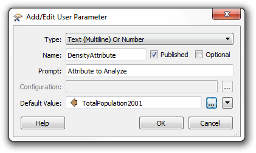

Click OK to close the dialog. Return to the main tab and check the custom transformer parameters to prove the label change worked, and run the workspace to show that the output is still correct.

---

<table style="border-spacing: 0px">
<tr>
<td style="vertical-align:middle;background-color:darkorange;border: 2px solid darkorange">
<i class="fa fa-quote-left fa-lg fa-pull-left fa-fw" style="color:white;padding-right: 12px;vertical-align:text-top"></i>
First Officer Transformer says…
</td>
</tr>

<tr>
<td style="border: 1px solid darkorange">

It's because we chose to handle schema automatically that we can simply change this user parameter name and not worry about where it is used. FME will handle the name change wherever is necessary.

</td>
</tr>
</table>

---

 **3) Implement Units Selection**
 At the moment this workspace is calculating the number of items (in this exercise, persons) per square kilometre of land. This works for the original scenario, however, other uses of this transformer might find different units to be more useful.

Therefore we’ll implement a parameter for users to be able to select their units of choice.

In the custom transformer definition, browse the Navigator window and right-click on the entry labelled User Parameters. Select the Add Parameter option:

In the Add/Edit User Parameter dialog, set the following parameters:

<table>
<tr><td>Type</td><td>Choice with Alias</td></tr>
<tr><td>Name</td><td>DensityUnits</td></tr>
<tr><td>Prompt</td><td>Density Units</td></tr>
</table>

Uncheck the check box parameter labelled Optional because the user has to select a value.

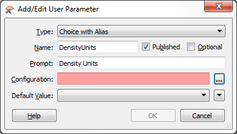

Now click the [...] button to the right of the Configuration parameter. This opens a dialog in which to define choices for the user to select from. Make two entries into this dialog

<table>
<tr><th>Display Name</th><th>Value</th></tr>
<tr><td>Sq Metres</td><td>1</td></tr>
<tr><td>Sq Kilometres</td><td>0.000001</td></tr>
</table>

To save you counting, that's five zeros after the decimal place. 

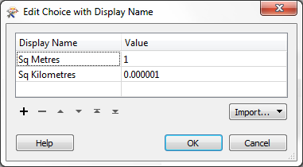

Click OK to close that dialog. Back in the Add/Edit User Parameter dialog set Sq Kilometres as the Default Value.

Then click OK to close this dialog and add the published parameter.

 **4) Implement Parameter**
 Now we’ve defined a published parameter that the user can set the units with, but we still have to apply it in the custom transformer.

Open the parameters dialog for the AreaCalculator transformer. For the Multiplier field, click the drop-down arrow and select the newly defined user parameter, DensityUnits.

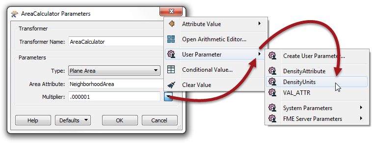

Click OK to close the dialog.

Back in the main canvas the custom transformer now has a parameter for the end user to select the output density units. Experiment by running the workspace using different units, to prove that the changes were implemented properly.

---

<!--Advanced Exercise Section-->

<table style="border-spacing: 0px">
<tr>
<td style="vertical-align:middle;background-color:darkorange;border: 2px solid darkorange">
<i class="fa fa-cogs fa-lg fa-pull-left fa-fw" style="color:white;padding-right: 12px;vertical-align:text-top"></i>
Advanced Exercise
</td>
</tr>

<tr>
<td style="border: 1px solid darkorange">

Although it’s not needed for this population density calculation, another useful function for this transformer would be the ability to apply a weighting to the density calculations. If you have time, carry out the following steps to set it up.
  The weighting will come from an incoming attribute, which means we need to be able to handle this in the custom transformer’s schema.

</td>
</tr>
</table>

---

 **5) Add RandomNumberGenerator**
 Our source data doesn't have any fields we could reasonably use for weighting the output. Therefore return to the Main canvas tab and add a RandomNumberGenerator transformer in order to generate a test attribute:

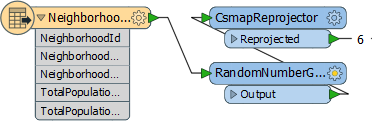

Open the parameters dialog for the RandomNumberGenerator. For the purposes of this exercise set:

<table>
<tr><td>Minimum Value</td><td>0.1</td></tr>
<tr><td>Maximum Value</td><td>1</td></tr>
<tr><td>Decimal Places</td><td>1</td></tr>
<tr><td>Result Attribute</td><td>WeightingAttribute</td>
</table>

 **6) Expose Attribute in Custom Transformer**
 Now we have an attribute we need to expose it in the custom transformer, in order to use it.

Return to the DensityEvaluator tab where the transformer is defined. Click on the parameters button on the Input port object to open up a dialog named Edit Transformer Input.

Put a checkmark against the WeightingAttribute attribute and then click OK to close the dialog.

This will cause the attribute to be exposed in the custom transformer definition:

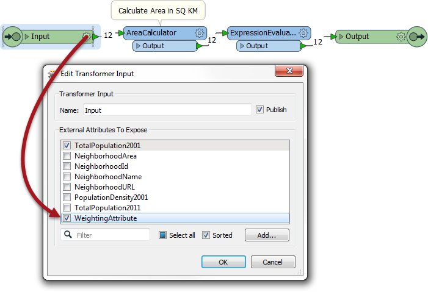

It will also cause a user parameter to be created. Locate the parameter in the Navigator window (it should be called WEIGHTINGATTRIBUTE) right-click on it and choose Edit Definition.

Put a checkmark in the Optional field, as this should not be compulsory (the user might not have an attribute to weight the results by).

 **7) Duplicate ExpressionEvaluator**
 Now we can use the attribute inside the custom transformer.

Make a duplicate copy of the existing ExpressionEvaluator and connect it in parallel to the current one. Then put a Tester in beforehand where the Passed port goes to one ExpressionEvaluator and the Failed port goes to the other:

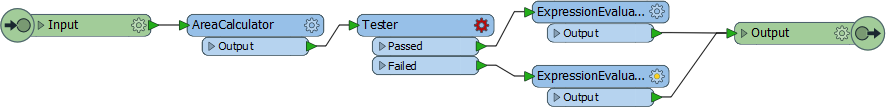

 **8) Set up Tester**
 Open up the Tester parameters dialog. Make a test for where WeightingAttribute > 0

 **9) Adjust Equation**
 Now that the attribute is exposed in the custom transformer, we can use it in the equation for calculating density. Open the parameters dialog for the ExpressionEvaluator transformer connected to the Tester:Passed port.

Change the equation to:

<pre>
@Value(TotalPopulation2001)/(@Value(NeighborhoodArea)*@Value(WeightingAttribute))
</pre>

i.e. multiply the existing NeighborhoodArea attribute by the WeightingAttribute and place parentheses around that part of the expression.

Click OK to close the dialog and run the workspace to check the result. Remember – the results will be different every time because we’re generating the weighting attribute randomly at run time!

Experiment selecting the weighting attribute in the main canvas, and not selecting it. When no attribute is selected then the features should pass through the Failed port and no weighting is used in the calculation:

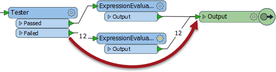

---

<table style="border-spacing: 0px">
<tr>
<td style="vertical-align:middle;background-color:darkorange;border: 2px solid darkorange">
<i class="fa fa-quote-left fa-lg fa-pull-left fa-fw" style="color:white;padding-right: 12px;vertical-align:text-top"></i>
First Officer Transformer says…
</td>
</tr>

<tr>
<td style="border: 1px solid darkorange">

It may seem odd – especially to experienced users – that we would use the attribute in the expression, and not the published parameter. But this is all part of how FME handles this behavior automatically. It avoids the author
needing to know about published parameters and how to use them, and uses hidden functionality to replace the attribute with the published parameter wherever necessary.

</td>
</tr>
</table>

---

<!--Exercise Congratulations Section--> 

<table style="border-spacing: 0px">
<tr>
<td style="vertical-align:middle;background-color:darkorange;border: 2px solid darkorange">
<i class="fa fa-thumbs-o-up fa-lg fa-pull-left fa-fw" style="color:white;padding-right: 12px;vertical-align:text-top"></i>
CONGRATULATIONS
</td>
</tr>

<tr>
<td style="border: 1px solid darkorange">

By completing this exercise you have learned how to:
<ul><li>Publish an FME parameter inside a custom transformer</li>
<li>Create a new user parameter inside a custom transformer</li>
<li>Expose attributes inside a custom transformer</li>
<li>Use an exposed attribute inside a custom transformer</li></ul>

</td>
</tr>
</table>