<!--Exercise Section-->
<!--NB: In GitBook world we don't give a number to exercises-->

<table style="border-spacing: 0px;border-collapse: collapse;font-family:serif">
<tr>
<td style="vertical-align:middle;background-color:darkorange;border: 2px solid darkorange">
<i class="fa fa-cogs fa-lg fa-pull-left fa-fw" style="color:white;padding-right: 12px;vertical-align:text-top"></i>
Exercise
</td>
<td style="border: 2px solid darkorange;background-color:darkorange;color:white">
Looping in a Custom Transformer
</td>
</tr>

<tr>
<td style="border: 1px solid darkorange; font-weight: bold">Data</td>
<td style="border: 1px solid darkorange">Address Data (Esri Geodatabase (File Geodb API))</td>
</tr>

<tr>
<td style="border: 1px solid darkorange; font-weight: bold">Overall Goal</td>
<td style="border: 1px solid darkorange">Create a custom transformer to calculate a check digit</td>
</tr>

<tr>
<td style="border: 1px solid darkorange; font-weight: bold">Demonstrates</td>
<td style="border: 1px solid darkorange">Custom Transformers and Loops</td>
</tr>

<tr>
<td style="border: 1px solid darkorange; font-weight: bold">Start Workspace</td>
<td style="border: 1px solid darkorange">None</td>
</tr>

<tr>
<td style="border: 1px solid darkorange; font-weight: bold">End Workspace</td>
<td style="border: 1px solid darkorange">C:\FMEData2016\Workspaces\DesktopAdvanced\CustomTransformers-Ex6-Complete.fmw</td>
</tr>

</table>

Due to a horrible mistake (don't worry, it wasn't yours) a city workcrew were given an incorrect address and accidentally demolished the house of the city's police chief!

You've been asked to come up with ideas to help prevent this from reoccurring, and the quickest method you can think of is to add a check digit to all address ID numbers.

Having taken FME training(!) you realize this can be done using a custom transformer loop.

---

<table style="border-spacing: 0px">
<tr>
<td style="vertical-align:middle;background-color:darkorange;border: 2px solid darkorange">
<i class="fa fa-quote-left fa-lg fa-pull-left fa-fw" style="color:white;padding-right: 12px;vertical-align:text-top"></i>
Wikipedia <a style="color:white;font-size:x-large;font-weight: bold;font-family:serif;text-decoration:underline" href="https://en.wikipedia.org/wiki/Check_digit">says</a>...
</td>
</tr>

<tr>
<td style="border: 1px solid darkorange">

A check digit is a form of redundancy check used for error detection on identification numbers (e.g. bank account numbers) which have been input manually. It is analogous to a binary parity bit used to check for errors in computer-generated data. It consists of a single digit (sometimes more than one) computed by an algorithm from the other digits (or letters) in the sequence input.
</td>
</tr>
</table>

---

A looping transformer is useful here because it can take each digit in an ID number, one at a time, and add its value to a running count. The last digit of the final count will be the checkdigit. Looping is particularly good because it can be applied to any length of ID attribute.

 **1) Start Workbench**
 Start FME Workbench. Use Readers > Add Reader to add a Reader with the following specifications:

<table style="border: 0px">

<tr>
<td style="font-weight: bold">Reader Format</td>
<td style="">Esri Geodatabase (File Geodb API)</td>
</tr>

<tr>
<td style="font-weight: bold">Reader Dataset</td>
<td style="">C:\FMEData2016\Data\Addresses\Addresses.gdb</td>
</tr>

</table>

When prompted, the only table you need to select is *PostalAddress*

 **2) Add StringLengthCalculator**
 We want FME to handle attributes with published parameters. It doesn't make a lot of difference, but it's slightly easier to create the custom transformer using at least one transformer that uses the main attribute (OBJECTID)

So, place a StringLengthCalculator transformer and use it to calculate the length of the OBJECTID attribute:

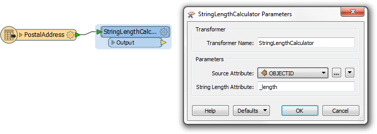

 **3) Create Custom Transformer**
 Now select the StringLengthCalculator and create a new Custom Transformer. You can call it CheckDigitCalculator.

Edit it to make sure it has properly named input and output ports:

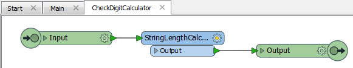

 **4) Initialize Loop**
 Now let's set up some attributes to initialize the loop. Inside the custom transformer definition place an AttributeCreator transformer and use it to create two new attributes: loopCounter and digitSum. Set both of their initial values to 0 (zero).

loopCounter will be the position of the digit we are processing, and digitSum will be the total of the digits processed.

 **5) Add SubstringExtractor**
 This is where we start to process the data. Add a SubstringExtractor transformer to fetch the next digit of the ID string. The Start and End Index parameters will be set to the value of loopCounter:
 
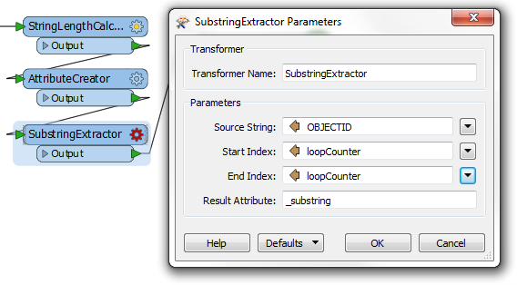

This way, as the loop is incremented, we fetch subsequent characters from the ID string.

 **6) Add ExpressionEvaluator**
 This is the other key transformer of the processing part. Place an ExpressionEvaluator transformer after the SubstringExtractor.

Open the parameters dialog. Set up the transformer to add the value of the extracted substring to the current digitSum value:

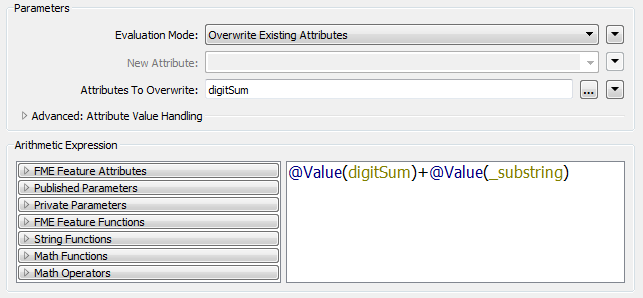 

 **7) Add ExpressionEvaluator**
 The main part of the processing is done. Now all we need to do is implement the conditional part of the looping. So, add a second ExpressionEvaluator and use it to increment the loopCounter attribute by 1:

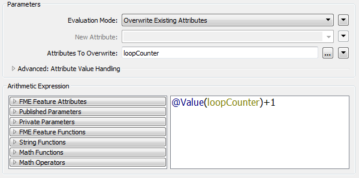 

 **8) Add Tester**
 Next we need to test whether we have reached the end of the ID string. Add a Tester transformer and set it up to test whether loopCounter = _length (i.e. has the transformer looped n times, where n is the length of the ID string).

The Tester:Passed port can be linked to the custom transformer Output port.

 **9) Add Loop Start Point**
 Before we can add the loop "object" we need to define where to loop back to. In this case we want to loop back to where the processing takes place, just after the loop count initialization.

So, add a new Custom Transformer Input port. Call it loopInput and connect it to the SubstringExtractor transformer input port:

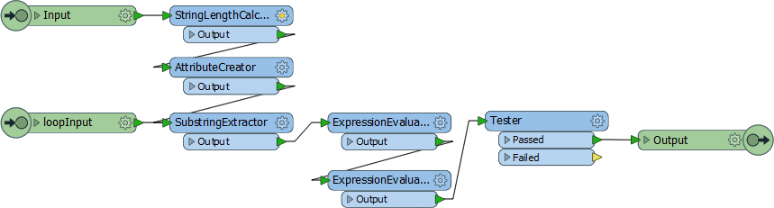

Open the properties dialog and uncheck the published button to hide this port from the main canvas.

 **10) Add Loop End Point**
 Now let's add the loop end point object. Right-click on the canvas and choose to add a Transformer Loop. When prompted, choose loopInput as the input port to loop back to:

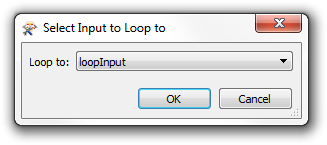

Connect the loop object to the Tester:Failed port:

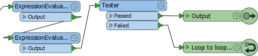

 **11) Add SubstringExtractor**
 The result of this translation will be a number that is a total of the digits in the ID attribute. For example, if OBJECTID = 5621 then digitSum will be 14 (5+6+2+1).

However, a check digit is normally a single digit - the last digit of our sum (in the above example, 4).

So, add a second SubstringExtractor transformer and connect it between the Tester:Passed and Output ports:

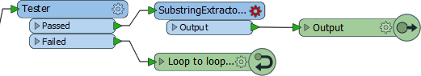

Open the parameters dialog and set it up to extract just the final digit of digitSum and create a new attribute called CheckDigit:

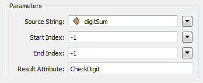

-1 means the final digit in the string.

 **12) Clean Up Attributes**
 One final thing to do: clean up the attributes emerging from the transformer. Open the properties dialog for the Output port and set it up to output the CheckDigit attribute, but no others.

 **13) Run Workspace**
 Add an Inspector to the main canvas and run the translation. You could also optionally add a transformer to concatenate the old ID (OBJECTID) and the check digit (CheckDigit) to give a new ID.

The output should be something like this:

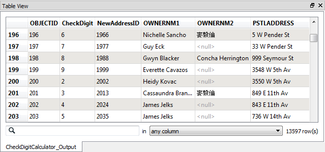

The final digit of the new address ID field will always be the sum of the preceding digits, meaning there is more ability to check for mistakes before anything bad happens!

---

<!--Exercise Congratulations Section--> 

<table style="border-spacing: 0px">
<tr>
<td style="vertical-align:middle;background-color:darkorange;border: 2px solid darkorange">
<i class="fa fa-thumbs-o-up fa-lg fa-pull-left fa-fw" style="color:white;padding-right: 12px;vertical-align:text-top"></i>
CONGRATULATIONS
</td>
</tr>

<tr>
<td style="border: 1px solid darkorange">

By completing this exercise you have learned how to:
<ul><li>Create a loop object in a custom transformer</li>
<li>Create and increment a loop counter in a custom transformer</li>
<li>Use a loop counter to loop through content in a custom transformer</li>
<li>Add an unpublished input port and use it for a loop target</li>
<li>Prevent excess attributes exiting a custom transformer</li></ul>

</td>
</tr>
</table>