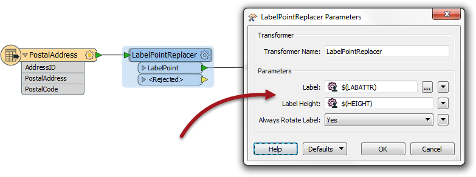
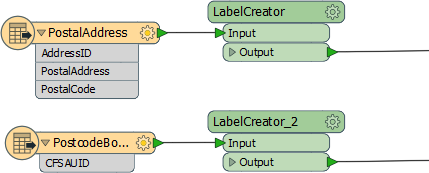

# Custom Transformers and Schema

Schema Handling is one of the most misunderstood components in Custom Transformers.

The main consequence of making a reusable custom transformer is that the author (and FME) cannot be sure where the transformer will be used and whether the schema will always match what is required.

## Handling Attribute Schema ##

One part of the schema to be considered is the set of attributes available to the custom transformer.

For example, in this workspace a custom transformer carries out processing on incoming data using an attribute called AddressID as a key field:

However, if that transformer is duplicated and used elsewhere, there is no guarantee that AddressID will exist:

These cases will both fail; the first schema has ADDRESSID (not AddressID) and the other AddressUUID.

Therefore it’s vital that there is some form of mechanism for protecting against problems of a mismatched schema of this type. In fact there are two ways this can be handled: FME can automatically take care of the schema, or the workspace author can handle it manually.

## Handling User Parameters ##

The other schema item to be handled are user parameters.

Here, for example, a LabelPointReplacer transformer allows user input for label content and height:

Now let's assume that LabelPointReplacer is incorporated into a custom transformer, and that transformer used in several places in a workspace:

Ideally each instance of the custom transformer will allow different values for the LabelPointReplacer parameters, in which case we need a mechanism for the user to enter different values.

As with attribute schema, there is an automated method for handling these, as well as a manual method.

