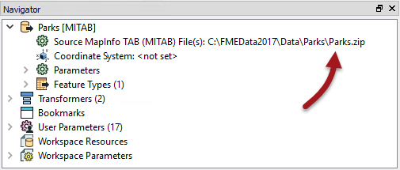

# Zip File Handling

Both FME readers and writers are capable of working with compressed (zip) files. Zip files are a convenient way to store datasets that need to be handled as a single unit; for example a set of multiple files can be contained within a single zip file.

---

## Zip File Reading ##

The dataset a reader reads is defined by the Source Dataset/Files parameter in the Navigator window:

As in the above screenshot, this dataset parameter can be a pointer to a zip file. You simply select the zip file in the source parameter and FME will extract the data when it is being read. 

It doesn't matter whether the dataset is file-based (like a single AutoCAD file) or folder-based (like the set of files that make up a Shapefile dataset).

The only difficulty in setting this up is to remember that the file browser does not display zip files by default, and that the file extension being viewed must be changed:

---

## Zip File Writing ##

Writing data as a zip file is particularly useful for where the output data needs to be post-processed. For example, if you use a shutdown script to move or copy output data to a new location, it’s more convenient to handle a single zip file than multiple data files.

The simplest way to create a zipped output is to simply change the file extension to .zip in the output dataset field:

You can also specify the filename to be written inside the zip file. In fact, a shortcut button for setting a zip extension, will do this for you:

Notice the small icon in the dataset field that indicates the zipped status.

When the workspace is run the log file reports the zip creation:

<pre>
Finished updating output zip file `C:\FMEData2017\Output\Parks.zip'
</pre>

And the output is, indeed, a zipped dataset:

---

<!--Person X Says Section-->
<!--Sister Intuitive is the representative for this chapter-->

<table style="border-spacing: 0px">
<tr>
<td style="vertical-align:middle;background-color:darkorange;border: 2px solid darkorange">
<i class="fa fa-quote-left fa-lg fa-pull-left fa-fw" style="color:white;padding-right: 12px;vertical-align:text-top"></i>
Sister Intuitive says…
</td>
</tr>

<tr>
<td style="border: 1px solid darkorange">

I’m Sister Intuitive from the order of Perpetual Translations. I’ll provide you with spatial guidance throughout this chapter.
  Some users may want to zip data in order to move or copy it to a different location as a single entity. A user parameter can be used in a TCL or Python script to find the name of the file just written, and the FeatureWriter transformer also provides the name of the dataset as an attribute.

</td>
</tr>
</table>