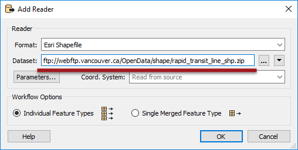

# Web Based Datasets #

There can be no doubt that there is a trend towards data being stored in the cloud, including spatial data. For that reason FME has comprehensive tools for reading datasets that are web-based.
 

## Simple URL Selection ##

The easiest way to read a web-based dataset is to simply paste the URL into the source dataset parameter.

Here the workspace author is adding a reader to read a Shapefile directly from an open data ftp site.

---

<!--Person X Says Section-->
<!--Sister Intuitive is the representative for this chapter-->

<table style="border-spacing: 0px">
<tr>
<td style="vertical-align:middle;background-color:darkorange;border: 2px solid darkorange">
<i class="fa fa-quote-left fa-lg fa-pull-left fa-fw" style="color:white;padding-right: 12px;vertical-align:text-top"></i>
Sister Intuitive says…
</td>
</tr>

<tr>
<td style="border: 1px solid darkorange">

A folder-based dataset must be compressed to a single zip file for FME to read it from the web like this; the above is a perfect illustrations of that requirement. Datasets can be read from non-zipped datasets, but only when the dataset consists of a single file (such as an AutoCAD DWG file).

</td>
</tr>
</table>

---

The URL entered into a source dataset field may also be a reference to a shared resource on a web-based file storage system. For example, here a user is reading a MapInfo TAB dataset directly from a Dropbox link into the FME Data Inspector:

The key is to force the web service to provide a direct link to the file, rather than to their own web interface. For example, to cause Dropbox to render data you should [set the dl query parameter](https://www.dropbox.com/en/help/201) to 1 in the URL, as in the above screenshot, instead of the default value of 0 (zero).

However, there are better ways to read data from a web service...

---

<!--Tip Section--> 

<table style="border-spacing: 0px">
<tr>
<td style="vertical-align:middle;background-color:darkorange;border: 2px solid darkorange">
<i class="fa fa-info-circle fa-lg fa-pull-left fa-fw" style="color:white;padding-right: 12px;vertical-align:text-top"></i>
TIP
</td>
</tr>

<tr>
<td style="border: 1px solid darkorange">

If the web site data is being read from needs authentication, most readers have parameters to enter such information:
  
  Notice the use of br tags to create spacing.

</td>
</tr>
</table>

---

## Web Services ##

Besides being able to read from a URL, FME can also directly access certain web services to read data. This is done with functionality inside FME called Web Connections.

 