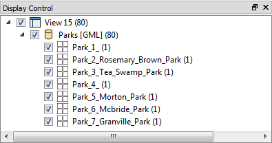

## Feature Type Fanout ##

A Feature Type Fanout delivers data to multiple feature types (layers) within a single dataset. Taking the elevation example, here the output is a different feature type for each elevation value:

This results in a DXF dataset containing multiple layers of data.

### Setting a Feature Type Fanout ###

A feature type fanout is defined in the Feature Type Properties dialog by selecting an attribute like so:

The Feature Type Name then changes to match what has been selected:

In this case, each feature with a different park name will be written to a different layer of the GML output dataset.

Additionally, the Text Editor can be used to construct a fanout string:

The result of this translation - as shown in the FME Data Inspector - is a series of layers, each with the park ID and name included:

Two things to notice in that result are:

- Parks 1 and 4 did not have a ParkName attribute (or it was empty) and so the layer name reflects that
- The **:** (colon) and **-** (dash) characters in the fanout string were rendered as **_** (underscore) characters instead. Presumably this is a limitation of the GML output format. 

---

<table style="border-spacing: 0px">
<tr>
<td style="vertical-align:middle;background-color:darkorange;border: 2px solid darkorange">
<i class="fa fa-quote-left fa-lg fa-pull-left fa-fw" style="color:white;padding-right: 12px;vertical-align:text-top"></i>
Sister Intuitive says…
</td>
</tr>

<tr>
<td style="border: 1px solid darkorange">

FME2016 (in fact, FME2015.1) introduced the above technique as an easier way for setting a feature type fanout, losing the "fanout" label at the same time. But, regardless of the label, it's still the same fanout as in previous versions. 

</td>
</tr>
</table>

