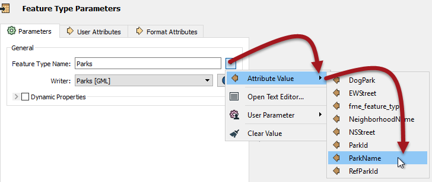

## Feature Type Fanout ##

A Feature Type Fanout delivers data to multiple feature types (layers) within a single dataset. Taking the elevation example, here the output is a different feature type for each elevation value:

This results in a DXF dataset containing multiple layers of data.

### Setting a Feature Type Fanout ###

A feature type fanout is defined in the Feature Type parameters by selecting an attribute for the feature type name, like so:

The Feature Type Name then changes to match what has been selected:

In this case, each feature with a different park name will be written to a different layer of the GML output dataset.

---

### Constructing a Feature Type Fanout ###

Besides selecting an attribute, the Text Editor can be used to construct a fanout string:

The result of this translation - as shown in the FME Data Inspector - is a series of layers, each with the park ID and name included:

Two things to notice in that result are:

- Parks 1 and 4 did not have a ParkName attribute (or it was empty) and so the layer name reflects that
- The **:** (colon) characters in the fanout string were rendered as **_** (underscore) characters instead. Presumably this is a limitation of the GML output format. 

