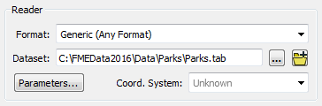
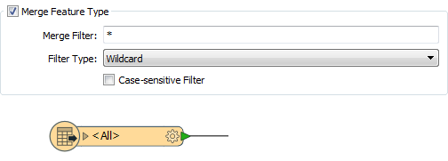
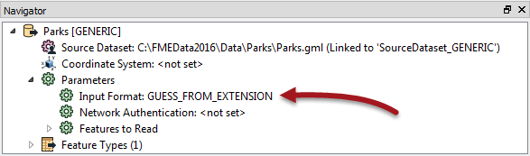
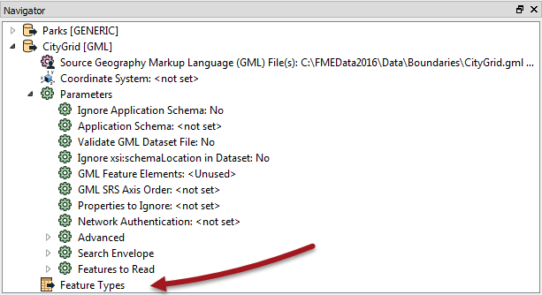

## The Generic Reader ##

A Generic Reader is used in the same way as any other Reader; by specifying the format in the new Reader dialog:

Here the workspace is being created by reading a MapInfo TAB dataset, but it could then be set to GML when run, like so:

FME will examine the extension of the file chosen to identify the format of data and then read it just as if it were a true GML Reader.

---

<table style="border-spacing: 0px">
<tr>
<td style="vertical-align:middle;background-color:darkorange;border: 2px solid darkorange">
<i class="fa fa-quote-left fa-lg fa-pull-left fa-fw" style="color:white;padding-right: 12px;vertical-align:text-top"></i>
Sister Intuitive says…
</td>
</tr>

<tr>
<td style="border: 1px solid darkorange">

You're thinking there must be a catch, right? Well it's true. Firstly this technique only works with file-based formats (it won't work on a database or web format). Secondly, the Generic Reader is not immune from the Unexpected Input Remover, so switching datasets - regardless of format - only works with a compatible schema.

</td>
</tr>
</table>

---

### Generic Reader Feature Types ###

The Unexpected Input Remover is the function in FME that filters incoming data against the list of feature types (layers) that are defined in the workspace. If the incoming data is stored on a layer that is not defined in the workspace, then it will be dropped from the translation:

So, although the Generic Reader allows you to read datasets of different formats, the limitation is that each dataset must have its layers defined as feature types in the workspace, unless you want them to be dropped.

Of course, an easy way to allow all layers to pass is to set a Merge Feature Type in the Feature Type Properties dialog:

With that setup, any layer of data can be passed into the workspace, regardless of format. But even then you need to be careful about assuming what attributes will be available!

---

### Generic Reader Parameters ###

All Readers in a workspace have a number of parameters that can be used to control how that Reader operates. Each format has its own set of specialized parameters.

However, the Generic Reader has very few parameters, the main one being to set the format of data being read:

By default this is set to determine data format from the file extension, but it can be set manually to a specific format.

---

<table style="border-spacing: 0px">
<tr>
<td style="vertical-align:middle;background-color:darkorange;border: 2px solid darkorange">
<i class="fa fa-quote-left fa-lg fa-pull-left fa-fw" style="color:white;padding-right: 12px;vertical-align:text-top"></i>
Sister Intuitive says…
</td>
</tr>

<tr>
<td style="border: 1px solid darkorange">

The Input Format parameter is useful when the file extension is - like .mdb - one used by multiple formats. For example, you might turn it into a user parameter for use in an FME Server data upload service. Then a single workspace can read any format of data, but the end-user is able to tell you what format that is.

</td>
</tr>
</table>

---

However, let's say you wish to use the Generic Reader, but apply a particular GML Reader parameter when a GML dataset is being read. If the Generic Reader has no parameters, then how can this be done?

In brief, the solution is to add a dummy GML Reader:

Here, for example, the author has added a GML Reader but then deleted all its feature types. The data will be read and then dropped. But, all of the parameters in this Reader will get applied to the Generic Reader when reading GML data.

---

<table style="border-spacing: 0px">
<tr>
<td style="vertical-align:middle;background-color:darkorange;border: 2px solid darkorange">
<i class="fa fa-quote-left fa-lg fa-pull-left fa-fw" style="color:white;padding-right: 12px;vertical-align:text-top"></i>
Sister Intuitive says…
</td>
</tr>

<tr>
<td style="border: 1px solid darkorange">

In fact, the little-known Resource Reader is the best solution, because it applies parameters without reading any data. You can add a Resource Reader using Readers > Add Reader as Resource. There's more info on Resource Readers later in this chapter.

</td>
</tr>
</table>

---

