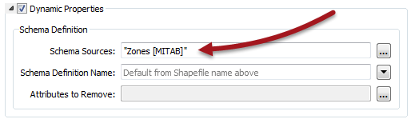
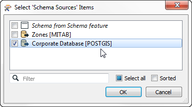

## Schema Sources ##

The Writer feature type has a dynamic parameter labelled Schema Sources:

This parameter defines where the destination schema is going to be obtained from. By default, this parameter is set to whatever source dataset is being read. That way the output schema is always a duplicate of the input.

However, it can be set to use any Reader dataset – in any format – as the source for the outgoing schema. 

For example, here the workspace author is converting zoning data, but has chosen a PostGIS database as the required structure for the output dataset.

Presumably, the corporate database includes a zoning table, and the structure of that table will be used as the schema of the output in this workspace.

---

<table style="border-spacing: 0px">
<tr>
<td style="vertical-align:middle;background-color:darkorange;border: 2px solid darkorange">
<i class="fa fa-quote-left fa-lg fa-pull-left fa-fw" style="color:white;padding-right: 12px;vertical-align:text-top"></i>
Sister Intuitive says…
</td>
</tr>

<tr>
<td style="border: 1px solid darkorange">

In this scenario the “Dynamic” part of the translation is the destination schema being fetched at run time.
For example, if the corporate schema (above) were to change, the workspace feature types would not need updating. They would be automatically ‘updated’ when the workspace is run.

</td>
</tr>
</table>

---

### Resource Readers ###

The Schema Source parameter can be set to point to any Reader as the source of a dynamic schema. However, in most cases all we need from the dataset is the schema, not the data. 

This is where Resource Readers can be used.

A Resource Reader is a Reader that returns the schema of a dataset, but no data. One is added using Readers > Add Reader as Resource on the menubar:

Here the user adds a PostGIS database as a resource and it appears in the Navigator window:

Once available the resource Reader can be used as the source of a schema for a dynamic Writer.

---

### Non-Matching Data ###

Sadly, the ability to pick any schema for the Writer doesn't mean it will handle just any type of data. The incoming data must have the same features types as defined in the Writer schema, otherwise they will be dropped. 

When features are dropped, the FME log reports that fact like this:

<pre>
                       Features With No Schema defined
=-=-=-=-=-=-=-=-=-=-=-=-=-=-=-=-=-=-=-=-=-=-=-=-=-=-=-=-=-=-=-=-=-=-=-=-=-=-=-
Zones                                                                      416
==============================================================================
Total Features NOT Written                                                 416
=-=-=-=-=-=-=-=-=-=-=-=-=-=-=-=-=-=-=-=-=-=-=-=-=-=-=-=-=-=-=-=-=-=-=-=-=-=-=-
</pre>

Consider this behavior a sort of “Unexpected Output Remover”. In this case, data was read from a feature type called Zones. However, no table called Zones is defined in the PostGIS database used as the Writer schema. Therefore the Zones data was dropped from the translation. 

---

### Why Use an External Schema? ###

The main reason for using an external dataset schema is to adhere to a fixed standard. Perhaps the most useful aspect of this is that if the schema of the dataset changes, then the workspace makes use of it automatically. There's no need to manually update the workspace because the output requirements have changed.

However, as noted above, the data being written must match that standard or risk being dropped. So there is always likely to be some data transformation required in the workspace to coax the input data into the required output schema.

The SchemaMapper transformer is useful for reconciling data with the required schema - that's because the SchemaMapper too can use an external lookup table, meaning that the dynamic workspace can be changed to meet any required output schema without having to actually make edits in Workbench!  