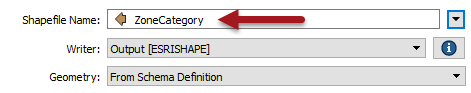

## Dynamic Feature Types ##

In all writer feature types, the feature type name can be defined by an attribute (or string constructed from attributes). When a writer is set up as dynamic, by default the attribute used is an FME attribute called **fme&#95;feature&#95;type**:

fme&#95;feature&#95;type stores the name of the original feature type on incoming features. It makes sense to default to this attribute because then all data is written to the same feature type as it came from, and we get an output that is a duplicate of the input.

However, should you wish, there's no reason why a different attribute couldn't be used, in order to define a different set of output feature types:

Here, for example, the author is using ZoneCategory to supply the name of the layers to create. This will work well where - for example - the incoming data is a single dataset containing zones, while the output is a database with a table for each category of zone.

---

### Schema Requirements ###

However! Changing the output feature type names is not as simple as that. Because this is a dynamic workspace (not just a fanout) the feature type names chosen must match a layer that exists in the source schema dataset.

Failure to do so will lead to the data being dropped with the following log messages:

<pre>
                       Features With No Schema defined
=-=-=-=-=-=-=-=-=-=-=-=-=-=-=-=-=-=-=-=-=-=-=-=-=-=-=-=-=-=-=-=-=-=-=-=-=-=-=-
Commercial                                                                  51
Comprehensive Development                                                  237
Historic Area                                                                5
Industrial                                                                  14
Light Industrial                                                            19
Multiple Family Dwelling                                                    45
One Family Dwelling                                                         19
Two Family Dwelling                                                         26
==============================================================================
Total Features NOT Written                                                 416
=-=-=-=-=-=-=-=-=-=-=-=-=-=-=-=-=-=-=-=-=-=-=-=-=-=-=-=-=-=-=-=-=-=-=-=-=-=-=-
=-=-=-=-=-=-=-=-=-=-=-=-=-=-=-=-=-=-=-=-=-=-=-=-=-=-=-=-=-=-=-=-=-=-=-=-=-=-=-
</pre>

What the author must ensure is that the schema used actually contains these layers. Then the translation will proceed as expected.