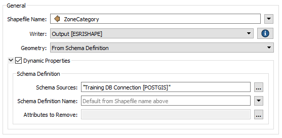
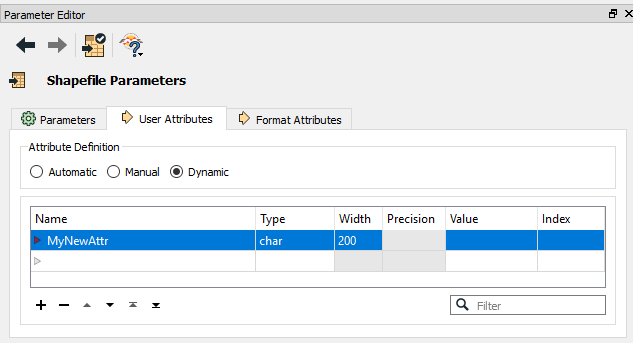
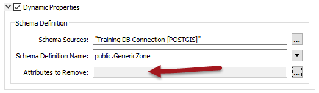

## Dynamic Attributes ##

As we know, there are three main components of a schema:

- Feature Type
- Attributes
- Geometry

This section looks at Attributes, and how a workspace author can change the attributes that are written in a dynamic translation.

---

### Defining Attribute Names ###

This is probably the most complex part of dynamic translations, so let's take the explanation step by step, going back over some old ground where necessary.

As we've seen, in a dynamic translation each incoming feature has an attribute (either *fme&#95;feature&#95;type* or another attribute) that specifies which feature type the data is to be written to.

The Schema Sources parameter defines where those feature types exist, and uses them to also define the attributes and geometry types that are written to the output. 

Here, for example, we have a set of zones data. If, for a particular feature, ZoneCategory = "Residential" then the writer will look for a PostGIS table called Residential, and create the output dataset using the same structure as that table.

However... underneath the Schema Source parameter is a setting for Schema Definition Name. The Schema Definition Name overrides attribute definitions:

Here, for example, the user is specifying ZoneCategory as the name of the feature type to be written, but overrides the use of attributes by saying they have to come from a table called GenericZone.

What's interesting is that the feature type specified by ZoneCategory no longer needs to exist; i.e. the "Residential" table does not have to exist to get a "Residential" feature type in the Shape output. It is enough that the GenericZone table does exist.

---

<table style="border-spacing: 0px">
<tr>
<td style="vertical-align:middle;background-color:darkorange;border: 2px solid darkorange">
<i class="fa fa-quote-left fa-lg fa-pull-left fa-fw" style="color:white;padding-right: 12px;vertical-align:text-top"></i>
Sister Intuitive says…
</td>
</tr>

<tr>
<td style="border: 1px solid darkorange">

In the above example, the Schema Definition Name was a fixed value; i.e. all output feature types got the same attribute definitions. However, the Schema Definition Name can also come from an attribute; meaning one attribute defines the feature type name, and another attribute defines a feature type where the attribute schema is to come from!

</td>
</tr>
</table>

---

### Adding or Deleting Attributes ###

Besides specifying which set of attributes to use, sometimes - even in a dynamic translation - you need to add or delete specific attributes. This is very simple to do.

#### Adding a New Attribute ####

Adding a new attribute to all output on a dynamic feature type is just a case of editing the feature type definition to add that attribute:

In other words, any attribute you add to the feature type definition will get added to all features output through there – regardless of source or resource schemas.

For example, I might add an attribute if an AreaCalculator transformer was in the workspace and I wished to store the result.

#### Deleting an Attribute ####

Deleting an existing attribute is done through the dynamic Schema Definition dialog. At the foot of that dialog is a field for removing attributes:

The edit [...] button opens a dialog in which to select or manually enter attributes that are in the source schema but that you don’t want in the output:

By being able to manually enter names you can choose to remove attributes even when the schema is coming from outside of the workspace.