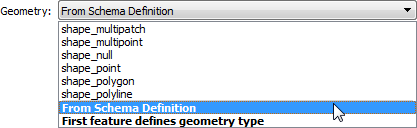

## Dynamic Geometry ##

The geometry used in an output dataset depends on the format used. Only when the format does not allow a mix of geometries in a single feature type can there be a problem.

For example, a standard (static) Shape Writer feature type allows you to pick the geometry allowed in that file:

In a dynamic workspace this changes. The geometry type permitted depends on that defined in the chosen schema:

By default - when the Schema Source is unchanged as that being read by the Reader - then the permitted geometry will be a duplicate of the source data.

When the Schema Source is changed to another dataset, then the permitted geometry is what is defined in that dataset. If the geometry of the source dataset is different, then it would be dropped instead of written.

Additionally, the workspace author may edit the schema definition for permitted geometry:

 

A specific geometry type will set the permitted geometry to that type. From Schema Definition, as we know, sets the permitted geometry to whatever is defined in the Source Schema.

The other option is First Feature Defines Geometry Type.

### First Feature Defines Geometry Type ###

The geometry type in a dynamic translation can be difficult to handle once the feature types are being handled dynamically (i.e. either the Schema Source has changed or the Feature Type name is set to other than fme_feature_type).

That's because two features with the same Feature Type name might have different geometry types. In that situation FME can't tell which should get priority.

If First Feature Defines Geometry Type is the chosen method of handling geometry, then the first feature to arrive at the Writer gets to set the geometry type. Subsequent features destined for the same feature type will be refused if they do not have the correct geometry.