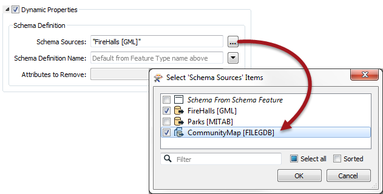
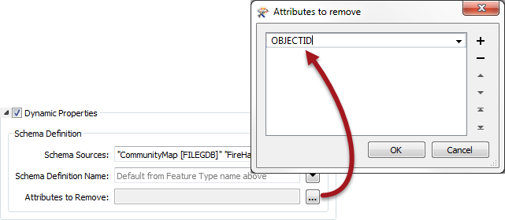

<!--Exercise Section-->
<!--NB: In GitBook world we don't give a number to exercises-->

<table style="border-spacing: 0px;border-collapse: collapse;font-family:serif">
<tr>
<td style="vertical-align:middle;background-color:darkorange;border: 2px solid darkorange">
<i class="fa fa-cogs fa-lg fa-pull-left fa-fw" style="color:white;padding-right: 12px;vertical-align:text-top"></i>
Exercise 4
</td>
<td style="border: 2px solid darkorange;background-color:darkorange;color:white">
Dynamic Community Mapping Updates
</td>
</tr>

<tr>
<td style="border: 1px solid darkorange; font-weight: bold">Data</td>
<td style="border: 1px solid darkorange">Community Mapping (Esri File Geodatabase)</td>
</tr>

<tr>
<td style="border: 1px solid darkorange; font-weight: bold">Overall Goal</td>
<td style="border: 1px solid darkorange">Create a workspace to generate a new Community Mapping dataset using an existing schema</td>
</tr>

<tr>
<td style="border: 1px solid darkorange; font-weight: bold">Demonstrates</td>
<td style="border: 1px solid darkorange">Dynamic Schemas</td>
</tr>

<tr>
<td style="border: 1px solid darkorange; font-weight: bold">Start Workspace</td>
<td style="border: 1px solid darkorange">None</td>
</tr>

<tr>
<td style="border: 1px solid darkorange; font-weight: bold">End Workspace</td>
<td style="border: 1px solid darkorange">C:\FMEData2017\Workspaces\DesktopAdvanced\ReadWrite-Ex4-Complete.fmw</td>
</tr>

</table>

Previous exercises have involved translating the Community Mapping dataset, used by the planning department for various community mapping tasks.

However, as time has moved on the Community Mapping dataset has become out of date. The planning department therefore wants to start building a new community map dataset. The dataset will have new data, but use the existing schema where possible. They also – in order to use an open standard – want a format change to GML.

At the moment two source datasets have been identified as being required in the new community mapping "database". They are fire halls (source format: GML) and city parks (source format: MapInfo TAB).

So, let's create a new workspace to handle that scenario.

 **1) Inspect Data**
 Inspect the two source datasets in the FME Data Inspector, to become familiar with them. 

<table style="border: 0px">

<tr>
<td style="font-weight: bold">Format</td>
<td style="">GML (Geography Markup Language)</td>
</tr>

<tr>
<td style="font-weight: bold">Dataset</td>
<td style="">C:\FMEData2017\Data\Emergency\FireHalls.gml</td>
</tr>

</table>

<table style="border: 0px">

<tr>
<td style="font-weight: bold">Format</td>
<td style="">MapInfo TAB (MITAB)</td>
</tr>

<tr>
<td style="font-weight: bold">Dataset</td>
<td style="">C:\FMEData2017\Data\Parks\Parks.tab</td>
</tr>

</table>

There was already parks data in the community mapping, but this time it is polygons, not points. The FireHalls data is entirely new for community mapping.

 **2) Start Workbench**
 Let's get started by generating a workspace as follows: 

<table style="border: 0px">

<tr>
<td style="font-weight: bold">Reader Format</td>
<td style="">GML (Geography Markup Language)</td>
</tr>

<tr>
<td style="font-weight: bold">Reader Dataset</td>
<td style="">C:\FMEData2017\Data\Emergency\FireHalls.gml</td>
</tr>

<tr>
<td style="font-weight: bold">Writer Format</td>
<td style="">GML (Geography Markup Language)</td>
</tr>

<tr>
<td style="font-weight: bold">Writer Dataset</td>
<td style="">C:\FMEData2017\Output\Training\NewCommunityMap.gml</td>
</tr>

<tr>
<td style="font-weight: bold">Workflow Options</td>
<td style="">Dynamic Schema</td>
</tr>

</table>

The dynamic option is chosen so that we can use a schema other than that of the dataset being translated.

 **3) Add Reader**
 So far, so good. Now let’s add a Reader for the new parks data.

Select Readers &gt; Add Reader from the menubar. Add a Reader as follows:

<table style="border: 0px">

<tr>
<td style="font-weight: bold">Reader Format</td>
<td style="">MapInfo TAB (MITAB)</td>
</tr>

<tr>
<td style="font-weight: bold">Reader Dataset</td>
<td style="">C:\FMEData2015\Data\Parks\Parks.tab</td>
</tr>

<tr>
<td style="font-weight: bold">Workflow Options</td>
<td style="">Single Merged Feature Type</td>
</tr>

</table>

Connect the new Reader feature type up to the existing Writer feature type, and label the feature types for easier recognition.

 **4) Add Resource Reader**
 One of the requirements was to use the existing community mapping schema where possible. With the firehalls it isn’t possible, since that never existed in the Community Mapping Geodatabase. However, the parks dataset did exist in that Geodatabase, so we’ll need to use that schema.

So, select Readers &gt; Add Reader as Resource.

When prompted, enter the following info:

<table style="border: 0px">

<tr>
<td style="font-weight: bold">Reader Format</td>
<td style="">Esri Geodatabase (File Geodb API)</td>
</tr>

<tr>
<td style="font-weight: bold">Reader Dataset</td>
<td style="">C:\FMEData2017\Data\CommunityMapping\CommunityMap.gdb</td>
</tr>

</table>

Click OK and the Reader is added as a Resource:

 **5) Adjust Dynamic Parameters**
 Now we need to make sure that resource is being used.

Open the properties dialog for the Writer feature type. Click the Schema Sources browse button.

Put a checkmark against CommunityMap and ensure Parks is NOT checked. 

Click OK.

Since we are writing both points and polygons, for some formats we might have to change the Geometry setting. But GML can cope with both geometry types and so this section is greyed-out.

Click OK to close the Feature Type Properties dialog.

 **6) Save and Run Workspace**
 Save the workspace and then run it.

Inspect the output. There should be two layers: one for fire halls, the other for parks. The parks dataset should have the schema from the Geodatabase (not the MapInfo parks), including attributes for ParkName, ParkAddress, and ParkURL (even if there is no data to fill some fields yet):

Notice that it also has OBJECTID, which came from the Geodatabase and we don’t really need.

 **7) Delete Attribute**
 Re-open the properties dialog for the Writer feature type. Under Attributes to Remove type OBJECTID into the first row. You won’t be able to select it from the drop-down list because it comes from a resource reader, not a real reader:

But don’t close the Feature Type Properties dialog yet.

 **8) Add Attribute**
 A last-minute request is to add an attribute – *LastUpdatedBy* – to all tables in the output.

So, click on the User Attributes tab and add this new attribute. Make it a 30 character string.

As you can see, there is no need to change the attribute definition mode - it should stay as *dynamic*.

 **9) Re-Run Workspace**
 Save the workspace and run it again.

Inspect the output. Notice that OBJECTID will not appear as an attribute. LastUpdatedBy does appear, albeit that it doesn’t have a value yet.

---

<!--Exercise Congratulations Section--> 

<table style="border-spacing: 0px">
<tr>
<td style="vertical-align:middle;background-color:darkorange;border: 2px solid darkorange">
<i class="fa fa-thumbs-o-up fa-lg fa-pull-left fa-fw" style="color:white;padding-right: 12px;vertical-align:text-top"></i>
CONGRATULATIONS
</td>
</tr>

<tr>
<td style="border: 1px solid darkorange">

By completing this exercise you have learned how to:
<ul><li>Create a dynamic workspace with multiple Readers</li>
<li>Add a Resource Reader</li>
<li>Change the source of a dynamic workspace schema</li>
<li>Add and remove hard-coded attributes in a dynamic workspace</li></ul>

</td>
</tr>
</table>