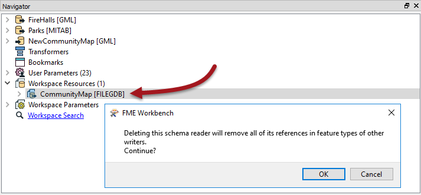
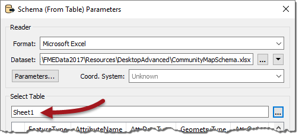
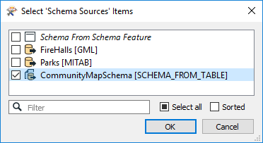
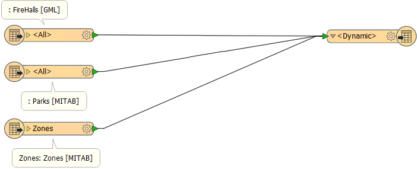
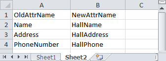
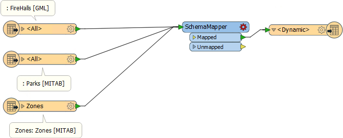

<!--Exercise Section-->

<table style="border-spacing: 0px;border-collapse: collapse;font-family:serif">
<tr>
<td style="vertical-align:middle;background-color:darkorange;border: 2px solid darkorange">
<i class="fa fa-cogs fa-lg fa-pull-left fa-fw" style="color:white;padding-right: 12px;vertical-align:text-top"></i>
Exercise 5
</td>
<td style="border: 2px solid darkorange;background-color:darkorange;color:white">
Dynamic Community Map Translation (Table-Based)
</td>
</tr>

<tr>
<td style="border: 1px solid darkorange; font-weight: bold">Data</td>
<td style="border: 1px solid darkorange">Community Mapping (Esri File Geodatabase)</td>
</tr>

<tr>
<td style="border: 1px solid darkorange; font-weight: bold">Overall Goal</td>
<td style="border: 1px solid darkorange">Generate a new Community Mapping dataset using a table-based schema</td>
</tr>

<tr>
<td style="border: 1px solid darkorange; font-weight: bold">Demonstrates</td>
<td style="border: 1px solid darkorange">Table-based schemas for dynamic translations</td>
</tr>

<tr>
<td style="border: 1px solid darkorange; font-weight: bold">Start Workspace</td>
<td style="border: 1px solid darkorange">C:\FMEData2017\Workspaces\DesktopAdvanced\ReadWrite-Ex5-Begin.fmw</td>
</tr>

<tr>
<td style="border: 1px solid darkorange; font-weight: bold">End Workspace</td>
<td style="border: 1px solid darkorange">C:\FMEData2017\Workspaces\DesktopAdvanced\ReadWrite-Ex5-Complete.fmw C:\FMEData2017\Workspaces\DesktopAdvanced\ReadWrite-Ex5-Complete-Advanced.fmw</td>
</tr>

</table>

In a previous exercise you created a new community map dataset for the planning department using a dynamic schema. At the time only two tables were defined, but now another one is required and the planning department wants you to update the workspace.

Rather than having to make changes each time they add more datasets, you figure that you can simply create an Excel spreadsheet containing the schema definition, so the planning team can edit it themselves and do the same for all future updates.

 **1) Inspect Spreadsheet**
 Open and examine the spreadsheet at C:\FMEData2017\Resources\DesktopAdvanced\CommunityMapSchema.xlsx.

If you don’t have Excel then open it in the FME Data Inspector and switch to Table View.

The table has schema definitions for Firehalls, Parks, and Zones feature types.

 **2) Start Workbench**
 Start FME Workbench. Open the workspace from the previous exercise or the begin workspace listed above. 

 **3) Delete CommunityMap Resource Reader**
 Because we are using a spreadsheet to define our output schemas, the CommunityMap Resource Reader is no longer needed. Locate it in the Navigator window, right-click on it, and choose Delete.

When prompted, click OK to confirm that all references relating to this dataset will also be removed.

 **4) Add Excel File as Reader Resource**
 Now select Readers > Add Reader as Resource. In the dialog that opens choose:

<table style="border: 0px">

<tr>
<td style="font-weight: bold">Reader Format</td>
<td style="">Schema (From Table)</td>
</tr>

<tr>
<td style="font-weight: bold">Reader Dataset</td>
<td style="">C:\FMEData2017\Resources\DesktopAdvanced\CommunityMapSchema.xlsx</td>
</tr>

</table>

***NB:** Be sure to use the Schema (From Table) format and not the Excel format!*

Before clicking OK, click the parameters button (if you don't you will be prompted to anyway). This dialog is where we can define how the table maps to the required schema.

Check the reader parameters at the top. They should show the dataset is an Excel format file. Select Sheet1 as the table to use:

The first row should get used as the field names. If this is not the case, then click the parameters button above and set the values properly:

Next select the appropriate fields to match to the required parameters (for example Feature Type = FeatureType):

Click OK to close the dialog and again to add the resource reader.

---

<!--Tip Section--> 

<table style="border-spacing: 0px">
<tr>
<td style="vertical-align:middle;background-color:darkorange;border: 2px solid darkorange">
<i class="fa fa-info-circle fa-lg fa-pull-left fa-fw" style="color:white;padding-right: 12px;vertical-align:text-top"></i>
TIP
</td>
</tr>

<tr>
<td style="border: 1px solid darkorange">

The fields in such a lookup table can be given any name you desire. In this example they have been given the same name as the parameter to which they are being applied, but only to make the relationship as obvious as possible.

</td>
</tr>
</table>

---

 **5) Set Dynamic Parameters**
 Now inspect the feature type parameters for the writer feature type.

Under the User Attributes tab remove the LastUpdatedBy attribute, as we’ve added this to the spreadsheet definition for each type and no longer need it in here.

In the General tab click the Schema Sources edit button. Uncheck FireHalls and check CommunityMapSchema [SCHEMA&#95;FROM&#95;TABLE]:

Accept the changes to these parameters.

 **6) Add Reader**
 If you noticed, the schema spreadsheet included an entry for the Zones dataset, so add a reader (not a Resource – we really want the data this time) as follows:

<table style="border: 0px">

<tr>
<td style="font-weight: bold">Reader Format</td>
<td style="">MapInfo TAB (MITAB)</td>
</tr>

<tr>
<td style="font-weight: bold">Reader Dataset</td>
<td style="">C:\FMEData2017\Data\Zoning\Zones.tab</td>
</tr>

</table>

Once added, connect its reader feature type to the dynamic writer feature type.

 **7) Save and Run Workspace**
 Save the workspace and then run it.

Inspect the output. Notice that all three feature types have been written, and that their attribute schema matches what was defined in the Excel spreadsheet; including the LastUpdatedBy field for each one.

---

<table style="border-spacing: 0px">
<tr>
<td style="vertical-align:middle;background-color:darkorange;border: 2px solid darkorange">
<i class="fa fa-cogs fa-lg fa-pull-left fa-fw" style="color:white;padding-right: 12px;vertical-align:text-top"></i>
Advanced Exercise
</td>
</tr>

<tr>
<td style="border: 1px solid darkorange">

Let's do a couple more advanced steps, if you have the time.
  If you aren't able to make edits to the Excel file (as in the next two steps) simply inspect and substitute an advanced copy of the file at: C:\FMEData2017\Resources\DesktopAdvanced\CommunityMapAdvancedSchema.xlsx

</td>
</tr>
</table>

 **8) Update Spreadsheet - 1**
 The planning team have decided they should rename some attributes, so open the spreadsheet and rename the following attributes for the FireHalls feature type:

- Name to HallName
- Address to HallAddress
- PhoneNumber to HallPhone

***NB:*** *If you don't have Excel, instead of this step simply change the Resource Reader to use the advanced schema version of the file, C:\FMEData2017\Resources\DesktopAdvanced\CommunityMapAdvancedSchema.xlsx*

 **9) Update Spreadsheet - 2**
 If you run the workspace now it will run to completion, but there will be no values in the renamed fields. That’s because FME has no way to tell how to map the source data to the new schema.

We could simply add an AttributeRenamer transformer to handle this change, but the better way is to use the SchemaMapper. That way it can be made a little more dynamic.

So, in sheet 2 of the spreadsheet, enter:

<table>
<tr><td>OldAttrName</td><td>NewAttrName</td></tr>
<tr><td>Name</td><td>HallName</td></tr>
<tr><td>Address</td><td>HallAddress</td></tr>
<tr><td>PhoneNumber</td><td>HallPhone</td></tr>
</table>

Then save the spreadsheet.

***NB:*** *Again, if you don't have Excel simply change the Resource Reader to use the advanced schema version of the file, C:\FMEData2017\Resources\DesktopAdvanced\CommunityMapAdvancedSchema.xlsx*

 **10) Add SchemaMapper**
 Add a SchemaMapper transformer to the workspace, connected to the output feature type:

Inspect the SchemaMapper's parameters. It is a wizard, rather than a single dialog. In the format panel select the edited Excel file. In the next panel select Sheet 2 as the table to use.

In the final panel, select Add > Attribute Map.

When prompted, select OldAttrName as the source field and NewAttrName as the Destination field. Check the box to Remove the original attributes (i.e. this is a renaming, not copying):

Click OK to close this dialog, then click Finish. Now save and run the workspace again.

This time the output will have its attributes properly mapped. So now the planning department can translate their data, decide on the output schema, and map source to destination attributes dynamically; all by editing this one Excel spreadsheet.

---

<!--Exercise Congratulations Section--> 

<table style="border-spacing: 0px">
<tr>
<td style="vertical-align:middle;background-color:darkorange;border: 2px solid darkorange">
<i class="fa fa-thumbs-o-up fa-lg fa-pull-left fa-fw" style="color:white;padding-right: 12px;vertical-align:text-top"></i>
CONGRATULATIONS
</td>
</tr>

<tr>
<td style="border: 1px solid darkorange">

By completing this exercise you have learned how to:
<ul><li>Set up a spreadsheet for use as a dynamic translation schema</li>
<li>Use the Schema (from Table) Reader to read a schema from a spreadsheet</li>
<li>Map attributes in a dynamic workspace using a SchemaMapper transformer</li></ul>

</td>
</tr>
</table>	