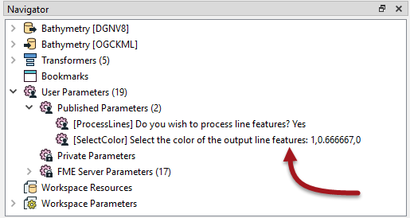
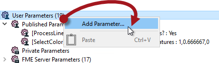
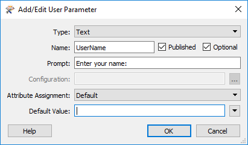
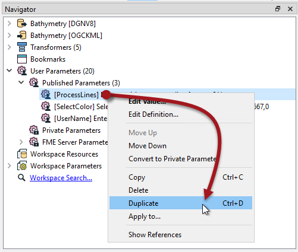
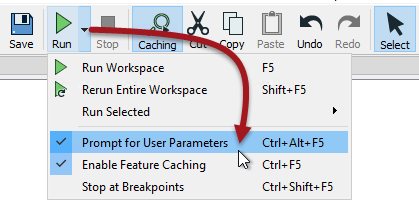
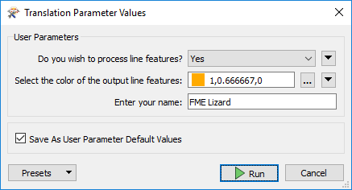
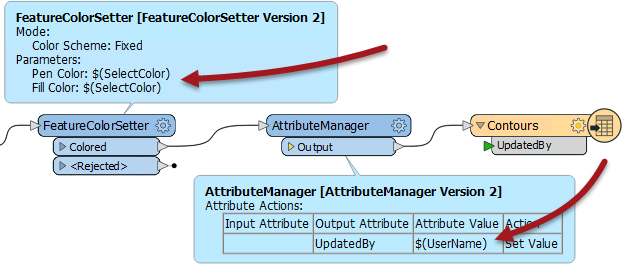
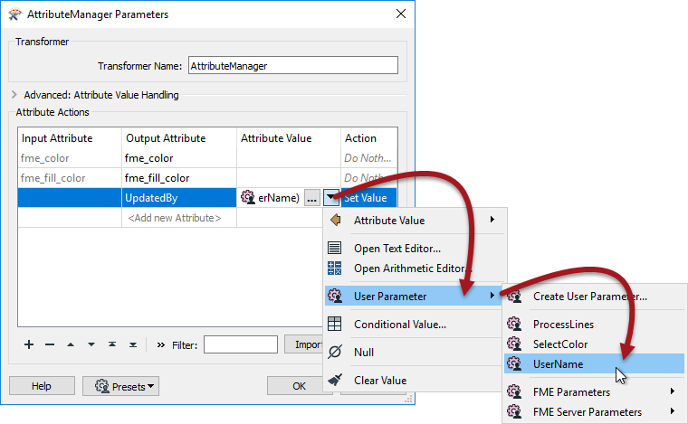

## User Parameters ##

User parameters are those that are created *by* an FME author, but *for* an FME user to use. In other words, they are a way for the end-user of the workspace to provide their input, regardless of where and how the workspace is being used.

### Creating a User Parameter ###
User parameters appear in a particular section of the Navigator window, labeled User Parameters. Here, for example, two user parameters have been defined:

Each of these user parameters allows the end-user of a workspace to enter information into the translation; whether to process line features and what color to write them in.

A user parameter is easy to create by right-clicking on the User Parameters label and choosing Create User Parameter:

A dialog appears in which the author can define the parameter. In this case, they are creating a parameter in which the user can enter their name:

You can also copy, paste, and duplicate user parameters. This allows the workspace author to duplicate existing parameters and make changes, instead of having to build several near identical parameters from scratch:

This includes being able to paste a parameter definition into a different workspace from which it was copied.

---

### Entering Information into a User Parameter ###
Once a user-parameter is defined, the workspace can be run in Prompt for User Parameters mode:

With this mode activated in FME Workbench, the user is prompted to supply values through a simple dialog:

In FME Server, the user is prompted through a web page:

---

### Using a User Parameter ###

Getting input from a user is pointless if it is not used, so it’s also necessary to actually do something with that input.

User parameters can be exploited in a number of places. Firstly they can be tied to an FME parameter (more information on that in the next section), but they can also be used to provide values to transformers and attributes in a workspace.

For example, here the author is making use of the color and username parameters (in the FeatureColorSetter and AttributeManager transformers):

The author set up these transformers to use the parameter input by selecting it in the transformer like so:

Now when the workspace is run, the end user can select the color of features to write, plus enter their name into a text field and have it entered into the UpdatedBy attribute in the output.

---

<!--Warning Section-->

<table style="border-spacing: 0px">
<tr>
<td style="vertical-align:middle;background-color:darkorange;border: 2px solid darkorange">
<i class="fa fa-exclamation-triangle fa-lg fa-pull-left fa-fw" style="color:white;padding-right: 12px;vertical-align:text-top"></i>
WARNING
</td>
</tr>

<tr>
<td style="border: 1px solid darkorange">

A screenshot above shows a workspace being run with both parameter prompts <strong>and</strong> feature caching.
 Be aware that a prompt is only provided for a parameter that is used in the section of workspace being run. In other words a partial run that fetches data from caches, may prevent a parameter prompt, if that parameter is not used in that partial run.

</td>
</tr>
</table>

---

<!--Person X Says Section-->
<table style="border-spacing: 0px">
<tr>
<td style="vertical-align:middle;background-color:darkorange;border: 2px solid darkorange">
<i class="fa fa-quote-left fa-lg fa-pull-left fa-fw" style="color:white;padding-right: 12px;vertical-align:text-top"></i>
FME Lizard asks...
</td>
</tr>

<tr>
<td style="border: 1px solid darkorange">

<quiz name="">
  <question>
    

      Q) Here are two questions for you to answer. To start, tell me this: what are our two roles of FME user?
    

    <answer>Maker/Consumer</answer>
    <answer>Creator/Inspector</answer>
    <answer correct>Author/User</answer>
    <answer>Reader/Writer</answer>
      <explanation>A) The person who creates a workspace is the author. The person who runs the workspace is the user. Sometimes they are both the same person, but often not.</explanation>
  </question>

  <question>
    

      Q) Here's another question, only slightly less easy. Look at the ParameterFetcher transformer. What does it do?
    

    <answer>Fetches the name of a user parameter</answer>
    <answer correct>Fetches the value of a user parameter</answer>
    <answer>Fetches the type of a user parameter</answer>
    <answer>Fetches the user a cup of tea</answer>
      <explanation>A) This transformer fetches the value of a user parameter, although you could just as easily use the AttributeManager transformer to do the same thing. Sadly, making tea is still a manual process!</explanation>
  </question>
</quiz>

</td>
</tr>
</table>
