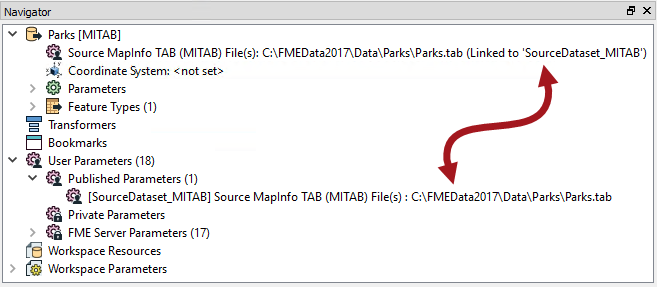

### Pre-Linked Parameters ###

In some scenarios, user parameters are created automatically and linked to an FME parameter, without any manual action by the workspace author.

For example, any time a reader or writer is added to a workspace, their source/destination dataset parameters are automatically turned into user parameters.

Here, a Source MapInfo TAB parameter is linked automatically to a user parameter called SourceDataset_MITAB:

 <!-- ** Update screenshot -->

Automatic linking occurs for parameters that are important to the end-user, and that appear in nearly all workspaces.

---

<!--Person X Says Section-->

<table style="border-spacing: 0px">
<tr>
<td style="vertical-align:middle;background-color:darkorange;border: 2px solid darkorange">
<i class="fa fa-quote-left fa-lg fa-pull-left fa-fw" style="color:white;padding-right: 12px;vertical-align:text-top"></i>
FME Lizard asks...
</td>
</tr>

<tr>
<td style="border: 1px solid darkorange">

<quiz name="">
  <question>
    

      Q) If you – as the workspace author – don’t want or require the end-user to have access to pre-linked parameters, then what can you do?
    

    <answer><li>Delete the Reader/Writer</answer>
    <answer><li>Unlink the user parameter</answer>
    <answer><li>Delete the FME parameter</answer>
    <answer correct><li>Delete the user parameter</answer>
    <explanation>  A) The user parameter does not have an unlink option, and FME parameters cannot be deleted, so you would delete the user parameter. You could choose unlink on the FME parameter - but that would automatically delete the user parameter anyway!</explanation>
  </question>
</quiz>

</td>
</tr>
</table>

