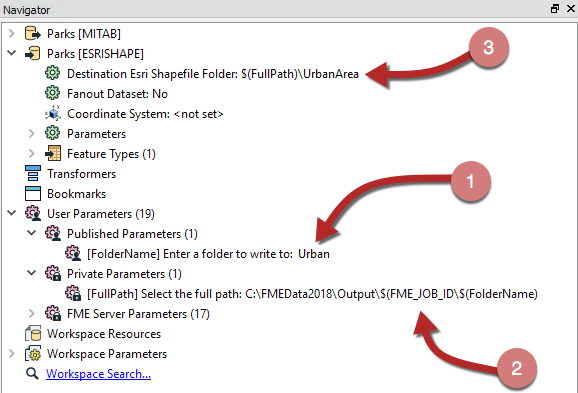

## Parameter Settings ##

When a user parameter is created two checkbox options exist; one is labelled Published and the other Optional.

---

### Published Parameters ###
The purpose of this option is to expose or hide the parameter from the end user. If the Published box is checked, then the end user is able to enter a value. If the box is unchecked then they will not be prompted to enter a value, and the parameter will be treated as "private".

**Private Parameters** have two uses. 

Firstly a private parameter is a way for a workspace author to create a shared parameter without having it exposed to the user.

For example, if they want to supply the same tolerance value to several Snapper transformers – but that value is set by the author, not the user – then a private parameter is used. 

A second use of a private parameter is to embed a user's partial input into a larger parameter.

For example, here the workspace author prompts the user to enter a folder in which a file is to be written (1). The full folder path is then defined by the author as a private parameter (2) as a mix of fixed path and a job ID:

Finally (3) the Private Parameter is embedded inside the FME Parameter for the destination GML dataset.

---

<!--Person X Says Section-->

<table style="border-spacing: 0px">
<tr>
<td style="vertical-align:middle;background-color:darkorange;border: 2px solid darkorange">
<i class="fa fa-quote-left fa-lg fa-pull-left fa-fw" style="color:white;padding-right: 12px;vertical-align:text-top"></i>
Ms. Analyst says...
</td>
</tr>

<tr>
<td style="border: 1px solid darkorange">

You might have noticed that there are a number of FME Server Parameters available to workspace authors who intend to deploy their creation on an enterprise scale.
  In fact, if you look at the above screenshot, you might notice that a Server parameter (FME_JOB_ID) has been embedded into the FullPath private parameter!

</td>
</tr>
</table>

---

### Optional Parameters ###

The Optional checkbox tells FME whether the user parameter is compulsory or optional. 

Here, for example, the DateTimeCalculator is being used to calculate the time a park closes, given its opening time and user input on how many hours and minutes it is open:

The Minutes user parameter has a checkmark in the Optional setting, meaning it is not compulsory. For example the user can just enter that the park is open for eight (8) hours and ignore the minutes parameter.

Alternatively, a user parameter might provide a tolerance value to a Generalizer transformer. In this case the author will want to turn off this checkbox and make the parameter compulsory. A Generalizer that is not given a tolerance value will usually fail and making tolerance compulsory is one way to prevent that happening.

---

<!--Person X Says Section-->

<table style="border-spacing: 0px">
<tr>
<td style="vertical-align:middle;background-color:darkorange;border: 2px solid darkorange">
<i class="fa fa-quote-left fa-lg fa-pull-left fa-fw" style="color:white;padding-right: 12px;vertical-align:text-top"></i>
Miss Vector says...
</td>
</tr>

<tr>
<td style="border: 1px solid darkorange">

Tell me, is it possible to have a compulsory, private parameter? (i.e. both settings boxes are unchecked)
  <a href="http://52.73.3.37/fmedatastreaming/Manual/QAResponse2017.fmw?chapter=11&question=5&answer=1&DestDataset_TEXTLINE=C%3A%5CFMEOutput%5CQAResponse.html">1. Yes</a>
 <a href="http://52.73.3.37/fmedatastreaming/Manual/QAResponse2017.fmw?chapter=11&question=5&answer=2&DestDataset_TEXTLINE=C%3A%5CFMEOutput%5CQAResponse.html">2. No</a>
 <a href="http://52.73.3.37/fmedatastreaming/Manual/QAResponse2017.fmw?chapter=11&question=5&answer=3&DestDataset_TEXTLINE=C%3A%5CFMEOutput%5CQAResponse.html">3. Yes, but you need to set a value immediately</a>
 <a href="http://52.73.3.37/fmedatastreaming/Manual/QAResponse2017.fmw?chapter=11&question=5&answer=4&DestDataset_TEXTLINE=C%3A%5CFMEOutput%5CQAResponse.html">4. Yes, but only for text or numeric parameters</a>

</td>
</tr>
</table>
