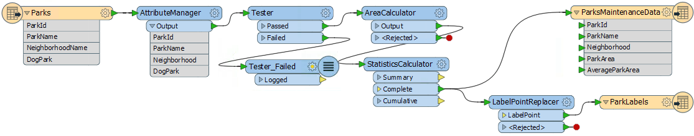
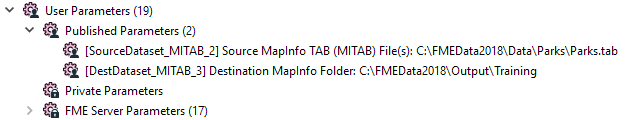
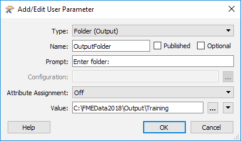
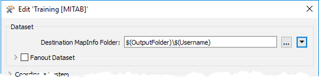
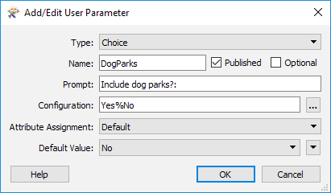
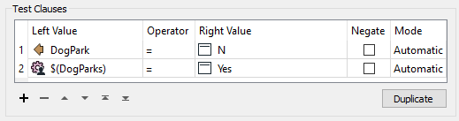
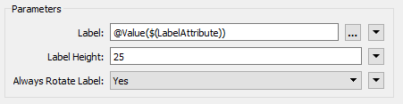
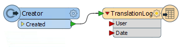
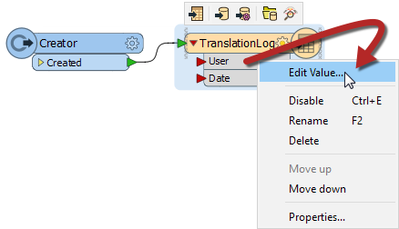
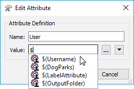

<!--Exercise Section-->

<table style="border-spacing: 0px;border-collapse: collapse;font-family:serif">
<tr>
<td style="vertical-align:middle;background-color:darkorange;border: 2px solid darkorange">
<i class="fa fa-cogs fa-lg fa-pull-left fa-fw" style="color:white;padding-right: 12px;vertical-align:text-top"></i>
Exercise 3
</td>
<td style="border: 2px solid darkorange;background-color:darkorange;color:white">
Grounds Maintenance Project
</td>
</tr>

<tr>
<td style="border: 1px solid darkorange; font-weight: bold">Data</td>
<td style="border: 1px solid darkorange">Parks (MapInfo TAB)</td>
</tr>

<tr>
<td style="border: 1px solid darkorange; font-weight: bold">Overall Goal</td>
<td style="border: 1px solid darkorange">Parameterize and implement a translation log</td>
</tr>

<tr>
<td style="border: 1px solid darkorange; font-weight: bold">Demonstrates</td>
<td style="border: 1px solid darkorange">Creation and use of complex User Parameters</td>
</tr>

<tr>
<td style="border: 1px solid darkorange; font-weight: bold">Start Workspace</td>
<td style="border: 1px solid darkorange">C:\FMEData2018\Workspaces\DesktopAdvanced\Parameters-Ex3-Begin.fmw</td>
</tr>

<tr>
<td style="border: 1px solid darkorange; font-weight: bold">End Workspace</td>
<td style="border: 1px solid darkorange">C:\FMEData2018\Workspaces\DesktopAdvanced\Parameters-Ex3-Complete.fmw C:\FMEData2018\Workspaces\DesktopAdvanced\Parameters-Ex3-Complete-Advanced.fmw</td>
</tr>

</table>

In a previous project (in the FME Basic Desktop training) you created a project to transform parks data by calculating the size and average size of each park.

The team who are using this now want to implement it on FME Server. At the same time, they want to improve some of the functionality and implement a custom translation log.

As you created the original workspace, you are assigned to carry out these upgrades to your former work.

- Set the output to write to a folder for that user
- Ask whether to filter out dog parks
- Ask which attribute to use to create labels
- Create a translation log in CSV format

 **1) Start Workbench**
 Start Workbench and open the workspace C:\FMEData2018\Workspaces\DesktopAdvanced\Parameters-Ex3-Begin.fmw

You can see that the workspace reads some MapInfo parks data, filters out dog parks, calculates park area and average area, creates labels, and writes out the data back to MapInfo.

---

<!--Updated Section--> 

<table style="border-spacing: 0px">
<tr>
<td style="vertical-align:middle;background-color:darkorange;border: 2px solid darkorange">
<i class="fa fa-bolt fa-lg fa-pull-left fa-fw" style="color:white;padding-right: 12px;vertical-align:text-top"></i>
.1 UPDATE
</td>
</tr>

<tr>
<td style="border: 1px solid darkorange">

FME2018.1 has a new version of the AttributeManager transformer, with improved performance. If you wish, right-click the AttributeManager and choose Upgrade Transformer to upgrade the transformer in this workspace.

</td>
</tr>
</table>

---

There are two existing published parameters - one for the source dataset and one for the destination:

The source dataset will never change, and we are going to create a new parameter for the destination, so delete these two parameters.

 **2) Add User Parameter**
 If we are going to write the output to a folder specific to the current user, we need to know who that user is.

So, next create a text format user parameter to ask for the user's name:

Ensure that the optional checkbox is unchecked; we want users to have to enter a value in here. Also, make sure Attribute Assignment is Off because we don't want them to be able to select an attribute.

 **3) Add User Parameter**
 There are various ways we can implement the requirements here; we'll do the version that involves sharing user parameters.

So, create a new user parameter of type Folder (Output). Uncheck **both** of the Published and Optional fields; i.e. it will be a private parameter for us to use (not the end user) and it will be required.

Set the Name field to something like OutputFolder and for the Value browse to C:\FMEData2018\Output\Training

Set Attribute Assignment to Off, although it doesn't really matter because this will be a private parameter anyway.

---

<!--Person X Says Section-->

<table style="border-spacing: 0px">
<tr>
<td style="vertical-align:middle;background-color:darkorange;border: 2px solid darkorange">
<i class="fa fa-quote-left fa-lg fa-pull-left fa-fw" style="color:white;padding-right: 12px;vertical-align:text-top"></i>
Dr. Workbench says...
</td>
</tr>

<tr>
<td style="border: 1px solid darkorange">

Technically, we could use a text-type parameter. The only benefit of a folder parameter is it lets us browse to the location. But since it's a private parameter that the user will never see, it doesn't really matter. Anyway, both methods will meet our requirements.

</td>
</tr>
</table>

---

 **4) Set Output Location**
 Now let's use the two parameters we've created.

***NB:*** *First ensure you deleted the two existing source/destination user parameters in step 1, else this step won't work!*

Locate the FME parameter for Destination MapInfo Folder in the Navigator window and double-click it to open the editing dialog.

In that dialog manually enter:

<pre>
$(OutputFolder)\$(Username)
</pre>

Alternatively, use the text editor where you can add these by double-clicking, to reduce the chance of error.

You've basically concatenated/embedded the two user parameters into the FME parameter.

When you run the workspace, you will be prompted to enter your name, and then the output data will now be written to C:\FMEData2018\Output\Training\&lt;Username&gt;

---

<!--Person X Says Section-->

<table style="border-spacing: 0px">
<tr>
<td style="vertical-align:middle;background-color:darkorange;border: 2px solid darkorange">
<i class="fa fa-quote-left fa-lg fa-pull-left fa-fw" style="color:white;padding-right: 12px;vertical-align:text-top"></i>
Dr. Workbench says...
</td>
</tr>

<tr>
<td style="border: 1px solid darkorange">

There are various ways we <strong>could</strong> have done this. We could have set the OutputFolder parameter to C:\FMEData2018\Output\Training\$(Username) and then linked it to the FME Destination MapInfo parameter. You'll see in a moment why we didn't do that!

</td>
</tr>
</table>

---

 **5) Add User Parameter**
 The next task is to check whether dog parks are required in the output. The Tester transformer in the workspace shows that an attribute (DogParks) has a value of Y or N to denote its status. We need to ask the user and add their decision to the Tester.

Now create a new user parameter. It will be a Choice type parameter that is **not** optional:

Set it up to be a simple Yes/No question of whether to include dog parks in the output. Turn off Attribute Assignment because - again - we don't want the user to be able to select an attribute.

 **6) Update Tester**
 To use the DogParks parameter open up the Tester parameters dialog. Add a second test clause:

<pre>
$(DogParks) = Yes
</pre>

Now when the workspace runs, if you choose not to keep dog parks they will be filtered out from the workspace. This concept - of directing features depending on the value of a user parameter - is a very useful one to be aware of.

 **7) Add User Parameter**
 OK. Next task is to allow the user to pick which attribute to use for a label.

As noted in the previous section of training, if we just publish the label parameter in the LabelPointReplacer the user will be able to enter text as well as select an attribute. We want them to have to select an attribute and not to be able to enter text.

So, create a new user parameter of type Attribute Name. This one can be optional, as the user failing to select an attribute is equivalent to saying "no labels required":

---

<!--Person X Says Section-->

<table style="border-spacing: 0px">
<tr>
<td style="vertical-align:middle;background-color:darkorange;border: 2px solid darkorange">
<i class="fa fa-quote-left fa-lg fa-pull-left fa-fw" style="color:white;padding-right: 12px;vertical-align:text-top"></i>
Dr. Workbench says...
</td>
</tr>

<tr>
<td style="border: 1px solid darkorange">

Click the run button and see what appears in the list of prompts; you should see a parameter to Select the Label Attribute. But look! The parameter shows "No Attributes Available". Why is this?
  This is because the list of available attributes depends on where the parameter is used. Since we have not used the parameter yet, no attributes are available!
  Similarly, if we used the parameter in a location where we have attributes A and B, and also in a different location with attributes B and C, the only attribute available to the parameter is B. That's because a parameter of this type will only show attributes that exist <strong>in all places</strong> that it is used.

</td>
</tr>
</table>

---

 **8) Update LabelPointReplacer**
 To use the LabelAttribute parameter inspect the LabelPointReplacer parameters.

Remember (again from the previous section) that we can't just apply this user parameter to the Label FME parameter. That would just return the name of the attribute; we want the attribute value.

So in the Label parameter manually enter (or open the text editor and enter):

<pre>
@Value($(LabelAttribute))
</pre>

Now when the workspace runs you are also prompted to select an attribute with which to label the parks. If you choose no attribute, no labels are created (just point features).

 **9) Add Log Writer**
 The final task is to create a CSV format translation log. That is not too difficult to do.

Use Writer &gt; Add Writer to add a new CSV format writer with the following setup:

<table style="border: 0px">

<tr>
<td style="font-weight: bold">Writer Format</td>
<td style="">CSV (Comma Separated Value)</td>
</tr>

<tr>
<td style="font-weight: bold">Writer Dataset</td>
<td style="">C:\FMEData2018\Output\Training</td>
</tr>

<tr>
<td style="font-weight: bold">Writer Parameters</td>
<td style="">Overwrite Existing File: No Write Field Names Row: If Writing First Row</td>
</tr>

<tr>
<td style="font-weight: bold">Add Feature Type(s)</td>
<td style="">CSV File Definition: Manual...</td>
</tr>

</table>

When you click OK, the dialog will open for you to define the table schema.

On the General tab set the CSV File Name as *TranslationLog*:

In the User Attributes tab, define the attributes User and Date:

Click OK to close the dialog.

 **10) Connect Feature Type**
 We need a single record to trigger this feature type; but only one feature, else we will get multiple records.

Place a Creator transformer down and connect it to the TranslationLog feature type:

 **11) Set Output Folder**
 We should set the output location for the log to be relative to where the user files are being written.

So, locate the destination dataset parameter for the CSV writer, right-click on it and choose Link to User Parameter:

When prompted select the OutputFolder (private) parameter that we created earlier.

---

<!--Person X Says Section-->

<table style="border-spacing: 0px">
<tr>
<td style="vertical-align:middle;background-color:darkorange;border: 2px solid darkorange">
<i class="fa fa-quote-left fa-lg fa-pull-left fa-fw" style="color:white;padding-right: 12px;vertical-align:text-top"></i>
Dr. Workbench says...
</td>
</tr>

<tr>
<td style="border: 1px solid darkorange">

You might be wondering what the point of that last part was. Why did we link the parameter when both were pointing to the same folder already?
  The point is that now the MapInfo and CSV writers share a parameter defining their output folder. If we wish to change where they are being written to (say when the path changes from FMEData2018 to FMEData2019), we only need to edit the private parameter to fix both writers. That's why we did what we did in step #4.
  If you don't believe me, try it and find out for yourself!

</td>
</tr>
</table>

---

 **12) Set User Attribute**
 The very last step here is to provide values for the User and Date fields of the translation log (CSV writer).

Right-click on the attribute called User on the feature type and choose the option to Edit Value:

In the dialog that pops up enter $(Username) for the value (you'll be prompted to select it as soon as you start to type):

This is another example of sharing user parameters. This parameter is now used here and in the MapInfo writer name.

 **13) Set Date Attribute**
 Now - to provide a value to the Date attribute - repeat the above step for the Date field, but this time entering the DateTimeNow() function instead of a user parameter:

We are done! Save the workspace and then run it!

You should find your choice of data (with or without labels) written to a folder under your name, and a record of the translation added to the CSV file in the main folder.

---

<!--Advanced Exercise Section-->

<table style="border-spacing: 0px">
<tr>
<td style="vertical-align:middle;background-color:darkorange;border: 2px solid darkorange">
<i class="fa fa-cogs fa-lg fa-pull-left fa-fw" style="color:white;padding-right: 12px;vertical-align:text-top"></i>
Advanced Exercise
</td>
</tr>

<tr>
<td style="border: 1px solid darkorange">

If you have time for one more task, why not add a transformer to round the ParkArea and AverageParkArea attributes and create a user parameter to control how that rounding occurs? You can choose any type of parameter you think would be best for allowing the user to select the number of decimal places to round to. It could be a Choice parameter, a Choice with Alias parameter, a Number parameter, or something else.
  You could also expand on the information that is written to the CSV log file; for example add the build  of FME used in the translation, which is available as a parameter called $(FME_BUILD_NUM).

</td>
</tr>
</table>

---

<!--Exercise Congratulations Section-->

<table style="border-spacing: 0px">
<tr>
<td style="vertical-align:middle;background-color:darkorange;border: 2px solid darkorange">
<i class="fa fa-thumbs-o-up fa-lg fa-pull-left fa-fw" style="color:white;padding-right: 12px;vertical-align:text-top"></i>
CONGRATULATIONS
</td>
</tr>

<tr>
<td style="border: 1px solid darkorange">

By completing this exercise you have learned how to:
<ul><li>Create a user parameter that is not optional</li>
<li>Create a private user parameter</li>
<li>Create a Folder type user parameter</li>
<li>Control Attribute Assignment for a user parameter</li>
<li>Embed/Concatenate user parameters inside an FME parameter</li>
<li>Create a choice type user parameter</li>
<li>Use a user parameter in a Tester transformer to redirect features</li>
<li>Create and use an Attribute Name user parameter</li>
<li>Share a user parameter by using it in multiple locations</li></ul>

</td>
</tr>
</table>
