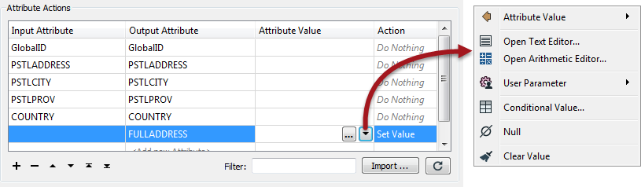

<!--This section is (mostly) a copy of part of the basic manual, used here just as a reminder-->

# Constructing Attributes #
Besides constant attribute values FME also allows you to construct values using string manipulation and arithmetic calculations. This is acheived using the menu opened by clicking on the arrow in the Attribute Value field:

This is very useful because the attribute now no longer is a fixed value: it can be constructed from a mix of existing attributes and parameters. The two main methods are the Text Editor and Arithmetic Editor.

The string functions are mostly based around Tcl, the arithmetic functions around C.

---

<table style="border-spacing: 0px">
<tr>
<td style="vertical-align:middle;background-color:darkorange;border: 2px solid darkorange">
<i class="fa fa-quote-left fa-lg fa-pull-left fa-fw" style="color:white;padding-right: 12px;vertical-align:text-top"></i>
Professor Lynn Guistic says…
</td>
</tr>

<tr>
<td style="border: 1px solid darkorange">

Are you wondering why some transformer parameters have an option for the text editor, some have an option for the arithmetic editor, and some have both?
  That’s easy. The editor is matched to the type of value expected by that parameter. For example, the LabelPointReplacer Label (content) parameter can access the text editor, because it expects a string. The same transformer's Label Height parameter can access the arithmetic editor because it expects a number.
  The AttributeCreator transformer allows access to both because it doesn’t rely on a particular type. It is happy with either numeric or string values.

</td>
</tr>
</table>

